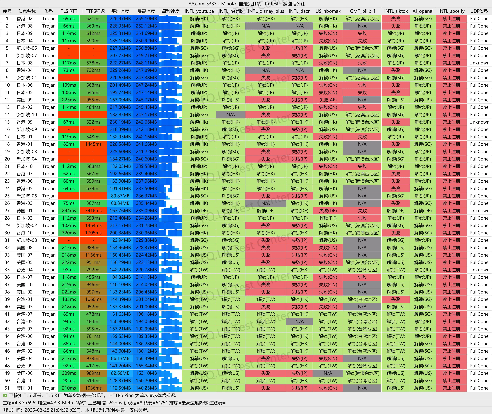
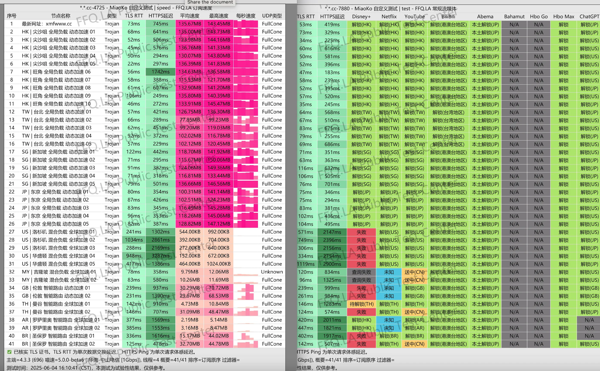
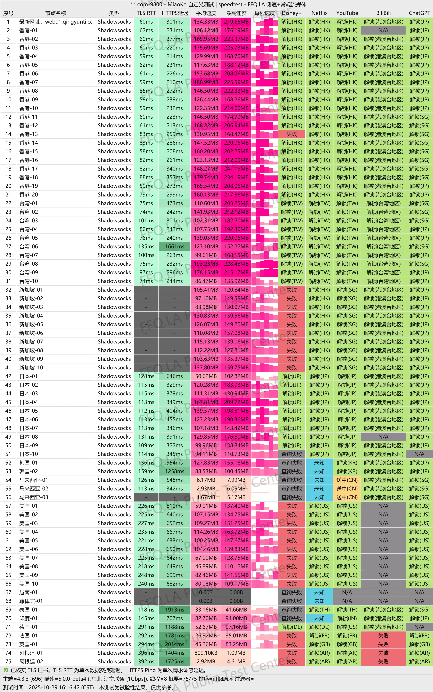
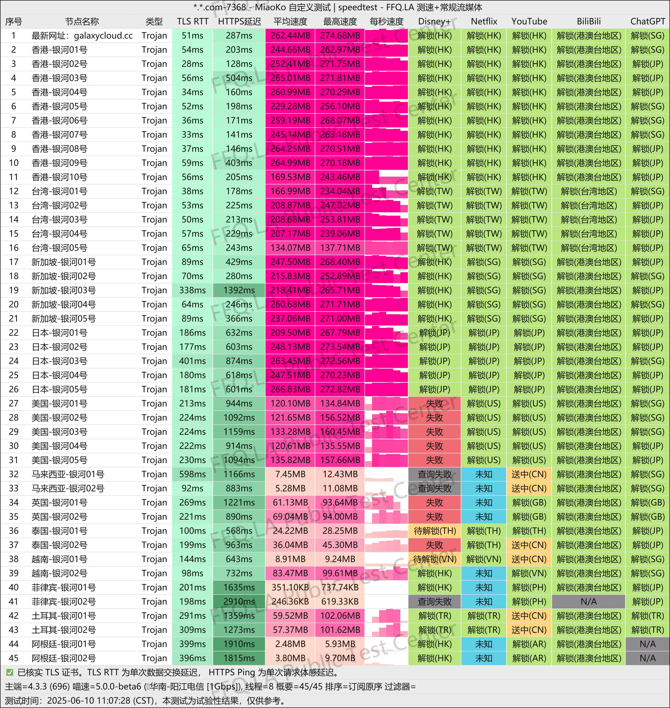
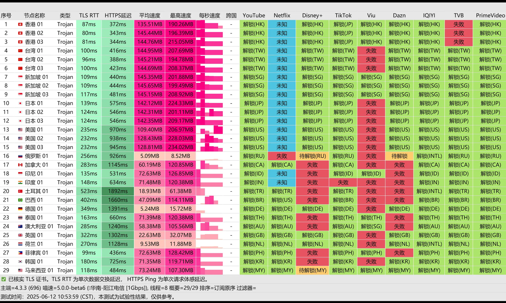

# 🚀 机场推荐｜科学上网 / 魔法上网 / 梯子实测（专注 AI 工具与流媒体）

📅 **内容最后更新：2025年12月14日**

想长期稳定地使用 ChatGPT、Claude、GitHub Copilot 等 AI 工具，同时又希望 YouTube、Netflix、Disney+ 看剧不再卡成 PPT？  
本项目聚焦 **机场推荐 + 科学上网/魔法上网/梯子实测**，特别为程序员、远程办公用户和流媒体重度用户筛选出更适合日常工作的稳定线路。

📌 本仓库由长期自费订阅多家机场的开发者维护，重点关注：
- 🤖 **AI 使用场景**：ChatGPT / Claude / GitHub Copilot / Google Gemini 3.0 Pro / OpenAI Codex 等通用 AI 工具，以及 Vibe Coding、Cursor、Claude Code 等 AI 编程助手的解锁情况与 IP 纯净度（是否原生/家宽 IP、是否容易触发风控、是否适合注册账号与长时间对话/调用 API）
- 🎬 **流媒体解锁**：YouTube / Netflix / Disney+ / TikTok 等平台的 4K 播放与多区域访问能力
- 🧪 **真实稳定性**：晚高峰速度、丢包率、封锁抗性，是否适合作为主力办公/开发线路
- 🛠 **程序员友好**：Clash / V2Ray / Trojan / Shadowrocket 等客户端的实际配置与踩坑记录

## 🔝 快速注册入口

| 机场 | 核心优势                      | 优惠力度                        | 截止日期 | 优惠码 | 过境线路 | 快捷跳转 |
| --- |---------------------------|-----------------------------|----------| --- | -------- | --- |
| TNTCloud | 全 IPLC 专线 + 原生 IP，AI 解锁顶级 | 专属长期 8 折（30元季付小包除外）         | 长期 | `Tnt80` | 全节点 IPLC 专线 | [立即注册](https://tanu095.tntvipaff.cc/#/register?code=7MPbfr89) |
| 小蜜蜂机场 | 全 IEPL 性价比王，AI/流媒体全解锁     | 专属长期 8 折（¥96 年付小包除外）        | 长期 | `TVX8JfZP` | 全节点 IEPL 专线 | [立即注册](https://tangwu095.xmfvipaff01.cc/register?aff=oClLBb5A) |
| 青云梯 | 六年老牌， 智能分流稳定              | 年付及以上 8 折 / 其他 85 折（¥96年付小包除外） | 长期 | `gptvpnhelper80` / `gptvpnhelper85` | 企业级 IPLC 专线 | [立即注册](https://realvtest.qytvipaff.cc/register?aff=zcIlh0VY) |
| 银河云 | Trojan专线，预算党首选主力          | 长期 8 折 / 85 折（¥98 福利年付除外）   | 长期 | `gptvpnhelper80` / `gptvpnhelper85` | Trojan + IEPL 专线 | [立即注册](https://inv03.galaxyaff.cc/register?aff=tcOd0ob7) |
| 百变小樱 | 3 天免费试用，新手应急必备            | 3 天免费 + 95 折                | 长期 | `bbxy-5th` | 三网 IEPL 专线 | [立即注册](https://bbxy.xn--cesw6hd3s99f.com/auth/register?code=FFHk) |
| 贝贝云 | 低门槛入门，日常稳连                | 95 折（新手福利）                  | 长期 | `beibei.cloud` | 江苏隧道中转线路 | [立即注册](https://beibeilink.top/register?code=Oa86Fbs3) |
| WgetCloud | 企业级 99.99% 在线率，重度/团队优选    | 新用户 85 折                    | 长期 | 注册赠送 85 折券 | BGP 中转 + IEPL 专线 | [立即注册](https://invite.wgetcloud.ltd/auth/register?code=xEgJKS) |

\* 以官方公告为准，如活动调整请以官网提示为准。

> ℹ️ **说明**：上表中除「百变小樱」为 **3 天免费试用（应急/新手恢复连接）** 外，其余为本文重点长期评测的 **6 家主力机场**。

> ✅ **下单领折扣 3 步（建议照做）**  
> 1）点击表格「立即注册」进入官网；2）选择套餐；3）结算页输入对应优惠码（不输入通常不会自动打折）。  
> 如遇官网限时活动，请以结算页最终价格为准，并留意与本文专属优惠的叠加规则。

> ⚠️ **下单前记得填优惠码**：本文优惠信息为作者向机场申请/整理的专属或长期优惠（以官方为准）。官网公开优惠码可能过期或力度更低，建议优先尝试本文优惠码并对比结算价再下单。

## ⚡ 快速选择

如果你不想一开始就看完整评测，可以先根据自己的使用场景，快速锁定 1–2 家最合适的机场：

| 使用场景 | 推荐机场组合 | 立即查看 |
|---------|--------------|----------|
| 🤖 **ChatGPT / AI 工具重度** | **TNTCloud + 小蜜蜂** | [跳转 TNTCloud 评测](#tnt) |
| 🎬 **流媒体刷剧 / 4K 观影** | **小蜜蜂 / WgetCloud** | [查看 WgetCloud 高端方案](#wgetcloud) |
| 💼 **远程办公 / 团队重度稳定** | **WgetCloud（主力）+ TNTCloud（备用）** | [查看 WgetCloud 高端方案](#wgetcloud) |
| 🆓 **完全无法翻墙，先恢复连接** | **百变小樱 3 天免费试用** | [领取免费试用](#free) |
| 💰 **预算有限 / 备用线路** | **银河云 / 贝贝云** | [查看银河云性价比方案](#yinheyun) |

🧑‍🎓 **第一次配置的新手**：建议先看下方的 [3 分钟从零开始科学上网教程](#study)，按图一步步导入订阅即可。

💡 想按「预算 / 多设备 / 使用强度」更精细地选，可直接跳转到下方的 [个人快速推荐清单](#person)。

📌 **墙内访问 Github 太慢？**  
👉 推荐使用镜像站查看测速图与完整内容：  
🔗 [https://gptvpnhelper.com/airport-access/](https://gptvpnhelper.com/airport-access/)

---

**2025年网络封锁持续升级，ChatGPT 打不开？YouTube 加载慢？Netflix 无法播放？**

本指南为你提供经过 **3年实测验证** 的机场推荐方案，覆盖从 **免费试用** 到 **企业级专线** 的全价位段选择。无论你是科学上网新手还是资深用户，都能在 **3 分钟内** 找到最适合的解决方案。

> ⚠️ **网络环境特别说明（省墙）**  
> 近期部分地区出现明显“省墙”现象，如果你遇到“所有节点都不可用”，除了机场本身问题，还可能是本地网络/运营商限制（如湖北域名解析 `127.0.0.1`、福建屏蔽境外 IP、江苏跳转反诈、新疆屏蔽国内中转）。  
> 本文推荐的机场均为作者长期自费实测、在绝大多数地区可正常使用(XinJ省基本所有机场都不能使用)；如你所在省份受省墙影响，建议先重新导入并更新订阅链接，如仍无法使用，尽快联系机场客服说明所在省份与运营商，申请更换入口或应急线路。

---


### 📊 为什么要相信这份推荐？

我们的测试标准与数据保证：

- ✅ **长期跟踪**：从 2022 年至今，持续 **3 年** 实际使用与测试
- ✅ **大规模对比**：测试超过 **40+ 家** 主流机场服务商，只保留适合长期使用的 **6 家主力**（另含 1 个免费试用应急）
- ✅ **真实测速**：不定期更新实测数据，优先覆盖晚高峰 **20:00-22:00** 黄金时段
- ✅ **全场景验证**：覆盖 ChatGPT / Copilot / Gemini / Claude Code / Cursor / Vibe Coding 等 AI 编程工具，以及 Netflix / TikTok / 游戏加速等 **10+ 种** 使用场景
- ✅ **透明评分**：公开评分标准（速度、稳定性、价格、解锁能力、售后服务）
- ✅ **及时更新**：不定期同步最新优惠活动与套餐变化（以文章顶部更新时间为准）
- ✅ **连通性巡检**：通过下方「[每日稳定性巡检](#daily-check)」模块记录订阅连通情况，出现大面积异常时会及时标注说明

---

### 🚀 本指南包含什么？

| 内容模块 | 你将获得 |
|---------|---------|
| 📖 **基础科普** | 什么是机场？如何选择？避坑指南 |
| 🏆 **六大精选机场（主力）** | 从平价主力到顶级专线的完整评测 |
| 🆓 **免费试用（应急）** | 无法翻墙时先恢复连接，再决定是否升级 |
| 💰 **专属优惠** | 独家优惠码，最高可享 **8 折** |
| 📊 **对比表格** | 一目了然的价格、性能、解锁能力对比 |
| 🎓 **小白教程** | 1 分钟快速上手，含客户端下载与配置 |
| ⚠️ **避坑指南** | 如何防止机场跑路、封号风险提示 |

---

### ✨ 核心优势

> 🎁 **免费试用**：推荐支持 3 天免费试用的机场，零风险体验  
> 💰 **专属优惠**：独家申请 8 折 - 95 折优惠码，为你省钱  
> 📱 **全平台支持**：Windows / macOS / iOS / Android / 路由器 全覆盖  
> 🌍 **全解锁验证**：ChatGPT / TikTok / Netflix 全区 / Disney+ / AI 工具  
> ⚡ **持续更新**：根据实测与活动变化，不定期更新测速与优惠信息

---

💡 **觉得这篇内容对你有帮助？**  
欢迎 Star + 分享给身边人，让更多人轻松、安全、稳定地连接全球网络！
---

## 📚 目录

### 📖 基础知识
1. [什么是机场？科学-上网的原理与作用](#ssssr)
2. [免费试用机场推荐](#free)

### 🎯 选购指南：如何挑选适合你的机场服务
3. [如何挑选靠谱机场？](#choose)
4. [快速选择机场服务](#person)
5. [精选机场深度评测](#top7)


### 🚀 使用教程：快速上手科学-上网
6. [一分钟快速上手教程｜配置机场科学-上网全流程](#study)

### ⚠️ 风险意识与责任说明
7. [购买建议与风险提醒（如何防跑路/规避封锁）](#risk)
8. [免责声明](#免责声明)

### 关于机场和VPN
9. [机场 vs VPN：哪个好用？适合谁？](#vs)

### 📖 更多阅读
10. [❓ 常见问题 FAQ（AEO优化）](#faq)
11. [📈 每日稳定性巡检（订阅连通性）](#daily-check)

---

<a id="ssssr"></a>
## ✈️ 什么是"机场"？5分钟读懂科学上网核心原理（2025版）

### 🤔 机场是什么？为什么叫"机场"？

在科学上网领域，**"机场"** 是基于 **Shadowsocks、V2Ray、Trojan** 等加密协议搭建的代理服务平台。之所以叫"机场"，是因为用户像在机场选择航班一样，可以从订阅链接中选择不同国家和地区的节点（服务器）。

**一句话解释：** 机场 = 提供多个节点的科学上网订阅服务

---

### 🆚 机场 vs VPN：为什么机场更受欢迎？

| 对比维度 | 传统 VPN | 机场服务 |
|---------|---------|---------|
| **节点数量** | 通常 5-15 个固定节点 | 30-200+ 个全球节点 |
| **速度表现** | 单线路，易拥堵 | 多线路智能切换，速度更快 |
| **稳定性** | 容易被识别封锁 | 伪装协议，抗封锁能力强 |
| **灵活度** | 全局代理，无法分流 | 智能分流：国内直连 + 国外代理 |
| **价格** | $5-15/月 | ¥15-120/月（选择更多） |
| **适用场景** | 简单上网 | ChatGPT、流媒体、游戏加速 |

**核心优势：** 机场支持 **智能分流** - 访问百度直连，访问 YouTube 走代理，既快又省流量。

---

### 🔧 机场的技术架构（3层结构）

```
你的设备 → 入口服务器（中国境内）→ 中转/专线通道 → 落地节点（国外）→ 目标网站
```

1. **入口链路** 🚪
    - 🔹 直连：速度快但易被封
    - 🔹 CN2 专线：电信优化线路，稳定性好
    - 🔹 隧道中转：多层跳转，更隐蔽

2. **过境技术** 🌉
    - 🔸 **IEPL 专线**：企业级内网专线，延迟低（< 50ms），不过墙（最稳定）
    - 🔸 **IPLC 专线**：国际专线，速度快但价格贵
    - 🔸 BGP 中转：动态选路，智能优化

3. **落地节点** 🌍
    - ✨ **原生 IP**：可解锁 Netflix、ChatGPT（推荐）
    - 🏠 **家庭宽带 IP**：IP 纯净度最高
    - ☁️ **数据中心 IP**：便宜但易被识别

---

### 🎯 机场的使用场景：能做什么？

| ✅ 应用领域 | 🌐 解锁能力一览 |
|------------|------------------|
| **内容娱乐** | 支持访问 **Netflix、Disney+、YouTube 4K HDR、Spotify 全球曲库、Prime Video、NBA League Pass** 等受限平台 |
| **AI 工具与远程办公** | 畅用 **ChatGPT、Claude、Gemini、Hugging Face、Notion AI** 等工具，顺利登录 **GitHub、Docker Hub、OpenAI API** |
| **跨境电商运营** | 可高效管理 **Amazon、eBay、Shopify** 等店铺，投放 **Google/Facebook 广告**，同步 **ERP 系统**，实时查看目标国家 **SERP 页面** |
| **国际游戏加速** | 低延迟连接 **PSN、Switch、Steam** 全球服务器，自由切换至 **阿根廷、土耳其** 等低价区加速体验 |
| **数字生活拓展** | 注册美区 **Apple ID** 或 **Google Play** 账号，购买海外礼品卡，订阅低价地区 **iCloud+、YouTube Premium、Spotify Family Plan** 等服务 |

---

> 💡 **简而言之：**  
> “机场” 是一种融合**多节点调度、智能流量分流与全球加速**的科学-上网解决方案，灵活性胜过 VPN，稳定性优于传统代理，堪称 2025 年访问 **ChatGPT、YouTube、Netflix** 等平台的优选工具。

---

<a id="free"></a>
## 🆓 限时免费高端机场推荐：<a href="https://bbxy.xn--cesw6hd3s99f.com/auth/register?code=FFHk" target="_blank" style="color:#1a73e8;text-decoration:underline;">百变小樱</a> —— 稳定实用科学上网方案

### 🚀 无法访问 ChatGPT、YouTube、GitHub？先用这个免费机场恢复联网！

如果你当前处于**完全无法翻墙**的状态 —— 无法打开 ChatGPT、YouTube、Google、GitHub 或 VPN 官网，那么这款 **限时免费高端IEPL专线机场「百变小樱」** 是你最佳的起点选择。

**适合人群：** 完全无法访问外网，需要先恢复基础联网的新手用户，以及想在付费前真实体验 IEPL 专线质量的轻度/备用用户。  
**不适合：** 已有稳定主力机场、只追求长期极致低价的纯重度用户。  
**核心优势：** 3 天免费试用 + IEPL 高速专线 + 全平台客户端支持，适合作为「从 0 到 1」的起步梯子。  
👉 想直接上车： [立即免费注册百变小樱（3 天试用 + 95 折）](https://bbxy.xn--cesw6hd3s99f.com/auth/register?code=FFHk)

📌 **强烈建议立即注册，恢复基础联网能力，体验顶级加速 IEPL 专线！**

---

### ✨ 为什么推荐「百变小樱」机场？

**一句话价值主张：** 运营 **5+ 年** 的海外团队，IEPL 高速专线 + 全平台一键导入，支持 **3 天免费试用**，先体验后购买。

- ✅ **0 成本试用**：注册即享 **3 天免费体验**，先测速度与稳定性，再决定是否付费。
- ✅ **长期稳定**：海外团队持续运维 **5+ 年**，高峰期依然顺畅，故障响应及时。
- ✅ **IEPL 高速专线**：低延迟 / 大带宽 / 抖动小，适合游戏、远程办公、下载与超清观影。
- ✅ **灵活套餐**：从入门到高阶多档位选择，**可随时升级**，按需购买更省钱。
- ✅ **一键导入**：全面兼容 **Clash / Shadowrocket / SSR** 等主流客户端，订阅链接一键导入即用。
- ✅ **强力解锁**：**ChatGPT、YouTube、TikTok、Netflix、Disney+、HBO Max** 等平台稳定解锁，**4K 串流无压力**。
- ✅ **会员福利**：**LV3+** 用户可享 **Netflix / Disney+ / Prime Video** 等会员福利（以官方活动为准）。
- ~~✅ **影视党福音**：内置 **Emby 服务器**，精选高清片库，开箱即看更省心。~~（官方已下架）
---

> 🧠 **作者实测使用超过3年，稳定性极高**。日常办公、AI 使用、高清观影、海外游戏、跨境电商访问，**全场景表现优秀，值得长期使用**！

### 🎁 长期优惠福利

- ✅ **免费试用**：新用户注册即享 **3 天免费体验**
- ✅ **专属折扣**：购买付费套餐使用优惠码 `bbxy-5th` 享 **95 折优惠**（长期有效）
- ✅ **套餐升级**：新套餐开通后会覆盖旧套餐，如需升级年付以上套餐可发工单补差价

📊 [👉 查看百变小樱机场详细测评：IEPL专线测速、ChatGPT解锁测试、完整套餐介绍](https://gptvpnhelper.com/airport-access/bbxy/)
---

### 🔗 立即开启你的科学上网之路：

<div align="center">
  <a href="https://bbxy.xn--cesw6hd3s99f.com/auth/register?code=FFHk">
    
  </a>
</div>

<br/>

### 💎 专属优惠码使用说明

> 📋 **优惠码：** `bbxy-5th`
>
> 💰 **优惠力度：** 所有付费套餐享 **95 折**（长期有效）
>
> 📝 **使用方法：** 试用期结束后购买套餐时，在支付页面输入优惠码即可

---

> 💡 提示：科学上网的第一步是选择靠谱稳定的机场节点。**百变小樱作为新手推荐第一站，解决你“打不开 ChatGPT”的痛点**，是你通往自由互联网世界的起点。

---

<a id="choose"></a>
## ❓如何挑选靠谱机场？避坑指南 + 5大核心指标

选机场就像买车，**配置、口碑、售后** 缺一不可。以下是经过 **3年测试总结** 的选购标准，帮你避开 **90% 的雷区**。

---

### 📋 核心挑选标准（按重要性排序）

#### 1️⃣ 【最重要】线路架构 —— 决定速度与稳定性

| 线路类型 | 延迟 | 稳定性 | 价格 | 推荐指数 | 适合人群 |
|---------|------|--------|------|----------|---------|
| 🏆 **IEPL / IPLC 专线** | < 50ms | ⭐⭐⭐⭐⭐ | ¥30-120/月 | ★★★★★ | 游戏党、办公、AI 重度用户 |
| 🥈 **BGP 中转** | 50-150ms | ⭐⭐⭐⭐ | ¥20-60/月 | ★★★★ | 日常上网、流媒体 |
| 🥉 **普通中转** | 100-200ms | ⭐⭐⭐ | ¥10-30/月 | ★★★ | 轻度使用、备用 |
| ⚠️ **公网直连** | 不稳定 | ⭐⭐ | ¥5-15/月 | ★★ | 不推荐（易被封） |

**怎么看线路好坏？**
- ✅ 机场官网有标注"IEPL"、"IPLC"、"专线" → 好
- ⚠️ 只写"高速节点"没有具体说明 → 可能是中转或直连
- ❌ 没有任何技术说明 → 十有八九是公网直连

---

#### 2️⃣ 【关键】晚高峰表现 —— 真实使用体验

**为什么看晚高峰？** 因为 **20:00-22:00** 是使用高峰，这个时段速度才是真实水平。

✅ **好机场的标志：**
- 晚高峰 YouTube 4K 不卡顿（需要 > 25 Mbps）
- Netflix 能稳定加载（需要 > 15 Mbps）
- 延迟稳定，不会突然从 50ms 飙到 500ms

❌ **烂机场的特征：**
- 白天跑 100 Mbps，晚上掉到 1 Mbps
- ChatGPT 频繁超时
- 测速网站跑得快，实际使用慢（测速节点作弊）

**如何验证？** 加入机场的 Telegram 群，看用户晚高峰的反馈。

---

#### 3️⃣ 【必看】解锁能力 —— ChatGPT / Netflix 能不能用

| 服务 | IP 要求 | 劣质机场的问题 | 优质机场的标准 |
|------|---------|---------------|---------------|
| **ChatGPT** | 原生 IP | 频繁验证、封号 | 稳定使用 > 1 年无封号 |
| **Netflix** | 原生 IP + 解锁 | 显示"检测到代理" | 支持 4K 播放 |
| **TikTok** | 非大陆 IP | 无法刷视频 | 正常浏览发布 |
| **Disney+** | 特定区域 IP | 内容库受限 | 支持多区切换 |

**⚠️ 避坑提示：**
- 避免 **中国 ASN**（如 AS4134、AS4837）落地，这类 IP 容易被封
- 优先选择标注"**原生 IP**"或"**家宽 IP**"的机场
- 数据中心 IP 便宜但容易被识别

---

#### 4️⃣ 品牌口碑 —— 防止跑路

✅ **靠谱机场的标志：**
- 运营 **2 年以上**（新机场跑路率高达 60%）
- Telegram 群活跃，**> 500 人**
- 有独立官网（不是套用模板）
- 支持工单系统 / 邮件客服
- 有公开的测速页面

❌ **危险信号：**
- 上线 < 6 个月
- 没有 TG 群或群内无人说话
- 只有一个域名，没有备用地址
- 只支持年付，不支持月付
- 价格离谱（¥9.9 包年 / ¥200 包月）

---

#### 5️⃣ 套餐灵活性

| 考察点 | 好机场 ✅ | 差机场 ❌ |
|-------|---------|----------|
| **支付周期** | 支持月付/季付/年付 | 只支持年付 |
| **设备限制** | 不限或 ≥ 3 台 | 限制 1 台 |
| **流量重置** | 每月重置 | 不重置（用完就没） |
| **支付方式** | 支付宝/微信/USDT | 只支持加密货币 |
| **试用退款** | 支持 3 天试用/退款 | 不支持 |

---

### 🎯 快速评估检查清单

复制这个清单，对照机场官网检查：

- [ ] 有明确标注线路类型（IEPL/IPLC/BGP）
- [ ] 运营时间 ≥ 1 年
- [ ] 有活跃的 Telegram 群（> 500 人）
- [ ] 支持月付
- [ ] 提供测速页面或实测数据
- [ ] 标注了解锁能力（ChatGPT/Netflix）
- [ ] 支持 ≥ 3 台设备同时在线
- [ ] 价格合理（¥15-120/月区间）

**通过 ≥ 6 项 → 可以购买**  
**通过 < 4 项 → 谨慎考虑**

---

### ⚠️ 避坑警告：这些机场千万别碰

#### 🚫 免费机场 —— 免费的往往最贵

**看起来诱人，实际上是坑：**

| 问题 | 后果 | 真实案例 |
|------|------|---------|
| 🐌 **严重限速** | 只有 1-3 Mbps，连网页都打不开 | 某免费机场白天限速到 0.5 Mbps |
| 💥 **频繁掉线** | 3 分钟断一次，根本无法使用 | ChatGPT 对话到一半就断开 |
| 🕵️ **隐私风险** | 注入广告、追踪浏览记录 | 用户数据被打包出售 |
| 🎯 **钓鱼风险** | 窃取账号密码 | 登录 Gmail 后被盗号 |

**❌ 绝对不要用免费机场做这些事：**
- 登录银行/支付宝等金融账号
- 访问公司内网/企业邮箱
- 注册/登录 ChatGPT 账号（易被封）

**✅ 替代方案：** 使用 [百变小樱 3 天免费试用](#free)，体验真正的高速专线。

---

#### 🚫 超低价机场（¥9.9 包年）—— 大概率跑路

**为什么这么便宜？真相是：**

- 💰 **亏本运营** → 2-3 个月后必定跑路
- 🏚️ **一键搭建** → 套用模板，随时跑路
- 🌐 **IP 污染严重** → 根本访问不了 ChatGPT、Netflix
- 👥 **用户爆满** → 1000 人共用一条 100M 带宽

**真实成本计算：**
```
1 台香港 VPS：¥200/月
1000GB CN2 带宽：¥500/月
总成本：¥700/月

如果卖 ¥9.9/年，需要 840 个用户才能回本
→ 根本不可能盈利 → 必定跑路或严重超售
```

**✅ 合理价格区间：**
- 入门套餐：¥15-30/月
- 中端套餐：¥30-80/月
- 高端专线：¥80-150/月

---

#### 💡 正确的省钱策略

| 方案 | 月均成本 | 适合人群 |
|------|---------|---------|
| 🎁 **利用试用期** | ¥0 | 新手，短期使用 |
| 📦 **年付套餐** | ¥8-15/月 | 确定长期使用的用户 |
| 🤝 **合租分摊** | ¥10-30/月 | 与朋友/家人共享 |
| 🎯 **按需购买** | ¥15-30/月 | 轻度用户，选小流量套餐 |
| 🔄 **主力+备用** | ¥30-50/月 | 稳定需求，2 个机场互补 |

**推荐组合：**
- 主力机场：小蜜蜂/TNTCloud（¥20-40/月）
- 备用机场：贝贝云（¥14.9/月）
- 总成本：¥35-55/月，双重保障

---


<a id="person"></a>
## ✨ 如果你不想看完整评测，直接根据我的个人推荐选择：

根据长期实际体验和稳定性测试，以下是我为不同需求用户精选的快速推荐：

---

### 🔥 主力推荐（适合 80% 用户）

#### 1. [**TNTCloud**｜AI工具专用 · IPLC专线 · 专属长期8折](https://tanu095.tntvipaff.cc/#/register?code=7MPbfr89)

- ✅ IPLC专线，延迟<30ms，海外团队运营
- ✅ ChatGPT / Claude / Gemini 等 AI 工具解锁表现优秀（以平台风控为准）
- ✅ 流媒体全解锁，不限速不限设备

> 🎉 **本站专属长期折扣：**`Tnt80`（8 折，不适用于 30 元季付小包）｜ [👉 完整测评](https://gptvpnhelper.com/airport-access/tntcloud/)

---

#### 2. [**小蜜蜂机场**｜性价比王者 · 年付¥8/月 · 专属长期8折](https://tangwu095.xmfvipaff01.cc/register?aff=oClLBb5A)

- ✅ 年付¥96（≈¥8/月）全IEPL专线，不限速不限设备
- ✅ Netflix/Disney+/ChatGPT/TikTok 全解锁
- ✅ 提供美区ID下载小火箭，新手友好

> 🎁 **专属长期 8 折码：**`TVX8JfZP`（¥96 年付小包除外）｜ [👉 完整测评](https://gptvpnhelper.com/airport-access/xmf/)

---


#### 3. [**青云梯**｜六年老牌 · 年付¥96/60G](https://realvtest.qytvipaff.cc/register?aff=zcIlh0VY)

- ✅ 2020年运营至今（6年），企业级IPLC专线
- ✅ 全平台解锁 + 海外团队7x24维护
- ✅ 80+节点覆盖全球，真人客服在线

> 🎯 **专属优惠：** 年付及以上使用 `gptvpnhelper80` 享 8 折，月付/季付等使用 `gptvpnhelper85` 享 85 折（青云·诀 ¥96/年福利款除外）｜ [👉 完整测评](https://gptvpnhelper.com/airport-access/qingyunti/)

---


---

### 🚀 高端 & 入门推荐

#### [**WgetCloud**｜企业级稳定 · 新用户85折](https://invite.wgetcloud.ltd/auth/register?code=xEgJKS)
- 💎 99.9%在线率，自建面板，适合重度办公/游戏党
- [👉 详细测评](https://gptvpnhelper.com/airport-access/wgetcloud/)

#### [**贝贝云**｜新手入门 · ¥14.9/月起 · 95折](https://beibeilink.top/register?code=Oa86Fbs3)
- 💸 低门槛入门之选，网页浏览/AI工具无压力
- 🎁 **95折码：**`beibei.cloud` ｜ [👉 详细测评](https://gptvpnhelper.com/airport-access/bby/)

---

### 💡 推荐组合策略

根据你的需求快速匹配：

| 使用场景 | 首选推荐 | 备选方案 | 预算 |
|---------|---------|---------|------|
| 🔥 **主力日常使用** | **小蜜蜂**（性价比王） | TNTCloud | ¥20-40/月 |
| 🤖 **AI 工具重度** | **TNTCloud**（IPLC专线） | 小蜜蜂 | ¥20-40/月 |
| 💰 **预算有限** | **银河云年付**（¥98/年） | 贝贝云 | ¥8-15/月 |
| 🚀 **企业级稳定** | **WgetCloud**（99.9%在线率） | 小蜜蜂 | ¥60-90/月 |
| 👶 **新手入门** | **百变小樱**（免费试用） | 贝贝云 | ¥0-20/月 |
| 📱 **多设备共享** | **青云梯**（年付省心） | 小蜜蜂 | ¥8-45/月 |

**🎯 主力 + 备用组合建议：**
- 💎 **性价比组合**：小蜜蜂（主力）+ 贝贝云（备用）= ¥35/月
- 🚀 **高端组合**：WgetCloud（主力）+ TNTCloud（备用）= ¥90/月
- 💰 **预算组合**：银河云年付（主力）+ 百变小樱试用（应急）= ¥8/月


---

✅ **小提醒**  
以上推荐适合不同预算和使用需求的用户参考。如果你想深入了解各大机场的测速表现、节点分布、流媒体解锁等细节，请阅读下面的「精选机场深度评测」。

---
<a id="top7"></a>
## 🏆 精选机场深度评测（2025 最新）

> 本次评测从超过 **40+ 热门机场服务商**中精挑细选，最终筛选出六款兼具稳定性、速度与性价比的优质机场。覆盖了从高端旗舰、平价主力到新手入门的**三大梯度**，无论你是重度使用者还是轻量需求者，都能找到适合自己的科学-上网解决方案。

这些机场均通过实测验证，全面支持 ChatGPT、YouTube、Netflix 等主流平台访问，并具备良好的连接稳定性和流媒体解锁能力。

🧭 无论你的需求是“零故障生产环境”、还是“流媒体刷剧党”，或是“低价备用应急”，这份清单都为你准备好了对应的优选方案。

<a id="tnt"></a>
### 1. <a href="https://tanu095.tntvipaff.cc/#/register?code=7MPbfr89" target="_blank" style="color:#1a73e8;text-decoration:underline;">🔥 TNTCloud — AI工具专用，IPLC专线，海外团队运营</a>

**综合评分：9.3 / 10** 🏆 **AI工具首选**  
**关键词标签**：IPLC专线 | Trojan协议 | 海外团队 | 不限速不限设备 | ChatGPT完美支持 | 原生IP | 专属8折

**适合人群：** 深度使用 ChatGPT / Claude / Copilot / Gemini 等 AI 工具的开发者、需要稳定生产环境的远程办公用户，以及对晚高峰速度和低延迟有要求的重度玩家。  
**不适合：** 只希望以极低价格「偶尔翻一下墙」的超轻度用户。  
**核心优势：** 海外团队运营 + 全线 IPLC 专线 + 原生 IP，高并发场景下依然能保证 AI / 流媒体 / 游戏的稳定体验。  
👉 想直接上车： [立即注册 TNTCloud（IPLC 专线 · 专属 8 折）](https://tanu095.tntvipaff.cc/#/register?code=7MPbfr89)

> **TNTCloud** 是一家成立于 2024 年的海外团队运营的专线级机场服务商，采用 Trojan 协议 + 全线 IPLC 专线通道（速度比 IEPL 更快），节点速度快、晚高峰稳定性高。**特别适合 AI 工具深度用户**（ChatGPT、Claude、Copilot、Midjourney 等），原生/高质量 IP 通常更不容易触发风控，解锁表现更稳（仍以平台策略与实际体验为准）。同时也适合流媒体重度用户、TikTok 运营者、跨境电商等场景。

---

#### ✅ 核心信息一览

| **评测维度**     | **详情说明**                                                                 |
  |------------------|------------------------------------------------------------------------------|
| **上线时间**     | 2024 年                                                                       |
| **协议支持**     | Trojan（支持 Clash、Clash Meta、Singbox、Shadowrocket 等客户端）            |
| **接入方式**     | IPLC 全专线传输，不限速、不限倍率                                             |
| **节点数量**     | 香港×10、台湾×10、新加坡×10、日本×10、美国×10、德国×1                      |
| **流媒体解锁**   | 支持 Netflix、Disney+、HBO、HUGO 等主流流媒体平台                             |
| **ChatGPT 支持** | 全节点均支持 ChatGPT、Gemini、Copilot、Claude 等 AI 工具                     |
| **设备限制**     | 不限设备数量，支持多端同时在线和路由器部署                                   |
| **支付方式**     | 支持支付宝、微信、U 转账                                                     |


---

#### 💰 套餐价格一览

| 套餐名称       | 流量 / 月     | 价格        | 说明                     |
|----------------|----------------|-------------|--------------------------|
| 季付限量包     | 60GB × 3 月    | ¥30 / 季     | 超低月均价，轻量用户首选 |
| VIP1（轻量）    | 110GB          | ¥20 / 月     | 日常上网 + 流媒体         |
| VIP2（中量）    | 220GB          | ¥40 / 月     | 主力推荐，性价比高         |
| VIP3（高量）    | 440GB          | ¥80 / 月     | 多设备 + 高画质视频适配     |
| VIP4（巨量）    | 1100GB         | ¥160 / 月    | 重度使用者或多人共享       |
| 定制套餐       | 独享 / 定制    | ¥680 / 月    | 专线独享，支持定向功能     |


---
#### ⭐️ 使用亮点
- 多节点 TLS RTT < 50ms，适合游戏、AI 工具调用
- 支持全球六大地区，晚高峰不降速
- 解锁能力强，TikTok / Netflix / ChatGPT 等平台在多数地区可直连使用（以当地网络与平台风控为准）

---

#### 🎯 推荐人群（重点推荐！）

**TNTCloud 特别适合以下用户：**

- 🤖 **AI 工具深度用户**（⭐⭐⭐⭐⭐ 强烈推荐）
    - ChatGPT、Claude、Copilot、Gemini、Midjourney 等 AI 工具解锁表现优秀（以平台风控为准）
    - 原生/高质量 IP，更不容易触发风控或验证（仍以实际为准）
    - IPLC 专线低延迟（<50ms），AI 对话响应快速

- 🎥 **流媒体重度观看者**
    - Netflix、Disney+、HBO、YouTube 4K 完美解锁
    - 不限速，晚高峰看 4K 视频不卡顿

- 📱 **TikTok 运营者 / 自媒体出海创作者**
    - 原生IP，避免账号风险
    - 支持多地区切换，方便测试不同市场

- 👨‍💻 **外贸 / 技术开发 / 远程办公人群**
    - 海外团队运营，线路维护与应急调整相对及时
    - 全年稳定在线，适合生产环境

📌 **为什么 AI 用户常选 TNTCloud？** 海外团队 + 原生/高质量 IP + IPLC 专线的组合，通常更稳定、更不容易触发风控；延迟低至 30–50ms，日常对话与调用体验更顺。

👉 **立即注册：** [TNTCloud（IPLC 专线 · 专属 8 折）](https://tanu095.tntvipaff.cc/#/register?code=7MPbfr89)

🎉 **本站独家长期 8 折优惠**

> 💥 **专属优惠码：** `Tnt80`（长期有效，30 元季付限量包不参与）
>
> ⚠️ **重要说明：**
> - ❌ 30 元季付小包/福利款不支持任何优惠码（系统会直接提示不可用）
> - ✅ 其他常规套餐均可使用 `Tnt80` 获得 8 折
> - 💡 结算页输入折扣码后自动生效，如提示不可用，可尝试更换套餐周期或联系官方客服

--- 

>  👉 [TNTCloud 机场详细测评,如需了解更多测速、解锁、套餐信息、使用教程请前往](https://gptvpnhelper.com/airport-access/tntcloud/)

---

<details>
<summary><strong>📈 最新测速图（点击展开）｜TNTCloud</strong></summary>



</details>

---

<a id="xiaomifeng"></a>
### 2. <a href="https://tangwu095.xmfvipaff01.cc/register?aff=oClLBb5A" target="_blank" style="color:#1a73e8;text-decoration:underline;">🔥 小蜜蜂机场 — 性价比王者，全IEPL专线，年付低至8元/月</a>

**综合评分：9.6 / 10** 🏆 **编辑首选推荐**  
**关键词标签**：全IEPL专线 | 不限速不限设备 | 年付低至¥8/月 | 全平台解锁 | 美区ID赠送 | 专属8折

**适合人群：** 想要一条长期主力线路、预算适中、同时兼顾 AI 工具和 Netflix / Disney+ 等流媒体的 80% 普通用户。  
**不适合：** 完全不确定是否长期使用、只想短期体验最便宜线路的极端价格敏感型用户。  
**核心优势：** 全 IEPL 专线 + 不限设备 + 年付低至 ¥8/月，覆盖从日常上网到 AI / 流媒体的绝大多数场景。  
👉 想直接上车： [立即注册小蜜蜂（年付低至 8 元/月 · 专属 8 折）](https://tangwu095.xmfvipaff01.cc/register?aff=oClLBb5A)

> **小蜜蜂机场**是性价比最高的全IEPL专线机场之一，适合80%的用户。所有套餐不限速、不限设备，原生IP解锁全球流媒体（Netflix、Disney+、HBO等）和AI工具（ChatGPT、Copilot、Gemini），特色年付套餐低至¥8/月，还提供美区ID下载小火箭。无论是日常使用、流媒体追剧还是AI工具开发，都是不二之选。

---

#### ✅ 核心信息一览

| **评测指标**     | **详情**                                                 |
|------------------|--------------------------------------------------------|
| **开业时间**     | 2022 年                                                 |
| **入口 / 出海**  | 深圳 → 深港 IEPL 专线                                        |
| **节点覆盖**     | 香港×10、台湾×5、日本×5、新加坡×5、美国×5、马来西亚×2、英国×2、阿根廷×2、泰国×2、巴西×2 |
| **协议支持**     | Trojan                                                 |
| **UDP 支持**     | 全节点开启 Full‑Cone UDP                                    |
| **ChatGPT 支持** | 全节点解锁，响应稳定                                             |
| **流媒体解锁**   | 支持 Netflix 全球 90+ 区、Disney+、Hulu、HBO Max 等主流平台         |
| **设备限制**     | 不限设备数                                                  |
| **支付方式**     | 支持支付宝 + 微信 + USDT                                      |

---

#### 💰 套餐价格一览

| 套餐名称           | 流量            | 价格         | 计费方式 | 特点简述                                               |
|------------------|----------------|--------------|---------|------------------------------------------------------|
| 🐝 **大黄蜂特惠年度版** | 60GB/月 × 12     | ¥96         | 年付     | 每月轻度使用，年费低至 8 元/月，解锁 ChatGPT、Tiktok，稳定不掉线 |
| 🐝 **小蜜蜂畅游版**     | 120GB / 月       | ¥20 / 月     | 月付     | 适合日常通用场景，支持 AI 工具与多流媒体平台，高性价比         |
| 🛠 **工蜂极速版**      | 240GB / 月       | ¥40 / 月     | 月付     | 对速度和稳定性要求较高用户，IEPL 全专线，高峰不卡顿             |
| 👑 **蜂王尊享版**      | 500GB / 月       | ¥75 / 月     | 月付     | 中重度用户推荐，解锁所有平台，流畅看 4K 视频                   |
| 🌀 **蜂群无限版**      | 1000GB / 月      | ¥140 / 月    | 月付     | 超重度使用者首选，流量大户/办公族/AI重度工具用户推荐           |
| 📦 **备用流量包**      | 200GB（一次性）  | ¥125         | 一次性   | 不限时间使用，适合临时补充流量，应急使用场景                   |

> ✅ 所有套餐均为 **全IEPL专线**，不限速、不限设备数，支持 Netflix、Disney+、HBO、Tiktok、ChatGPT、Copilot、Midjourney 等  
> ✅ 提供美区 ID 下载小火箭，iOS 用户福音

---

#### 🎯 推荐人群

- ✅ **日常上网用户**：年付¥96（¥8/月）轻松应对日常需求
- ✅ **流媒体狂热用户**：Netflix全球90+区、Disney+、HBO完美解锁
- ✅ **AI工具深度用户**：ChatGPT、Copilot、Gemini全节点可用
- ✅ **多设备家庭用户**：不限设备数，全家共享无压力
- ✅ **跨境电商/技术团队**：注册各国账号、SEO测试、广告投放
- ✅ **TikTok运营者**：原生IP，完美解锁TikTok

📌 **一句话总结**：性价比王者，全IEPL专线，年付低至8元/月，适合80%用户的主力机场。

<div align="left" style="margin: 10px 0 20px 0;">
  <a href="https://tangwu095.xmfvipaff01.cc/register?aff=oClLBb5A" target="_blank" style="
    display:inline-block;
    background:linear-gradient(90deg,#00c9ff,#92fe9d);
    color:#000;
    font-weight:600;
    font-size:16px;
    padding:12px 24px;
    border-radius:8px;
    text-decoration:none;
    box-shadow:0 4px 14px rgba(0,0,0,0.2);
    transition:all 0.3s ease;
  " onmouseover="this.style.transform='scale(1.05)'" onmouseout="this.style.transform='scale(1)'">
    <strong>🐝 立即注册小蜜蜂（年付低至8元/月+专属8折）</strong>
  </a>
</div>

#### 🎁 专属长期 8 折优惠码

> 📋 **优惠码：** `TVX8JfZP`
>
> 💰 **优惠力度：** 全场 **8 折**（长期有效，¥96 年付福利小包除外）
>
> ⚠️ **使用建议：**
> - ❌ **大黄蜂特惠年付版（¥96/年）为福利款**，官方默认不支持任何折扣
> - 🔁 若结算页提示不可用，可尝试切换套餐周期或联系官方客服确认
> - 💡 适合错峰入手或补购流量，叠加年付/多年套餐更省，确保在支付前输入专属码

--- 

>  👉 [小蜜蜂机场详细测评,如需了解更多测速、解锁、套餐信息、使用教程请前往](https://gptvpnhelper.com/airport-access/xmf/)

---

<details>
<summary><strong>📈 最新测速图（点击展开）｜小蜜蜂</strong></summary>



</details>

---

<a id="qingyunti"></a>
### 3. <a href="https://realvtest.qytvipaff.cc/register?aff=zcIlh0VY" target="_blank" style="color:#1a73e8;text-decoration:underline;">🌤 青云梯 — 六年实力老牌，性价比 IPLC 专线，年付¥8/月</a>

**综合评分：9.4 / 10** 🔥 **性价比拉满的实力一线**  
**关键词标签**：六年老牌 | 企业级IPLC专线 | 智能负载均衡 | 年付¥96 | 80+全球节点 | 真人客服

**适合人群：** 希望长期稳定、又想把月均成本压到个位数的用户，以及需要多设备共享、全年无脑续费的家庭 / 团队。  
**不适合：** 完全不愿意年付、只想短期试水且对长期稳定性要求不高的用户。  
**核心优势：** 六年老牌 + 企业级 IPLC 专线 + 智能负载均衡，年付 ¥96 起即享专线体验，新手也能无脑使用。  
👉 想直接上车： [立即注册青云梯（年付 ¥96 / 60G）](https://realvtest.qytvipaff.cc/register?aff=zcIlh0VY)

> **青云梯** 成立于 2020 年 11 月，是一家专注性价比的实力派老牌机场。采用 **企业级 IPLC 专线 + 智能负载均衡技术**（根据用户本地网络自动分配最优入口和线路），全线 Shadowsocks 协议，三网优化。拥有覆盖全球 17+ 地区的 **80+ 专线节点**，全平台解锁 Netflix / Disney+ / ChatGPT / Gemini / TikTok。**年付套餐低至 ¥96/年（每月仅 ¥8）**，海外团队 7x24 专业运营，真人客服实时在线，新手友好。

---

| **评测维度**     | **详情说明**                                                                      |
|------------------|-----------------------------------------------------------------------------------|
| **开业时间**     | 2020.11.1（稳定运营 6 年+，实力老牌）                                             |
| **协议支持**     | Shadowsocks（SS）                                                                  |
| **接入方式**     | 企业级 IPLC 专线，三网优化，智能负载均衡（自动分配最优线路）                        |
| **节点覆盖**     | 80+ 全专线节点，覆盖香港、台湾、日本、新加坡、马来西亚、美国、韩国、泰国、印尼、菲律宾、越南、英国、德国、法国、土耳其、巴西、阿根廷等 17+ 地区 |
| **流媒体解锁**   | 全节点解锁 Netflix / Disney+ / HBO Max / HBO Go / YouTube Premium 等，晚高峰不限速 4K 秒开 |
| **ChatGPT 支持** | 全节点解锁 ChatGPT / Gemini / Claude 等 AI 工具，TikTok 全球短视频 + 直播环境可用    |
| **设备限制**     | 不限系统，支持多设备同时使用                                                        |
| **客户端支持**   | Shadowrocket / Clash / V2rayN / V2rayNG / Surge / Quantumult X / Stash 等全平台   |
| **售后服务**     | 真人客服实时在线，为新手用户排忧解难                                                |
| **支付方式**     | 支持支付宝 / 微信 / USDT                                                           |

---

**📦 套餐价格一览**

| 套餐方案     | 流量配额           | 月付价格 | 季付价格 | 年付价格        | 性价比推荐 |
|--------------|-------------------|---------|---------|----------------|-----------|
| **青云·诀** | 每月 60GB          | -       | -       | **¥96/年（≈¥8/月）** | ⭐⭐⭐⭐⭐ 超高性价比 |
| 青云·VIP1    | 每月 150GB         | ¥25     | ¥67     | ¥240（≈¥20/月） | ⭐⭐⭐⭐ |
| 青云·VIP2    | 每月 300GB         | ¥45     | ¥121    | ¥432（≈¥36/月） | ⭐⭐⭐⭐ |
| 青云·VIP3    | 每月 600GB         | ¥85     | ¥229    | ¥916（≈¥76/月） | ⭐⭐⭐ |

**💡 套餐选择建议：**
- 🌟 **青云·诀（¥96/年）**：轻度用户/备用机场首选，每月 60GB 够日常使用
- 🔥 **VIP1（¥240/年）**：中度用户最佳选择，150GB 流量覆盖办公 + 娱乐
- 💼 **VIP2/VIP3**：重度用户/多设备共享，支持企业级定制线路

---

**🌐 核心技术亮点**

✅ **智能负载均衡** - 根据用户本地实际网络环境，自动分配最适合的入口和线路，确保最优连接速度  
✅ **全线 IPLC 专线** - 企业级国际专线，三网优化，晚高峰不限速，4K 视频秒开  
✅ **80+ 全球节点** - 覆盖亚洲、欧洲、美洲 17+ 地区，全节点专线接入  
✅ **全平台解锁** - Netflix / Disney+ / HBO Max / ChatGPT / Gemini / TikTok 等全解锁  
✅ **海外团队运营** - 专业 7x24 全天候维护，真人客服实时在线  
✅ **新手友好** - 支持 Clash / Shadowrocket 等主流客户端，一键导入订阅

---

**🎯 推荐人群**

- ✅ **年付省心用户** - 追求性价比，每月 ¥8 享受专线品质
- ✅ **AI 工具重度用户** - ChatGPT / Gemini / Claude 等 AI 工具全节点解锁
- ✅ **流媒体爱好者** - Netflix / Disney+ / HBO 4K 秒开，晚高峰不卡顿
- ✅ **TikTok 运营者** - 全球短视频 + 直播环境完美支持
- ✅ **跨境办公人群** - 企业级 IPLC 专线，稳定可靠
- ✅ **新手入门** - 真人客服在线指导，支持主流客户端

<div align="left" style="margin: 10px 0 20px 0;">
  <a href="https://realvtest.qytvipaff.cc/register?aff=zcIlh0VY" target="_blank" style="
    display:inline-block;
    background:linear-gradient(90deg,#00bcd4,#2196f3);
    color:#fff;
    font-weight:600;
    font-size:16px;
    padding:12px 24px;
    border-radius:8px;
    text-decoration:none;
    box-shadow:0 4px 14px rgba(0,0,0,0.25);
    transition:all 0.3s ease;
  " onmouseover="this.style.transform='scale(1.05)'" onmouseout="this.style.transform='scale(1)'">
    <strong>🌤 立即注册青云梯（年付¥96/60G）</strong>
  </a>
</div>

🎯 **专属长期折扣（8 折 / 85 折）**

> 💥 **年付及以上套餐：** 使用 `gptvpnhelper80` 享 8 折优惠（适用于 VIP1+、多年付套餐；青云·诀 ¥96/年福利款不参与）
>
> 🎁 **月付 / 季付等短周期套餐：** 使用 `gptvpnhelper85` 享 85 折（同样不含青云·诀福利款）
>
> ⚠️ **使用提示：**
> - ❌ 青云·诀（¥96/年）为福利款，不参与任何专属优惠码
> - ✅ 结算页输入对应优惠码即可折扣，可与站内活动叠加
> - 📣 如遇提示不可用，可尝试切换套餐周期、刷新页面或咨询真人客服

--- 

>  👉 [青云梯 机场详细测评,如需了解更多测速、解锁、套餐信息、使用教程请前往](https://gptvpnhelper.com/airport-access/qingyunti/)
---

<details>
<summary><strong>📈 最新测速图（点击展开）｜青云梯</strong></summary>



</details>

---

<a id="yhy"></a>
<a id="yinheyun"></a>
### 4. <a href="https://inv03.galaxyaff.cc/register?aff=tcOd0ob7" target="_blank" style="color:#1a73e8;text-decoration:underline;">🌌 银河云 Galaxy — 年付爆款¥98，Trojan专线，节点丰富</a>

**综合评分：9 / 10** 💰 **年付性价比之王**  
**关键词标签**：Trojan协议 | IEPL专线 | 年付¥98起 | 不限速不限设备 | 支持退款 | 全球节点 | 最高8折优惠

**适合人群：** 预算有限但又希望长期稳定使用科学上网服务的用户，以及需要多设备共享、全家/多人一起使用的场景。  
**不适合：** 对线路极致苛刻、愿意为企业级 SLA 支付更高价格的顶级刚需用户（这类更适合 WgetCloud）。  
**核心优势：** 年付 ¥98 起即可享受 Trojan + IEPL 专线、全球丰富节点和不限设备数，是「低预算人群」中长期使用的首选方案之一。  
👉 想直接上车： [立即注册银河云（年付 ¥98 起 · 专属折扣码）](https://inv03.galaxyaff.cc/register?aff=tcOd0ob7)

> **银河云 Galaxy** 是预算有限用户的最佳选择！由新加坡团队运营，采用 Trojan 协议 + IEPL 专线传输，**年付套餐低至¥98/年（每月不到10元）**，是专线机场中性价比最高的选择之一。拥有超强稳定性和全球丰富节点覆盖，支持全平台客户端，不限设备数。无论你是日常上网、AI工具使用、流媒体观看，还是跨境远程办公，都能以极低的价格享受专线品质。

---

#### ✅ 核心信息一览

| **评测维度**     | **详情说明**                                                           |
|------------------|--------------------------------------------------------------------|
| **上线时间**     | 2023 年 6 月                                                         |
| **协议支持**     | Trojan（兼容 Clash / Meta / Singbox / Shadowrocket）                   |
| **接入方式**     | 全线路 IEPL 专线，低延迟高稳定                                                 |
| **节点分布**     | 香港×10、台湾×5、新加坡×5、日本×5、美国×5、马来西亚×2、越南×2、菲律宾×2、泰国×2、英国×2、阿根廷×2、土耳其×2 |
| **流媒体解锁**   | 支持 Netflix、Disney+、YouTube 4K、TikTok 等全平台                          |
| **ChatGPT 支持** | 所有节点均可直连使用 ChatGPT / Copilot / Gemini / Claude                     |
| **设备限制**     | 不限设备数量，支持路由器配置及家庭共享                                                |
| **支付方式**     | 支持支付宝、微信、USDT（USDT / VX 请联系官网客服）                                   |

---

#### 💰 套餐价格一览

| 套餐名称       | 流量 / 月    | 月付    | 季付    | 半年付  | 年付    | 两年付  | 三年付  |
|----------------|--------------|---------|---------|---------|---------|---------|---------|
| 年付轻量包     | 50GB         | -       | -       | -       | ¥98     | -       | -       |
| 星尘套餐       | 100GB        | ¥18     | ¥49     | ¥92     | ¥173    | ¥302    | ¥389    |
| 行星套餐       | 200GB        | ¥35     | ¥95     | ¥179    | ¥336    | ¥588    | ¥756    |
| 恒星套餐       | 400GB        | ¥70     | ¥189    | ¥357    | ¥672    | ¥1176   | ¥1512   |
| 星系套餐       | 800GB        | ¥140    | ¥378    | ¥714    | ¥1344   | ¥2352   | ¥3024   |
| 永久不限时套餐 | 1000GB       | -       | -       | -       | -       | -       | ¥680（一次性） |


---

#### ⭐️ 使用亮点

- 所有节点皆采用 Trojan 专线，晚高峰也能流畅观看 YouTube 4K
- 超快带宽，多端同时在线依然稳定
- 流媒体 / AI 工具 / TikTok 解锁率极高
- 支持退款，客服响应迅速（1 小时内修复节点问题）
- 年付套餐极致性价比，适合长期主力使用

---

#### 🎯 推荐人群（年付性价比之王！）

**银河云特别适合以下用户：**

- 💰 **预算有限的长期用户**（⭐⭐⭐⭐⭐ 强烈推荐）
    - 年付仅¥98（福利款默认不参与优惠码，依然是最划算的专线套餐）
    - 享受专线品质，比机场中转快10倍
    - 长期稳定，可搭配 `gptvpnhelper80/85` 在其他套餐上折上折

- 👨‍👩‍👧‍👦 **多设备家庭用户**
    - 不限设备数，全家共享无压力
    - 支持路由器配置，全屋设备自动翻墙

- 🎓 **学生党 / 初入职场**
    - 价格友好，每天不到3毛钱
    - ChatGPT、YouTube、Netflix 全解锁

- 🤖 **AI 工具日常用户**
    - ChatGPT、Copilot、Gemini 全节点可用
    - Trojan 协议稳定性好，不易掉线

- 🎥 **流媒体观影爱好者**
    - 油管 4K、Netflix、Disney+ 完美解锁
    - 不限速，晚高峰流畅观看

📌 **为什么选银河云年付？** 年付¥98就能享受全IEPL专线，相当于每天只需0.27元，比一杯奶茶还便宜，却能全年稳定访问全球网络。

<div align="left" style="margin: 10px 0 20px 0;">
  <a href="https://inv03.galaxyaff.cc/register?aff=tcOd0ob7" target="_blank" style="
    display:inline-block;
    background:linear-gradient(90deg,#0f2027,#2c5364);
    color:#fff;
    font-weight:600;
    font-size:16px;
    padding:12px 24px;
    border-radius:8px;
    text-decoration:none;
    box-shadow:0 4px 14px rgba(0,0,0,0.25);
    transition:all 0.3s ease;
  " onmouseover="this.style.transform='scale(1.05)'" onmouseout="this.style.transform='scale(1)'">
    <strong>🚀 立即注册银河云（年付¥98起+专属折扣码）</strong>
  </a>
</div>

🎁 **专属优惠码（分阶梯）**

> 📋 **优惠码（月付/季付/半年付）：** `gptvpnhelper85`
>
> 💰 **优惠力度：** **85 折**（长期有效）
>
> ---
>
> 📋 **优惠码（年付及以上）：** `gptvpnhelper80`
>
> 💰 **优惠力度：** **8 折**，最高可折合 **4.8 折**（长期有效）
>
> ---
>
> ⚠️ **重要说明：**
> - ❌ **银河云年付轻量包（¥98/年）为福利款，不参与优惠活动**（该套餐已是厂商最低价，无法再享优惠码折扣）
> - ✅ 月付、季付、半年付套餐使用 `gptvpnhelper85` 享85折
> - ✅ 年付、两年付、三年付套餐使用 `gptvpnhelper80` 享8折

---

>  👉 [Galaxy 银河云 机场详细测评,如需了解更多测速、解锁、套餐信息、使用教程请前往](https://gptvpnhelper.com/airport-access/yinheyun/)

<details>
<summary><strong>📈 最新测速图（点击展开）｜银河云</strong></summary>



</details>

---

<a id="wgetcloud"></a>
### 5. <a href="https://invite.wgetcloud.ltd/auth/register?code=xEgJKS" target="_blank" style="color:#1a73e8;text-decoration:underline;">💎 WgetCloud — 高端旗舰，企业级稳定，重度用户之选</a>

**综合评分：9.5 / 10**  
**推荐标签**：企业级稳定  
**关键词标签**：广州IEPL专线 | 自研控制面板 | 99.9%在线率 | 多线路动态分组 | 邮件流量提醒

**适合人群：** 对稳定性和在线率有刚性要求的企业用户、远程团队、专业内容创作者，以及愿意为「更少故障、更好售后」付费的重度用户。  
**不适合：** 月预算 < ¥50、主要只是日常浏览和轻度 AI / 流媒体的用户（这类选择小蜜蜂 / 银河云性价比更高）。  
**核心优势：** 99.9% 在线率 + 自研控制面板 + 广州 BGP 接入 + IEPL 专线传输，为高价值工作场景提供更接近企业级的网络体验。  
👉 想直接上车： [立即注册 WgetCloud（新用户 85 折）](https://invite.wgetcloud.ltd/auth/register?code=xEgJKS)

> **WgetCloud**（原名GaCloud）是一家成立于2021年的高端全球加速服务提供商，聚焦"稳定、速度、安全"三位一体的企业级体验。采用多线BGP中转和双程CN2优质线路，在香港设有自建机房，确保高峰期稳定连接。适合对服务质量有严苛要求的重度用户、团队办公和内容创作者。

---

#### ✅ 核心信息一览

| 指标         | 数据说明                                        |
|--------------|---------------------------------------------|
| **成立时间** | 2021 年                                      |
| **接入线路** | 广州 BGP 接入 → IEPL 专线传输                       |
| **节点覆盖** | 覆盖全球 18 个国家，29 条落地 IP（含香港、日本、新加坡、美国、英国、德国等） |
| **协议支持** | Trojan（主协议）+ Shadowsocks（兼容路由器使用）           |
| **UDP 支持** | 全节点开启 Full-Cone UDP，适配游戏/实时通话               |
| **流媒体解锁**| Netflix（美/日区）4K 全绿，Disney+ HK/US 全绿         |
| **ChatGPT**  | 台湾动态 IP 全解锁，晚高峰平均延迟 30‑50ms                 |
| **设备限制**| 默认 3 台设备同时在线，超过限制将自动延迟握手处理                  |
| **售后服务** | 支持工单系统和邮件响应，平均回复时间 1-3 小时                   |

---

#### 💰 套餐价格一览

| 套餐名称   | 月付套餐        | 季付套餐         | 年付套餐         |
|------------|-------------|--------------|--------------|
| 基础组 B   | ¥69 / 140GB | ¥196 / 200GB | ¥662 / 240GB |
| 优质组 C   | ¥79 / 160GB | ¥225 / 220GB | ¥758 / 280GB |
| 精品组 H   | ¥89 / 180GB | ¥253 / 240GB | ¥853 / 320GB |

---

#### 🎯 推荐人群

**适合以下高端用户群体：**

⚠️ **注意：WgetCloud 价格较高（¥69/月起），更适合以下特定场景用户：**

- 💼 **企业级稳定需求**
    - 需要 99.9% 在线率保障
    - 团队远程协作/运营办公
    - 对全年 24×7 无故障运行有严苛要求

- 🎬 **专业内容创作者**
    - 视频剪辑/后期制作工作室
    - 需要上传大文件到海外平台
    - 对网络质量要求极高

- 🎮 **游戏加速需求**
    - Full-Cone UDP 支持
    - 低延迟（30-50ms）
    - 适合《英雄联盟》等游戏加速

💡 **预算建议**：
- 如果你月预算 < ¥50，建议选择小蜜蜂或银河云
- 如果你需要 AI 工具专用，建议选择 TNTCloud
- 只有追求极致稳定性的企业/团队用户，才推荐 WgetCloud

📌 **一句话总结**：企业级旗舰，价格较高但稳定性极佳，适合追求 99.9% 在线率的高端用户。

<div align="left" style="margin: 10px 0 20px 0;">
  <a href="https://invite.wgetcloud.ltd/auth/register?code=xEgJKS" target="_blank" style="
    display:inline-block;
    background:linear-gradient(90deg,#ff416c,#ff4b2b);
    color:#fff;
    font-weight:600;
    font-size:16px;
    padding:12px 24px;
    border-radius:8px;
    text-decoration:none;
    box-shadow:0 4px 14px rgba(0,0,0,0.25);
    transition:all 0.3s ease;
  " onmouseover="this.style.transform='scale(1.05)'" onmouseout="this.style.transform='scale(1)'">
    <strong>💎 点击进入 WgetCloud 官网，立享 85 折限时优惠</strong>
  </a>
</div>

#### 💡 新用户优惠

> 💰 **新用户优惠：** 首次注册自动享受 **85 折**优惠
>
> ⚠️ **注意事项：** 新用户注册后自动应用优惠，无需输入优惠码

--- 

>  👉 [WgetCloud 机场详细测评,如需了解更多测速、解锁、套餐信息、使用教程请前往](https://gptvpnhelper.com/airport-access/wgetcloud/)

---

<details>
<summary><strong>📈 最新测速图（点击展开）｜WgetCloud</strong></summary>



</details>

---

<a id="bby"></a>
### 6. <a href="https://beibeilink.top/register?code=Oa86Fbs3" target="_blank" style="color:#1a73e8;text-decoration:underline;">💸 贝贝云 — 低价入门之选，月付¥14.9起，江苏入口</a>

**综合评分：8.4 / 10**  
**推荐标签**：入门首选  
**关键词标签**：月付低至 ¥14.9｜江苏隧道接入｜Telegram 社群活跃｜95 折优惠码

**适合人群：** 预算有限、主要用来日常浏览网站、查资料、轻度使用 ChatGPT / YouTube / Netflix 的新手和轻度用户。  
**不适合：** 对晚高峰速度、长时间高并发下载或极致低延迟有刚性要求的重度用户。  
**核心优势：** 月付 ¥14.9 起、入口在江苏隧道中转，性价比高、上手门槛低，非常适合作为「入门 / 备用」梯子。  
👉 想直接上车： [立即注册贝贝云（月付 ¥14.9 起 · 95 折优惠码）](https://beibeilink.top/register?code=Oa86Fbs3)

> 贝贝云是一款入门友好的高性价比机场，主打“低门槛 + 可用性稳定”，适合轻度使用者和日常访问 ChatGPT、YouTube、Netflix 等常规场景。官方 TG 群活跃，响应及时，适合新手入坑。

---

| **评测维度**     | **详情说明**                                                            |
|------------------|-------------------------------------------------------------------------|
| **开业时间**     | 2022 年                                                                 |
| **入口方式**     | 江苏隧道接入 + 中转备用                                                  |
| **节点数量**     | 30+（香港、日本、新加坡、美国、英国、马来西亚、土耳其、阿根廷等）         |
| **协议支持**     | Shadowsocks                                                              |
| **流媒体解锁**   | Netflix 港/美/日区，Disney+ US 4K 全绿                                   |
| **ChatGPT 支持** | 全解锁，建议优先使用 JP / SG 节点，HK 节点偶有限流                         |
| **设备限制**     | 默认 5 台设备同时在线                                                    |
| **支付方式**     | 支持支付宝 / 微信                                                        |

---

**📦 套餐价格一览**

| 套餐方案       | 内容说明                 | 价格         |
|----------------|--------------------------|--------------|
| 基础套餐       | 100 GB / 月              | ¥14.9 / 月（主打） |
| 标准套餐       | 200 GB / 月              | ¥22.9 / 月；季付 ¥62.9 |
| 大水管套餐     | 1000 GB / 月             | ¥79.9 / 月    |


---

**🎯 推荐人群**

- 预算有限但需要稳定访问外网的用户
- 科学-上网新手 & 小白友好入门方案
- 日常 ChatGPT / Netflix / 邮箱收发等轻度应用者

<div align="left" style="margin: 10px 0 20px 0;">
  <a href="https://beibeilink.top/register?code=Oa86Fbs3" target="_blank" style="
    display:inline-block;
    background:linear-gradient(90deg,#00b09b,#96c93d);
    color:#fff;
    font-weight:600;
    font-size:16px;
    padding:12px 24px;
    border-radius:8px;
    text-decoration:none;
    box-shadow:0 4px 14px rgba(0,0,0,0.25);
    transition:all 0.3s ease;
  " onmouseover="this.style.transform='scale(1.05)'" onmouseout="this.style.transform='scale(1)'">
    <strong>💸 立即注册贝贝云（新手首选¥14.9/月起）</strong>
  </a>
</div>

🎁 **新手专属 95 折优惠码**

> 📋 **优惠码：** `beibei.cloud`
>
> 💰 **优惠力度：** 全场 **95 折**（长期有效）

--- 

>  👉 [贝贝云 机场详细测评,如需了解更多测速、解锁、套餐信息、使用教程请前往](https://gptvpnhelper.com/airport-access/bby/)
---

<details>
<summary><strong>📈 最新测速图（点击展开）｜贝贝云</strong></summary>


</details>

---


## 📊 六大精选机场对比表格（按推荐优先级排序）

| 推荐 | 机场名称 | 协议 | 接入方式 | 起始价格 | 流媒体/AI解锁 | 设备限制 | 推荐人群 |
|------|---------|------|---------|---------|--------------|---------|---------|
| 🥇 | **小蜜蜂** | Trojan | 深港 IEPL 专线 | ¥20起（年付¥8/月） | 全解锁 | 不限 | 🔥 性价比王者 |
| 🥇 | **TNTCloud** | Trojan | IPLC 全专线 | ¥20起 | 全解锁 | 不限 | 🔥 AI工具专用 |
| 🥈 | **银河云** | Trojan | IEPL 专线 | ¥18起（年付¥98） | 全解锁 | 不限 | 💰 年付爆款 |
| 🥈 | **WgetCloud** | Trojan/SS | BGP+IEPL | ¥69起 | 全解锁 | 3台 | 💎 企业级 |
| 🥉 | **青云梯** | Shadowsocks | IPLC 专线 | ¥8/月（年付¥96） | 全解锁 | 不限 | 🌤 年付省心 |
| 🥉 | **贝贝云** | Shadowsocks | 江苏隧道 | ¥14.9起 | 部分解锁 | 5台 | 👶 新手 |

**💡 推荐等级：** 🥇 编辑首选（综合评分 9.5+）｜🥈 优质推荐（综合评分 9.0+）｜🥉 特定场景  
想看更具体的「场景 → 首选 + 备选 + 预算」搭配，可以直接回到上面的 [个人快速推荐清单](#person)。


<a id="study"></a>
## 🚀 新手必看：3分钟从零开始科学上网（图文教程）

**完全零基础？不用担心！** 跟着这个教程，**3 分钟**就能打开 ChatGPT、YouTube。

---

### 📱 第一步：选择一个机场并注册（1分钟）

#### 🎯 推荐新手首选：

| 机场 | 特点 | 价格 | 优惠 | 注册链接 |
|------|------|------|------|---------|
| 🌸 **百变小樱** | 免费试用 3 天 | ¥0 试用 | 95折码：`bbxy-5th` | [立即注册](#free) |
| 🐝 **小蜜蜂** | 性价比最高 | ¥20/月起 | 专属8折：`TVX8JfZP` | [立即注册](#xiaomifeng) |
| 💸 **贝贝云** | 最便宜 | ¥14.9/月 | 95折码：`beibei.cloud` | [立即注册](#bby) |

#### 📋 注册步骤：
1. 点击上方注册链接，进入机场官网
2. 输入邮箱 + 设置密码（记住这个密码！）
3. 选择套餐并支付（或选免费试用）
4. **重要！** 登录后找到 **"订阅链接"** 或 **"订阅地址"**，复制这个链接：
   ```
   https://example.com/api/v1/client/subscribe?token=xxxxxxxx
   ```

**⚠️ 提示：** 订阅链接就像你的"钥匙"，千万不要分享给别人！

---

### 💻 第二步：下载客户端软件（1分钟）

根据你的设备选择对应的软件：

#### 🪟 Windows 系统（推荐）

| 软件名称 | 推荐指数 | 下载 | 特点 |
|---------|---------|------|------|
| **Mihomo Party** | ⭐⭐⭐⭐⭐ | [GitHub 下载](https://github.com/mihomo-party-org/mihomo-party/releases) | 新手友好，界面简洁 |
| Clash Verge | ⭐⭐⭐⭐ | [GitHub 下载](https://github.com/zzzgydi/clash-verge/releases) | 功能强大 |

**下载哪个文件？**
- 64位系统 → 选 `xxx-x64-setup.exe`
- 32位系统 → 选 `xxx-ia32-setup.exe`
- 不确定？→ 右键"此电脑" → "属性"查看系统类型

---

#### 🍎 macOS 系统

| 软件名称 | 推荐指数 | 下载 | 适用芯片 |
|---------|---------|------|---------|
| **Clash Verge** | ⭐⭐⭐⭐⭐ | [GitHub 下载](https://github.com/zzzgydi/clash-verge/releases) | Intel + M系列 |
| ClashX Meta | ⭐⭐⭐⭐ | [GitHub 下载](https://github.com/MetaCubeX/ClashX.Meta/releases) | 全系列 |

**下载哪个文件？**
- M1/M2/M3 芯片 → 选 `xxx-aarch64.dmg`
- Intel 芯片 → 选 `xxx-x64.dmg`

**⚠️ 安装提示：**
- 如果提示"无法打开"，去"系统偏好设置" → "安全性与隐私" → 点击"仍要打开"

---

#### 🤖 Android 系统

| 软件名称 | 推荐指数 | 下载 |
|---------|---------|------|
| **Clash Meta** | ⭐⭐⭐⭐⭐ | [GitHub 下载](https://github.com/MetaCubeX/ClashMetaForAndroid/releases) |

**下载哪个文件？**
- 选择最新版本的 `xxx-arm64-v8a-release.apk`

**⚠️ 安装提示：**
- 需要开启"允许安装未知来源应用"

---

#### 📱 iOS 系统（iPhone / iPad）

| 软件名称 | 价格 | 下载 | 说明 |
|---------|------|------|------|
| **Shadowrocket** | $2.99 | [App Store](https://apps.apple.com/app/shadowrocket/id932747118) | ⭐ 最推荐 |
| Stash | $3.99 | [App Store](https://apps.apple.com/app/stash-rule-based-proxy/id1596063349) | 备选 |

**⚠️ 重要提示：**
- 需要 **美区/港区 Apple ID** 才能下载
- 没有外区账号？→ 推荐机场：[小蜜蜂](#xiaomifeng) 提供美区 ID，可直接下载

**如何切换 Apple ID？**
1. 打开 App Store（不是"设置"）
2. 点击右上角头像 → 拉到最底 → 退出登录
3. 登录外区账号 → 搜索 Shadowrocket → 购买下载
4. 下载完成后，退出外区账号，重新登录你的账号

---

### 🔗 第三步：导入订阅并连接（30秒）

#### 通用步骤（所有客户端都类似）：

1. **打开软件**
    - Windows/Mac：双击图标打开
    - 手机：点击 APP 图标

2. **导入订阅**
    - 找到"订阅"或"配置"选项
    - 点击"添加" 或 "导入订阅"
    - 粘贴你在第一步复制的订阅链接
    - 点击"确定"或"保存"

3. **更新节点**
    - 点击"更新订阅"按钮
    - 等待几秒，节点列表会自动加载

4. **选择节点**
    - 推荐新手选择：🇭🇰 香港节点（延迟低）
    - 看 ChatGPT：🇺🇸 美国节点
    - 看 Netflix 日本内容：🇯🇵 日本节点

5. **开启代理**
    - 找到"开启" 或 "启动"按钮
    - 切换到 ON 状态
    - 托盘图标/状态栏会显示代理已启动

**🎯 小技巧：**
- 大部分客户端可以右键节点 → "测速"，选延迟最低的（< 100ms 最好）

---

### ✅ 第四步：测试是否成功（10秒）

打开浏览器，访问以下网站测试：

| 测试网站 | 目的 | 成功标志 |
|---------|------|---------|
| [Google.com](https://www.google.com) | 基础测试 | 能打开 Google 搜索 |
| [ChatGPT](https://chat.openai.com) | AI 工具测试 | 能进入对话界面 |
| [YouTube](https://www.youtube.com) | 视频测试 | 能播放视频 |
| [IP查询](https://ip.sb) | 查看当前 IP | 显示国外 IP 地址 |

**✅ 如果都能打开，恭喜你！科学上网配置成功！**

**❌ 如果打不开，检查以下几点：**
1. 客户端是否显示"已启动"状态？
2. 是否选择了节点（不能空着）？
3. 订阅链接是否正确？
4. 尝试切换其他节点

---

### 🎓 第五步：进阶优化（可选）

#### 🔀 智能分流设置

**什么是分流？**
- 国内网站（百度、淘宝）→ 直连（快）
- 国外网站（YouTube、Twitter）→ 代理（能访问）

**如何设置？**
- 在客户端中找到"代理模式"
- 选择"规则模式"或"智能分流"
- 大部分客户端会自动分流，无需手动设置

---

#### ⚡ 自动选择最快节点

- 启用"自动选择"或"负载均衡"
- 软件会自动切换到延迟最低的节点
- 推荐每天打开软件时点一次"测速"

---

#### 🔒 隐私保护建议

- ✅ **不要用机场登录银行/支付宝** → 使用国内直连
- ✅ **敏感账号开启两步验证** → 避免账号泄露风险
- ✅ **定期更换节点** → 不要长期只用一个节点
- ✅ **不要分享订阅链接** → 容易被滥用，导致限速

---

### 🆘 常见问题快速解决

| 问题 | 原因 | 解决方法 |
|------|------|---------|
| 💔 **无法打开 GitHub** | DNS 污染 | 切换节点或清除 DNS 缓存 |
| 🐌 **速度很慢** | 节点拥堵 | 测速后选择延迟最低的节点 |
| ⚠️ **ChatGPT 显示不可用** | IP 被封 | 切换美国节点或台湾节点 |
| 🔄 **频繁断线** | 节点不稳定 | 更换机场或切换其他节点 |
| 🚫 **提示订阅无效** | 链接过期/错误 | 重新登录机场官网复制链接 |

---

### 🎉 恭喜！你已经掌握科学上网

**下一步建议：**
1. 🎬 试试访问 [Netflix](https://netflix.com) 看4K视频
2. 🤖 体验 [ChatGPT](https://chat.openai.com) 的强大
3. 📱 下载 [TikTok国际版](https://tiktok.com) 看全球内容
4. 🎮 加速游戏（Steam、PlayStation）

**需要帮助？**
- 加入机场的 Telegram 群组，有问题随时问
- 回到 [精选机场深度评测](#top7) 查看详细评测


---

<a id="risk"></a>
## 购买建议与风险提醒（如何防跑路/规避封锁）
1. **月付 / 季付优先**：机场行业缺乏监管，坚决不要一次性充年费给“小透明”。
2. **备份通道**：至少保留两家不同线路、不同协议的机场，出现地区性封锁可秒切换。
3. **紧盯公告**：Telegram / 邮件渠道发布的“入口变更”“节点迁移”需第一时间更新订阅，否则可能出现域名污染。
4. **合法合规**：严禁利用机场从事任何违法活动，否则账号冻结、追责风险自负。

---

## 免责声明
本文所有数据基于公开测速、实际体验与用户反馈，仅作学习交流，不构成任何法律或投资建议。在任何情况下，作者不对因使用本仓库信息而导致的直接或间接损失承担责任。请各位务必遵守当地法律法规，合理合规使用科学-上网服务。

> 科学-上网，先科学，后上网；愿你我都能自由、安全、快速地拥抱世界知识。

---

> 📌 本页为Markdown简版导航，如需在体验更好的阅读效果,请访问官网GithubPages页面：  
> 👉 [https://gptvpnhelper.com/airport-access/](https://gptvpnhelper.com/airport-access/)

---

<a id="vs"></a>
## 机场 vs VPN：哪个好用？适合谁？

| 维度 | VPN | 机场 |
| :-- | :-- | :-- |
| **连接方式** | 官方客户端一键全局(但是国内封锁严重)       | 订阅导入→策略组→分流 |
| **节点数量** | 3‑10 条主流出口 | 30‑200+ 全球线路 |
| **灵活度** | 全局 / 分应用（少数支持） | 域名 / 端口 / IP 分流、规则自定义、链式代理 |
| **速度上限** | 受单机带宽、用户量限制 | 取决于机场总带宽投入与线路等级 |
| **价格区间** | 2‑12 USD/月 | 5‑120 CNY/月（高中低档全覆盖） |
| **协议可选** | OpenVPN / WireGuard 等 | SS / Vmess / Trojan 并存，可混用 |
| **解锁能力** | Netflix 仅部分；ChatGPT 看官方策略 | 机场通常针对流媒体 + AI 服务优化，解锁率高 |

**🔍 核心结论对比**

- **VPN**： 因为国内网络封锁严重,使用起来稍微麻烦一点,网速通常很快,但是科学-上网要对信息各种加密解密,所以延迟比较高,短期价格也比较贵,长期价格还是比较便宜,国外大厂无跑路风险,安全性更有保障
- **机场**：自由度高，用户可根据自身需求在速度、价格、节点数量等方面灵活选择。机场专线延迟很低,对于有高质量网络需求的技术开发者、游戏玩家、跨境电商卖家、内容创作者、流媒体重度用户来说，**机场往往是更优选**。

📌 **延伸推荐**  
如需了解更多国际大厂 VPN 的实测体验、详细评测与使用教程（均为大陆可用）：

<div align="center">
  <a href="https://gptvpnhelper.com/network-access/">
    
  </a>
</div>

---
<a id="faq"></a>
## ❓ 常见问题 FAQ

### 1. 什么是“机场”？

机场是一种提供科学-上网节点订阅的服务，通常使用 V2Ray、Shadowsocks、Trojan 协议，搭配 Clash 或 V2rayN 客户端使用。

---

### 2. 机场和 VPN 有什么区别？

机场支持多节点、多协议、分流功能，适合需要自由切换节点和高性能连接的用户；VPN 操作更简单，但灵活性差、容易被封。

---

### 3. 使用机场安全吗？

只要使用口碑好、运营时间长的机场，配合加密协议使用是安全的。不要选择来源不明的“野鸡机场”。

---

### 4. 免费机场能长期用吗？

不建议长期使用。免费机场适合临时测试或紧急解锁，但稳定性和速度都不如付费机场。

👉 **推荐方案**：使用 [百变小樱 3天免费试用](#free) 体验付费机场的稳定性和速度，先试用后购买更放心。

---

### 5. 我人在中国，可以用机场吗？

可以。推荐使用支持 Clash / V2Ray 的优质机场，选择香港、日本、新加坡等节点，一般都能稳定连接。

---

### 6. 哪些平台可以用机场？

支持 Windows、macOS、Android、iOS（需外区账号）、Linux。部分机场还支持路由器配置。

---

### 7. 机场能解锁哪些网站？

大多数优质机场支持访问 ChatGPT、YouTube、Netflix、Google、Facebook、Twitter、GitHub 等被屏蔽网站。

---

### 8. 我需要安装什么软件？

常用软件包括 Clash for Windows、Clash Verge、V2rayN、Shadowrocket（iOS）、Stash（iOS）、ClashMeta for Android 等。

---

### 9. 机场速度快吗？会卡吗？

取决于机场所用线路、带宽投入和晚高峰表现。建议选择有 IEPL 专线或 CN2 GIA 的服务商，速度和稳定性更好。

---

### 10. 怎么防止机场跑路？

优先选择有官网、公开测速、活跃 TG 群的服务商。建议月付或季付，不要一次年付新机场。

👉 **安全选择**：本页推荐的几家 [主力机场](#top7) 大多为运营 2 年以上的成熟服务商（新晋专线如 TNTCloud 等已在文中标注上线时间），社群活跃，整体口碑良好。

---

### 11. 预算有限，我应该先从哪家开始？

如果你想把成本压到最低，又希望尽量稳定，推荐优先考虑：

- 💰 **长期低预算**：首选 [银河云](#yinheyun) 年付 ¥98 套餐，月均不到 ¥10；  
- 💸 **按月小额试用**：可以从 [贝贝云](#bby) 月付 ¥14.9 起入手；  
- 🆓 **完全没法翻墙 / 想先试试**：先用 [百变小樱 3 天免费试用](#free) 恢复连接，觉得合适再升级。  

也可以直接参考上文的 [个人快速推荐清单](#person)，按你的使用场景和预算选一个「主力 + 备用」组合。

---

### 12. 我完全不懂，能给一个三步走方案吗？

可以，照着下面 3 步来就行：

1. **选一条主力线路**：如果你主要是日常上网 + AI 工具，直接选 [小蜜蜂](#xiaomifeng) 或 [TNTCloud](#tnt)；预算极低就选 [银河云](#yinheyun)。  
2. **注册并导入订阅**：点击对应机场的「立即注册」按钮，完成注册后复制订阅链接，按文中的客户端教程导入（建议使用 Clash / Shadowrocket）。  
3. **按需再加一条备用线**：如果你非常依赖外网办公或学习，可以再搭配一条 [贝贝云](#bby) 或 [百变小樱](#free) 作为备用线路。  

照这个路径走，大多数用户在 10 分钟内就能完成「选机场 → 配置 → 顺利打开 ChatGPT / YouTube / Netflix」的全流程。


---


<a id="daily-check"></a>
## 📈 每日稳定性巡检（订阅连通性）

> ⚙️ 本模块只是作者的**简单连通性检查结果**（只检查订阅是否能正常拉取，不代表实时速度和解锁表现），方便快速了解各机场当前是否可正常使用，如有疑问可去机场官网联系客服。  
> 💡 如果你看到**所有机场都显示异常**，通常是检测脚本所在网络/运营商出现 DNS 或连通性问题，不代表这些机场已经全部失效，请以机场官网公告和客户端实际使用情况为准。

<!-- daily-check start -->
巡检日期：2025年12月17日 14:17:57

| 机场名称 | 状态 | 备注 |
|---------|------|------|
| 百变小樱 | 正常 | 订阅可访问，节点 50/50 在线 |
| TNTCloud | 正常 | 订阅可访问，节点 55/55 在线 |
| 小蜜蜂机场 | 正常 | 订阅可访问，节点 44/44 在线 |
| 青云梯 | 正常 | 订阅可访问，节点 78/78 在线 |
| 银河云 | 正常 | 订阅可访问，节点 48/48 在线 |
<!-- daily-check end -->

---

<a id="listweb"></a>
## 🌐常用网站推荐

一旦成功科学-上网，你就能畅游全球网络。下面是一些值得访问的热门网站，涵盖搜索、学习、娱乐、工具、社交，以及仅限成年人的平台。

### 🔍 搜索与问答资源
- [Google](https://www.google.com) – 世界上功能最强的搜索引擎，科学-上网后首选工具
- [DuckDuckGo](https://duckduckgo.com) – 注重隐私、不追踪你的搜索历史
- [Quora](https://www.quora.com) – 海外知识问答社区，获取真实见解
- [Reddit](https://www.reddit.com) – 国际综合论坛，内容覆盖新闻、科技、VPN测评等

### 🎓 在线学习平台与学术资源
- [YouTube](https://www.youtube.com) – 学习视频宝藏，推荐频道如 CrashCourse、CS50、Khan Academy
- [Coursera](https://www.coursera.org)、[edX](https://www.edx.org) – 免费学习名校课程
- [Google Scholar](https://scholar.google.com) – 查找学术论文的好帮手

### 📺 流媒体平台精选
- [Netflix](https://www.netflix.com) – 海量影视资源，美区账号可解锁更多内容
- [Hulu](https://www.hulu.com) – 精选美剧、综艺和纪录片
- [BBC iPlayer](https://www.bbc.co.uk/iplayer) – 英国广播公司平台，需英区 IP 才可观看
- [Twitch](https://www.twitch.tv) – 游戏直播和互动社区平台

### 💼 开发与实用工具平台
- [ChatGPT (OpenAI)](https://chat.openai.com) – AI 助手，提升工作与学习效率
- [GitHub](https://github.com) – 最大的开源项目平台
- [Figma](https://www.figma.com) – 在线 UI/UX 协作设计工具
- [Canva](https://www.canva.com) – 易上手的图形设计平台
- [Speedtest](https://www.speedtest.net) – 测试当前网络速度的实用工具

### 🔞 成人内容平台（仅限18岁及以上用户）
> 本栏目内容仅面向**年满18岁**的用户,请确保符合当地法律。

- [Pornhub](https://www.pornhub.com) – 全球访问量最高的成人视频网站
- [OnlyFans](https://onlyfans.com) – 内容创作者订阅平台，海外 IP 可完整访问
- [xHamster](https://xhamster.com)、[XNXX](https://www.xnxx.com) – 其他主流成人网站

### 📱 国际社交与短视频平台
- [TikTok](https://www.tiktok.com) – 国际版抖音，推荐使用日本或新加坡节点
- [Instagram](https://www.instagram.com) – 全球图片与短视频分享社区
- [X (Twitter)](https://twitter.com) – 全球最大实时信息平台，关注最新动态
- [Facebook](https://www.facebook.com) – 老牌社交网站，在东南亚等地区依然活跃
- [Threads](https://www.threads.net) – Meta 推出的新社交平台

---

✅ 小贴士：保持隐私、安全上网始终是首要任务，选择稳定的科学-上网方式和合规使用，才能真正自由访问世界。
