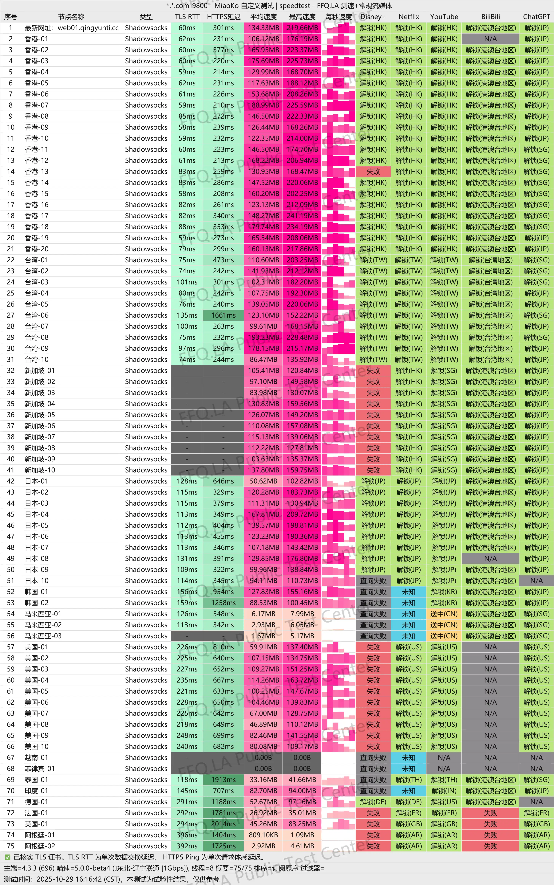

# 🚀 机场推荐｜科学上网 / 魔法上网 / 梯子实测（专注 AI 工具与流媒体）

📅 **内容最后更新：2026年04月19日**

> ℹ️ **2026-04 阶段说明：** 本文当前仍在推荐的主力机场已经恢复稳定，可正常用于 ChatGPT、Claude、GitHub Copilot、Cursor、YouTube、Netflix 等常见场景。后续如套餐价格、优惠码、最新地址或推荐顺序有变化，我会继续按实测和公开信息同步更新。
>
想长期稳定地使用 ChatGPT、Claude、GitHub Copilot、OpenAI Codex 等 AI 工具，同时又希望 YouTube、Netflix、Disney+、TikTok 看剧和刷内容都足够流畅？  
这篇文章聚焦 **机场推荐 / 科学上网 / 魔法上网 / 梯子实测**，重点面向程序员、远程办公用户、跨境业务用户和流媒体重度用户，目标不是堆概念，而是帮你更快选到真正能长期用的主力线路。

📌 本仓库由长期自费订阅多家机场的开发者维护，重点关注：

- 🤖 **AI 使用场景**：ChatGPT / Claude / GitHub Copilot / Google Gemini / OpenAI Codex 等通用 AI 工具，以及 Vibe Coding、Cursor、Claude Code 等 AI 编程助手的解锁情况与 IP 纯净度（是否原生/家宽 IP、是否容易触发风控、是否适合注册账号与长时间对话/调用 API）
- 🎬 **流媒体解锁**：YouTube / Netflix / Disney+ / TikTok 等平台的 4K 播放与多区域访问能力
- 🧪 **真实稳定性**：晚高峰速度、丢包率、封锁抗性，是否适合作为主力办公/开发线路
- 🛠 **程序员友好**：Clash / V2Ray / Trojan / Shadowrocket 等客户端的实际配置与踩坑记录

📌 **墙内访问 GitHub 太慢？**  
👉 推荐使用镜像站查看测速图与完整内容：  
🔗 [https://gptvpnhelper.com/airport-access/](https://gptvpnhelper.com/airport-access/)

---

💡 **这篇内容如果对你有帮助，建议先 Star 仓库，再收藏书签。**  
机场价格、优惠码、入口地址和推荐顺序会持续变化，后续回来看，优先以本文顶部更新时间和正文说明为准。

<a id="quick-pick"></a>

## 🔥 30 秒选机场（先看这个）

如果你不想先看长篇评测，先用下面这张表锁定 1-2 家，再去看对应段落的套餐、测速和优惠细节。

| 你的需求（点一下就走）                                  | 我建议你先选它       | 为什么（一句话）                            | 下一步                             |
| -------------------------------------------- | ------------- | ----------------------------------- | ------------------------------- |
| 🏆 **综合主力 / 稳定性优先 / 想一步到位**                 | **BoostNet**  | **自研客户端 + 三网直连 IEPL**，更省心，也更适合长期当主力 | [直接看 BoostNet 评测与入口](#boostnet) |
| 🤖 **AI 工具 / ChatGPT / Claude / Copilot 重度** | **TNTCloud**  | **IPLC 专线 + 高质量出口**，更适合长期对话、IDE 登录和开发场景 | [直接看 TNTCloud 评测与入口](#tnt)      |
| 🛍️ **TikTok / 电商 / 东南亚业务优先**                  | **唯兔云**        | **IPLC + SS2022 + 区域覆盖更广**，更适合跨境业务和多区域运营 | [直接看唯兔云评测与入口](#weituyun)         |
| 🎬 **流媒体 4K / 全家多设备 / 性价比主力**                | **小蜜蜂**       | **全 IEPL + 不限设备**，适合作为大多数用户的长期主力 | [直接看小蜜蜂评测与入口](#xiaomifeng)      |
| 🏡 **年付省心 / 家庭多设备 / 想长期低成本稳定用**               | **青云梯**       | **老牌 + 智能分流稳定**，更适合长期年付与家庭场景 | [直接看青云梯评测与入口](#qingyunti) |
| 💰 **预算优先 / 备用线 / 年付最划算**                    | **银河云**       | **年付门槛低**，做主力或备用都顺手 | [直接看银河云评测与入口](#yinheyun)        |
| 🆘 **现在完全连不上外网，先恢复连接**                       | **百变小樱（应急）**  | **三网 IEPL + 上手门槛低**，适合先恢复连接再决定要不要长期用 | [直接查看入口](#free)                 |
| 💼 **团队/办公极稳，愿意为省心付费**                       | **WgetCloud** | 重度办公场景更稳，适合对连续性要求更高的用户 | [直接看 WgetCloud 评测与入口](#wgetcloud)  |

### 📊 一眼看懂：简版对比

| 机场            | 起步价（参考）         | 设备限制  | AI/流媒体解锁 | 最适合谁          | 快捷跳转              |
| ------------- | ---------------:| ----- | -------- | ------------- | ----------------- |
| **BoostNet**  | ¥39/月起（200G/月）  | 常规 5 台 / 企业 30 台 | 多数节点解锁   | 稳定性优先的中高端主力 | [去看](#boostnet)   |
| **TNTCloud**  | ¥20/月起          | 不限    | 全解锁      | AI 工具重度用户 | [去看](#tnt)        |
| **小蜜蜂**       | ¥20/月起（年付≈¥8/月） | 不限    | 全解锁      | 流媒体 / 多设备的高性价比选择      | [去看](#xiaomifeng) |
| **唯兔云**       | ¥14.9/月起（另有¥79.9/年） | 不限    | 全解锁      | TikTok / 电商 / 多区域业务 | [去看](#weituyun)   |
| **银河云**       | ¥18/月起（年付¥98）   | 不限    | 全解锁      | 低预算主力 / 备用      | [去看](#yinheyun)   |
| **WgetCloud** | ¥79/月起          | 3-5 台 | 优质/精品更强  | 团队 / 办公 / 重度稳定    | [去看](#wgetcloud)  |
| **青云梯**       | 年付≈¥8/月（¥96/年）  | 不限    | 全解锁      | 年付省心/家庭多设备    | [去看](#qingyunti)  |
| **贝贝云**       | ¥19.9/月起        | 5 台   | 部分解锁     | 新手入门/低价备用     | [去看](#bby)        |

> 🔐 **客户端限制提醒（2026-04-19）**  
> 近期网络环境偏紧，机场整体处在更频繁的入口调整和风控阶段。`TNTCloud / 小蜜蜂 / 青云梯 / 银河云 / 唯兔云` 目前都建议直接使用机场自己的官方客户端，**暂时不要按旧教程去折腾 `Clash`、`小火箭`、`Shadowrocket`、`Sing-box` 这类通用客户端**；后续是否恢复，以各家面板公告为准。  
> `百变小樱 / BoostNet` 目前有自己的客户端，也支持 `Clash`、`Shadowrocket`、`Sing-box` 等通用客户端，按自己习惯选择即可。  
> 机场自研客户端优势是入口、协议和分流更新更快，特殊时期成功率更高、更省心；不足是自定义能力会弱一些。

> ✅ **下单前先看这 4 条**
>
> - **有官方封装客户端的机场，优先使用官方客户端。** 尤其是当前这种特殊时期，很多机场会把入口、分流规则、协议参数和线路策略都收拢进官方客户端里，实际稳定性通常比通用第三方客户端更好。
> - **TNTCloud / 小蜜蜂 / 青云梯 / 银河云 / 唯兔云 当前请直接使用官方客户端。** 这几家暂时不建议按旧教程使用 Clash、Shadowrocket、小火箭之类通用客户端。
> - **新购先从月付 / 季付开始。** 先确认你所在地区、运营商和常用节点表现，再决定要不要长期续费。
> - **福利款 / 特价包通常不参与优惠码。** 年付码和短周期码也经常分开，结算前一定看清楚。
> - **订阅链接等同“钥匙”，不要外传。** 泄露后不仅可能被他人滥用，也会影响你自己的稳定性。

> 💡 **如果你想少折腾，直接按组合选：**  
> 综合主力优先 `BoostNet + 银河云`；性价比优先 `小蜜蜂 + 青云梯`；AI 工具优先 `TNTCloud + 银河云`；跨境运营优先 `唯兔云 + TNTCloud`。

🧭 想直接看结论，跳到 [个人快速推荐清单](#person)。  
🧑‍🎓 第一次配置，先看 [3 分钟从零开始科学上网教程](#study)。  
⚠️ 想先看避坑建议，直接跳到 [购买建议与风险提醒](#risk)。

---

### 📊 这份推荐怎么做出来的？

- ✅ 从 2022 年持续到现在，长期自费测试并跟踪机场服务变化
- ✅ 对比过 **40+ 家** 主流机场，只保留适合长期使用的主力名单
- ✅ 优先看晚高峰 `20:00-22:00` 的表现，而不是只看白天跑分截图
- ✅ 重点覆盖 AI 工具、流媒体、远程办公、跨境业务等高频场景

> ⚠️ **网络环境特别说明（省墙）**  
> 如果你遇到“所有节点都不可用”，除了机场本身问题，也可能是本地网络、运营商或地区策略导致。遇到这种情况，先更新订阅、切换入口或联系机场客服确认，不要只看单个测速截图下结论。

---

## 📚 目录

0. [30 秒选机场（先看这个）](#quick-pick)
1. [按需求直接选：我的个人推荐](#person)
2. [精选机场深度评测](#top7)
3. [八大精选机场对比表格](#八大精选机场对比表格按推荐优先级排序)
4. [新手应急入口推荐](#free)
5. [新手教程：3 分钟从零开始科学上网](#study)
6. [如何挑选靠谱机场？](#choose)
7. [什么是机场？科学上网的原理与作用](#ssssr)
8. [购买建议与风险提醒](#risk)
9. [免责声明](#免责声明)
10. [机场 vs VPN：哪个好用？](#vs)
11. [常见问题 FAQ](#faq)
12. [最新国外新闻速览](#daily-check)
13. [常用网站推荐](#listweb)

---

<a id="person"></a>

## ✨ 按需求直接选：我的个人推荐

根据长期实际体验和稳定性测试，以下是我为不同需求用户精选的快速推荐：

---

### 🔥 主力推荐（适合 80% 用户）

#### 1. [**BoostNet**｜综合主力首推 · 自研客户端 · 三网直连 IEPL · 新用户 8 折](https://boostnet1.com/register?code=kKMFirlm)

- ✅ 自研客户端 + 三网直连 IEPL，日常使用更省心，线路稳定性和抗打击能力更强
- ✅ 稳定性和性价比都很能打，属于少见“不算便宜但也不离谱”的中高端专线机场
- ✅ 晚高峰看 YouTube 码率能跑到 500M+，4K 大片基本没压力，AI / 流媒体解锁也很强

> 🎁 **新用户一次性 8 折码：**`boost`（部分福利款/特价包可能不参与）｜ [👉 完整测评](https://airport.gptvpnhelper.com/boostnet/)

---

#### 2. [**TNTCloud**｜AI工具专用 · IPLC专线 · 专属长期8折](https://tanu095.tntvipaff.cc/#/register?code=7MPbfr89)

- ✅ IPLC专线，延迟<30ms，海外团队运营
- ✅ ChatGPT / Claude / Gemini 等 AI 工具解锁表现优秀（以平台风控为准）
- ✅ 流媒体全解锁，不限速不限设备

> 🎉 **本站专属长期折扣：**`Tnt80`（8 折，不适用于 30 元季付小包）｜ [👉 完整测评](https://gptvpnhelper.com/airport-access/tntcloud/)

---

#### 3. [**小蜜蜂机场**｜性价比王者 · 年付¥8/月 · 专属长期8折](https://inva.xmfaff.cc/register?aff=oClLBb5A)

- ✅ 年付¥96（≈¥8/月）全IEPL专线，不限速不限设备
- ✅ Netflix/Disney+/ChatGPT/TikTok 全解锁
- ✅ 当前阶段建议直接使用官方客户端，iOS 安装按官方指引处理

> 🎁 **专属长期 8 折码：**`TVX8JfZP`（¥96 年付小包除外）｜ [👉 完整测评](https://gptvpnhelper.com/airport-access/xmf/)

---

#### 4. [**唯兔云**｜2025 新晋 IPLC 专线 · SS2022 协议 · 新人 9 折](https://fast-v2.earthlink.cc/#/?code=5LVpl8Mh)

- ✅ 2025 年开始运营，海外团队负责运维与技术支持
- ✅ IPLC 专线 + SS2022 协议，ChatGPT / Gemini / TikTok / 流媒体解锁表现全面
- ✅ 港台日美新之外，还有东南亚五国、印度、韩国及部分欧美节点，适合跨境电商与直播运营

> 🎁 **新人 9 折码：**`rabbit`（45G 年付小包通常不参与）｜ [↓ 直接看本文评测](#weituyun)

---

#### 5. [**青云梯**｜六年老牌 · 年付¥96/60G](https://realvtest.qytvipaff.cc/register?aff=zcIlh0VY)

- ✅ 2020年运营至今（6年），企业级IPLC专线
- ✅ 全平台解锁 + 海外团队7x24维护
- ✅ 80+节点覆盖全球，真人客服在线

> 🎯 **专属优惠：** 年付及以上使用 `gptvpnhelper80` 享 8 折，月付/季付等使用 `gptvpnhelper85` 享 85 折（青云·诀 ¥96/年福利款除外）｜ [👉 完整测评](https://gptvpnhelper.com/airport-access/qingyunti/)

---

---

### 🚀 高端 & 入门推荐

#### [**WgetCloud**｜企业级稳定 · 新用户85折](https://invite.wgetcloud.ltd/auth/register?code=kVJQPh)

- 💎 99.9%在线率，自建面板，适合重度办公/游戏党
- [👉 详细测评](https://gptvpnhelper.com/airport-access/wgetcloud/)

#### [**贝贝云**｜新手入门 · ¥19.9/月起 · 95折](https://888.2beibei.com/register?code=Oa86Fbs3)

- 💸 低门槛入门之选，网页浏览/AI工具无压力
- 🎁 **95折码：**`beibei.cloud` ｜ [👉 详细测评](https://gptvpnhelper.com/airport-access/bby/)

---

> 💡 组合策略已经整合到上方「30 秒选机场」模块，想快速回看可直接跳转：[#quick-pick](#quick-pick)

---

✅ **小提醒**  
以上推荐适合不同预算和使用需求的用户参考。如果你想深入了解各大机场的测速表现、节点分布、流媒体解锁等细节，请阅读下面的「精选机场深度评测」。

---

<a id="top7"></a>

## 🏆 精选机场深度评测（2026 最新）

> 本次评测从超过 **40+ 热门机场服务商**中精挑细选，最终筛选出八款兼具稳定性、速度与性价比的优质机场。覆盖了从顶级 AI 专线、中高端省心主力、平价主力到新手入门的**四大梯度**，无论你是重度使用者还是轻量需求者，都能找到适合自己的科学-上网解决方案。

这些机场均通过实测验证，全面支持 ChatGPT、YouTube、Netflix 等主流平台访问，并具备良好的连接稳定性和流媒体解锁能力。

🧭 无论你的需求是“零故障生产环境”、还是“流媒体刷剧党”，或是“低价备用应急”，这份清单都为你准备好了对应的优选方案。

### ✅ 评测阅读结构（统一）

每家机场都按以下顺序呈现，方便横向对比：
**适合人群 / 不适合 / 核心优势 → 核心信息一览 → 套餐价格 → 推荐人群 → 优惠信息 → 测速图**。

### 💰 价格与优惠统一说明（必看）

- **福利款/特价包**通常不参与优惠码
- **年付码 / 短周期码**往往分开（看清适用周期）
- **以结算页最终价格为准**，如遇活动叠加以官方说明为准

<a id="boostnet"></a>

### 1. ⚡ BoostNet — 综合主力首推，自研客户端，三网直连 IEPL

**综合评分：9.4 / 10** 🏆 **综合主力首选**  
**关键词标签**：自研客户端 | 三网直连 IEPL | Anytls 协议 | 专线出口 | 香港 HGC 落地 | 新用户 8 折

> ✅ **3 行结论（先看这个再往下）**  
> 
> - **适合谁：** 想少折腾、直接上一条长期主力线的中高强度用户，尤其适合 AI + 流媒体 + 远程办公一起用的人  
> - **不适合：** 预算极低、只想偶尔用一下的轻度用户（更适合银河云/贝贝云等）  
> - **怎么买：** 日常主力优先 **200G/月（¥39）**；多设备优先 **400G/月（¥58）**；重度优先 **1000G/月（¥108）**｜[立即注册 BoostNet（新用户 8 折）](https://boostnet1.com/register?code=kKMFirlm)
> 
> 🧾 **优惠码怎么用（30 秒）**  
> 1）点上面的注册链接 → 选套餐/周期 → 进入结算页  
> 2）输入优惠码 `boost`（新用户一次性 8 折）  
> 3）确认折扣后再支付（福利款/特价包可能不参与，以结算页为准）

#### ✅ 适合人群 / 不适合 / 核心优势

**适合人群：** 追求稳定性、速度上限和长期省心体验的中高端用户，尤其适合经常使用 ChatGPT / Claude / Copilot、需要流媒体 4K 解锁、远程办公长时间在线的人。  
**不适合：** 只想最省钱年付、对上限不敏感的纯预算党。  
**核心优势：** 自研客户端 + 三网直连 IEPL 的组合，让它在稳定性、抗打击能力和日常使用便利度上更有优势；同时价格虽然比入门款贵一些，但整体仍在合理区间，没有贵到离谱。  
👉 想直接上车： [立即注册 BoostNet（新用户 8 折）](https://boostnet1.com/register?code=kKMFirlm)

> **BoostNet** 是一家定位偏中高端的专线机场（2024 年运营），主打广东电信/联通/移动三网直连 → IEPL 专线出口落地香港 HGC。它最大的卖点不只是速度上限高，而是“好用、稳、能长期当主力”这三点做得比较均衡。配合自研客户端，日常导入、切换节点和故障恢复都更省心；从长期使用视角看，线路稳定性和抗打击能力也更强。以 2026-03-03 这轮实测为参考，晚高峰看 YouTube 码率能跑到 500M+，4K 大片基本没压力，AI 工具与主流流媒体解锁表现也足够强。

---

#### ✅ 核心信息一览

| **评测维度**       | **详情说明**                                 |
| -------------- | ---------------------------------------- |
| **上线时间**       | 2024 年                                   |
| **协议支持**       | Anytls（以官方一键客户端为主，禁止共享他人使用）                |
| **接入方式**       | 三网直连 → IEPL 专线出口落地香港 HGC                    |
| **节点数量**       | 全球 10+ 国家/地区，40+ 节点（以实际订阅为准）               |
| **节点地区**       | 港/台/日/新/美/英/马/土/澳等（以实际订阅为准）              |
| **IPv6 支持**    | ✅ 部分节点原生 IPv6（以实际节点为准）                   |
| **流媒体解锁**      | ✅ Netflix / GPT / Disney+ 等流媒体（以实际套餐与节点为准） |
| **ChatGPT 支持** | ✅ 多地区可用，日常 AI 工具解锁表现稳定（以实测为准）            |
| **设备限制**       | 常规套餐支持 5 台同时使用；企业团队套餐支持 30 台；禁止共享他人使用 |
| **支付方式**       | 支持支付宝 / 微信，无手续费                          |
| **客户端支持**      | Windows / Mac / 安卓一键客户端                    |
| **管理系统**       | 自研客户端 + 官方服务文档（以官网当前提供方式为准）              |
| **可用区域**       | 仅限中国大陆使用，境外不可使用（以官方说明为准）                 |

---

#### 💰 套餐价格一览（按 2026-04-06 整理，以结算页为准）

| 套餐 | 价格 | 标签 | 每月流量 | 设备支持 | 手动重置 | 备注 |
| ---- | ----:| ---- | ------:| ------ | ------:| ---- |
| 每月20G流量套餐 | ¥158 / 年 | 轻度使用 | 20GB | Anytls，5 台同时使用 | ¥13.8 / 次 | 新手不懂慎拍；不做打游戏保证；禁 BT/P2P/PT；无退款 |
| 200G流量套餐 | ¥39 / 月 | 独家套餐 | 200GB | Anytls，5 台同时使用 | ¥40 / 次 | 禁 BT/P2P/PT；无退款 |
| 400G流量套餐 | ¥58 / 月 | - | 400GB | Anytls，5 台同时使用 | ¥60 / 次 | 新手不懂慎拍；不做打游戏保证；禁 BT/P2P/PT；无退款 |
| 1000G流量套餐 | ¥108 / 月 | - | 1000GB | Anytls，5 台同时使用 | ¥110 / 次 | 新手不懂慎拍；不做打游戏保证；禁 BT/P2P/PT；无退款 |
| 企业团队套餐 | ¥388 / 月 | 企业VIP套餐 | 1500GB | Anytls，30 台同时使用 | ¥388 / 次 | 新手不懂慎拍；不做打游戏保证；禁 BT/P2P/PT；无退款 |

> ✅ **统一套餐特点：** 专线出口、支持 Netflix / GPT / Disney+ 等流媒体、提供 Windows / Mac / 安卓一键客户端、全球 10+ 国家/地区与 40+ 节点。
> 
> 🔄 **流量重置规则：** 除 20G 套餐外，其余套餐均为“每月购买日免费重置流量，几号购买下个月几号过期/重置”；20G 套餐同样支持每月购买日免费重置。
> 
> ⚠️ **购买前注意：** 所有套餐均禁止共享他人使用；流量提前用完需购买流量重置包或更换账号购买；BoostNet 不提供退款服务。

> ✅ **新手默认推荐怎么买：**
> 
> - 日常主力：优先 **200G流量套餐（¥39 / 月）**
> - 多设备/偏重度：优先 **400G流量套餐（¥58 / 月）**
> - 重度：优先 **1000G流量套餐（¥108 / 月）**
> - 轻度备用：只偶尔用可选 **每月20G流量套餐（¥158 / 年）**

---

#### 🎯 推荐人群

- ✅ 想要一条“装好就能长期用”的综合主力线路用户
- ✅ 晚高峰也想稳看 YouTube 4K、刷流媒体不卡顿的人
- ✅ AI 工具日常重度使用者（ChatGPT / Claude / Copilot 等）
- ✅ 远程办公/语音会议/实时应用较多、希望线路更抗打击的人

---

#### 🎁 优惠信息（新用户）

> 📋 **优惠码：** `boost`  
> 💰 **优惠力度：** 新用户一次性 8 折（部分福利款/特价包可能不参与，以结算页为准）  
> 🔗 **立即注册：** [BoostNet（中高端 IEPL 专线）](https://boostnet1.com/register?code=kKMFirlm)  
> 📖 **完整测评：** [BoostNet 机场测评（2026-03-03 实测）](https://airport.gptvpnhelper.com/boostnet/)

---

**📷 解锁测试｜BoostNet（2026-03-03 实测）**


---

**📷 speedtest 测速｜BoostNet（2026-03-03 实测）**


---

<a id="tnt"></a>

### 2. 🔥 TNTCloud — AI工具专用，IPLC专线，海外团队运营

**综合评分：9.3 / 10** 🏆 **AI工具首选**  
**关键词标签**：IPLC专线 | Trojan协议 | 海外团队 | 不限速不限设备 | ChatGPT完美支持 | 原生IP | 专属8折

> ✅ **3 行结论（先看这个再往下）**  
> 
> - **适合谁：** ChatGPT / Claude / Copilot / Gemini 深度用户、远程办公/开发主力、对晚高峰稳定性要求高的人  
> - **不适合：** 只想“偶尔翻一下墙”、预算极低的超轻度用户  
> - **怎么买：** 轻度优先 **VIP1（110GB）**；主力优先 **VIP2（220GB）**；多设备/重度优先 **VIP3（440GB）**｜[立即注册 TNTCloud（IPLC 专线 · 专属 8 折）](https://tanu095.tntvipaff.cc/#/register?code=7MPbfr89)
> 
> 🧾 **优惠码怎么用（30 秒）**  
> 1）点上面的注册链接 → 选套餐/周期 → 进入结算页  
> 2）在「优惠码/折扣码」输入 `Tnt80`  
> 3）确认折扣后再支付（如提示不可用，多半是 30 元季付小包/福利款不参与）
>
> 🖥️ **客户端使用提醒：**  
> 近期是特殊时期，机场入口和参数调整比较频繁。TNTCloud 目前**暂时不支持** `Clash`、`Clash Meta`、`Sing-box`、`Shadowrocket` 这类通用客户端直接导入，请直接使用官网提供的官方客户端；后续是否恢复通用订阅，以面板公告为准。

#### ✅ 适合人群 / 不适合 / 核心优势

**适合人群：** 深度使用 ChatGPT / Claude / Copilot / Gemini 等 AI 工具的开发者、需要稳定生产环境的远程办公用户，以及对晚高峰速度和低延迟有要求的重度玩家。  
**不适合：** 只希望以极低价格「偶尔翻一下墙」的超轻度用户。  
**核心优势：** 海外团队运营 + 全线 IPLC 专线 + 原生 IP，高并发场景下依然能保证 AI / 流媒体 / 游戏的稳定体验。  
👉 想直接上车： [立即注册 TNTCloud（IPLC 专线 · 专属 8 折）](https://tanu095.tntvipaff.cc/#/register?code=7MPbfr89)

> **TNTCloud** 是一家成立于 2024 年的海外团队运营的专线级机场服务商，采用 Trojan 协议 + 全线 IPLC 专线通道（速度比 IEPL 更快），节点速度快、晚高峰稳定性高。**特别适合 AI 工具深度用户**（ChatGPT、Claude、Copilot、Midjourney 等），原生/高质量 IP 通常更不容易触发风控，解锁表现更稳（仍以平台策略与实际体验为准）。同时也适合流媒体重度用户、TikTok 运营者、跨境电商等场景。

---

#### ✅ 核心信息一览

| **评测维度**       | **详情说明**                                              |
| -------------- | ----------------------------------------------------- |
| **上线时间**       | 2024 年                                                |
| **协议支持**       | Trojan                                                |
| **客户端要求**      | 当前为特殊时期，需使用官方客户端；暂不支持 Clash / Clash Meta / Sing-box / Shadowrocket 等通用客户端直连 |
| **接入方式**       | IPLC 全专线传输，不限速、不限倍率                                   |
| **节点数量**       | 香港×10、台湾×10、新加坡×10、日本×10、美国×10、德国×1                   |
| **流媒体解锁**      | 支持 Netflix、Disney+、HBO、HUGO 等主流流媒体平台                  |
| **ChatGPT 支持** | 全节点均支持 ChatGPT、Gemini、Copilot、Claude 等 AI 工具          |
| **设备限制**       | 不限设备数量，支持多端同时在线                                       |
| **支付方式**       | 支持支付宝、微信、U 转账                                         |

---

#### 💰 套餐价格一览

| 套餐名称     | 流量 / 月     | 价格       | 说明            |
| -------- | ---------- | -------- | ------------- |
| 季付限量包    | 60GB × 3 月 | ¥30 / 季  | 超低月均价，轻量用户首选  |
| VIP1（轻量） | 110GB      | ¥20 / 月  | 日常上网 + 流媒体    |
| VIP2（中量） | 220GB      | ¥40 / 月  | 主力推荐，性价比高     |
| VIP3（高量） | 440GB      | ¥80 / 月  | 多设备 + 高画质视频适配 |
| VIP4（巨量） | 1100GB     | ¥160 / 月 | 重度使用者或多人共享    |
| 定制套餐     | 独享 / 定制    | ¥680 / 月 | 专线独享，支持定向功能   |

> ✅ **新手默认推荐怎么买：**  
> 
> - 轻度（只上网 + 偶尔 AI）：优先 **VIP1（110GB）**  
> - 中度（AI + 流媒体主力）：优先 **VIP2（220GB）**  
> - 多设备/重度：优先 **VIP3（440GB）** 或更高

---

#### ⭐️ 使用亮点

- 多节点 TLS RTT < 50ms，适合游戏、AI 工具调用
- 支持全球六大地区，晚高峰不降速
- 解锁能力强，TikTok / Netflix / ChatGPT 等平台在多数地区可直连使用（以当地网络与平台风控为准）

---

#### 🎯 推荐人群（重点推荐！）

**TNTCloud 特别适合以下用户：**

- 🤖 **AI 工具深度用户**（⭐⭐⭐⭐⭐ 强烈推荐）
  
  - ChatGPT、Claude、Copilot、Gemini、Midjourney 等 AI 工具解锁表现优秀（以平台风控为准）
  - 原生/高质量 IP，更不容易触发风控或验证（仍以实际为准）
  - IPLC 专线低延迟（<50ms），AI 对话响应快速

- 🎥 **流媒体重度观看者**
  
  - Netflix、Disney+、HBO、YouTube 4K 完美解锁
  - 不限速，晚高峰看 4K 视频不卡顿

- 📱 **TikTok 运营者 / 自媒体出海创作者**
  
  - 原生IP，避免账号风险
  - 支持多地区切换，方便测试不同市场

- 👨‍💻 **外贸 / 技术开发 / 远程办公人群**
  
  - 海外团队运营，线路维护与应急调整相对及时
  - 全年稳定在线，适合生产环境

📌 **为什么 AI 用户常选 TNTCloud？** 海外团队 + 原生/高质量 IP + IPLC 专线的组合，通常更稳定、更不容易触发风控；延迟低至 30–50ms，日常对话与调用体验更顺。

👉 **立即注册：** [TNTCloud（IPLC 专线 · 专属 8 折）](https://tanu095.tntvipaff.cc/#/register?code=7MPbfr89)

🎉 **本站独家长期 8 折优惠**

> 💥 **专属优惠码：** `Tnt80`（长期有效，30 元季付限量包不参与）
> 
> ⚠️ **重要说明：**
> 
> - ❌ 30 元季付小包/福利款不支持任何优惠码（系统会直接提示不可用）
> - ✅ 其他常规套餐均可使用 `Tnt80` 获得 8 折
> - 💡 结算页输入折扣码后自动生效，如提示不可用，可尝试更换套餐周期或联系官方客服

--- 

>  👉 [TNTCloud 机场详细测评,如需了解更多测速、解锁、套餐信息、使用教程请前往](https://gptvpnhelper.com/airport-access/tntcloud/)

---

**📷 测速图｜TNTCloud（2026-01-18 实测）**


---

<a id="xiaomifeng"></a>

### 3. 🔥 小蜜蜂机场 — 性价比王者，全IEPL专线，年付低至8元/月

**综合评分：9.6 / 10** 🏆 **编辑首选推荐**  
**关键词标签**：全IEPL专线 | 不限速不限设备 | 年付低至¥8/月 | 全平台解锁 | 美区ID赠送 | 专属8折

> ✅ **3 行结论（先看这个再往下）**  
> 
> - **适合谁：** 想要“买一条当主力就行”的大多数用户（AI + 流媒体都要、预算中等、设备多）  
> - **不适合：** 只想短期体验最低价、完全不确定是否长期用的人  
> - **怎么买：** 轻度可选 **¥96 年付福利款**（通常不参与优惠码）；主力优先 **工蜂极速版（240GB/月）**；重度优先 **蜂王尊享版（500GB/月）**｜[立即注册小蜜蜂（年付低至 8 元/月 · 专属 8 折）](https://inva.xmfaff.cc/register?aff=oClLBb5A)
> 
> 🧾 **优惠码怎么用（30 秒）**  
> 1）点上面的注册链接 → 选套餐/周期 → 进入结算页  
> 2）输入优惠码 `TVX8JfZP`  
> 3）确认折扣后再支付（如提示不可用，通常是你选了 ¥96 年付福利款/特价包）
>
> 🖥️ **客户端使用提醒：**  
> 近期机场环境比较敏感，小蜜蜂目前也**暂时不支持** `Clash`、`小火箭`、`Shadowrocket` 这类通用客户端订阅导入，建议直接使用机场官方客户端；iOS 端按官方当前提供的安装方案走，后续是否恢复通用客户端支持以公告为准。

#### ✅ 适合人群 / 不适合 / 核心优势

**适合人群：** 想要一条长期主力线路、预算适中、同时兼顾 AI 工具和 Netflix / Disney+ 等流媒体的 80% 普通用户。  
**不适合：** 完全不确定是否长期使用、只想短期体验最便宜线路的极端价格敏感型用户。  
**核心优势：** 全 IEPL 专线 + 不限设备 + 年付低至 ¥8/月，覆盖从日常上网到 AI / 流媒体的绝大多数场景。  
👉 想直接上车： [立即注册小蜜蜂（年付低至 8 元/月 · 专属 8 折）](https://inva.xmfaff.cc/register?aff=oClLBb5A)

> **小蜜蜂机场**是性价比最高的全IEPL专线机场之一，适合80%的用户。所有套餐不限速、不限设备，原生IP解锁全球流媒体（Netflix、Disney+、HBO等）和AI工具（ChatGPT、Copilot、Gemini），特色年付套餐低至¥8/月。当前这段特殊时期更建议直接使用官方客户端，iOS 端按官方安装指引处理。无论是日常使用、流媒体追剧还是AI工具开发，都是不二之选。

---

#### ✅ 核心信息一览

| **评测指标**       | **详情**                                                 |
| -------------- | ------------------------------------------------------ |
| **开业时间**       | 2022 年                                                 |
| **入口 / 出海**    | 深圳 → 深港 IEPL 专线                                        |
| **节点覆盖**       | 香港×10、台湾×5、日本×5、新加坡×5、美国×5、马来西亚×2、英国×2、阿根廷×2、泰国×2、巴西×2 |
| **协议支持**       | Trojan                                                 |
| **客户端要求**      | 当前为特殊时期，需使用官方客户端；暂不支持 Clash / 小火箭 / Shadowrocket 等通用客户端订阅导入 |
| **UDP 支持**     | 全节点开启 Full‑Cone UDP                                    |
| **ChatGPT 支持** | 全节点解锁，响应稳定                                             |
| **流媒体解锁**      | 支持 Netflix 全球 90+ 区、Disney+、Hulu、HBO Max 等主流平台         |
| **设备限制**       | 不限设备数                                                  |
| **支付方式**       | 支持支付宝 + 微信 + USDT                                      |

---

#### 💰 套餐价格一览

| 套餐名称            | 流量          | 价格       | 计费方式 | 特点简述                                      |
| --------------- | ----------- | -------- | ---- | ----------------------------------------- |
| 🐝 **大黄蜂特惠年度版** | 60GB/月 × 12 | ¥96      | 年付   | 每月轻度使用，年费低至 8 元/月，解锁 ChatGPT、Tiktok，稳定不掉线 |
| 🐝 **小蜜蜂畅游版**   | 120GB / 月   | ¥20 / 月  | 月付   | 适合日常通用场景，支持 AI 工具与多流媒体平台，高性价比             |
| 🛠 **工蜂极速版**    | 240GB / 月   | ¥40 / 月  | 月付   | 对速度和稳定性要求较高用户，IEPL 全专线，高峰不卡顿              |
| 👑 **蜂王尊享版**    | 500GB / 月   | ¥75 / 月  | 月付   | 中重度用户推荐，解锁所有平台，流畅看 4K 视频                  |
| 🌀 **蜂群无限版**    | 1000GB / 月  | ¥140 / 月 | 月付   | 超重度使用者首选，流量大户/办公族/AI重度工具用户推荐              |
| 📦 **备用流量包**    | 200GB（一次性）  | ¥125     | 一次性  | 不限时间使用，适合临时补充流量，应急使用场景                    |

> ✅ 所有套餐均为 **全IEPL专线**，不限速、不限设备数，支持 Netflix、Disney+、HBO、Tiktok、ChatGPT、Copilot、Midjourney 等  
> ✅ 当前阶段建议优先使用官方客户端，iOS 端按官方安装指引处理

> ✅ **新手默认推荐怎么买：**  
> 
> - 轻度：优先 **大黄蜂特惠年度版（¥96/年）**（福利款不参与优惠码，但最省钱）  
> - 中度主力：优先 **工蜂极速版（240GB）**  
> - 重度/多设备：优先 **蜂王尊享版（500GB）** 或更高

---

#### 🎯 推荐人群

- ✅ **日常上网用户**：年付¥96（¥8/月）轻松应对日常需求
- ✅ **流媒体狂热用户**：Netflix全球90+区、Disney+、HBO完美解锁
- ✅ **AI工具深度用户**：ChatGPT、Copilot、Gemini全节点可用
- ✅ **多设备家庭用户**：不限设备数，全家共享无压力
- ✅ **跨境电商/技术团队**：注册各国账号、SEO测试、广告投放
- ✅ **TikTok运营者**：原生IP，完美解锁TikTok

📌 **一句话总结**：性价比王者，全IEPL专线，年付低至8元/月，适合80%用户的主力机场。

> 👉 **立即注册：** [小蜜蜂（年付低至 8 元/月 + 专属 8 折）](https://inva.xmfaff.cc/register?aff=oClLBb5A)

#### 🎁 专属长期 8 折优惠码

> 📋 **优惠码：** `TVX8JfZP`
> 
> 💰 **优惠力度：** 全场 **8 折**（长期有效，¥96 年付福利小包除外）
> 
> ⚠️ **使用建议：**
> 
> - ❌ **大黄蜂特惠年付版（¥96/年）为福利款**，官方默认不支持任何折扣
> - 🔁 若结算页提示不可用，可尝试切换套餐周期或联系官方客服确认
> - 💡 适合错峰入手或补购流量，叠加年付/多年套餐更省，确保在支付前输入专属码

--- 

>  👉 [小蜜蜂机场详细测评,如需了解更多测速、解锁、套餐信息、使用教程请前往](https://gptvpnhelper.com/airport-access/xmf/)

---

**📷 测速图｜小蜜蜂（2026-01-18 实测）**


---

<a id="weituyun"></a>

### 4. 🐰 唯兔云 — 2025 新晋 IPLC 专线，SS2022 协议，TikTok / 电商 / AI 场景都能打

**综合评分：9.2 / 10** 🚀 **2025 新晋专线黑马**  
**关键词标签**：IPLC专线 | SS2022协议 | 海外团队 | 不限速不限设备 | ChatGPT/Gemini/TikTok 解锁 | 东南亚节点丰富 | 新人9折

> ✅ **3 行结论（先看这个再往下）**  
> 
> - **适合谁：** 想同时兼顾 ChatGPT / Gemini / Copilot、TikTok 运营、跨境电商、直播带货与多区域流媒体解锁的人  
> - **不适合：** 只想选“运营时间更久的老牌机场”、完全不愿尝试 2025 新晋线路的保守型用户  
> - **怎么买：** 轻度优先 **100GB（月付 ¥14.9）**；主力优先 **200GB（月付 ¥29.9）**；多设备/业务运营优先 **500GB（月付 ¥59.9）**｜[立即注册唯兔云（IPLC 专线 · 新人 9 折）](https://fast-v2.earthlink.cc/#/?code=5LVpl8Mh)
> 
> 🧾 **优惠码怎么用（30 秒）**  
> 1）点上面的注册链接 → 选套餐/周期 → 进入结算页  
> 2）在「优惠码/折扣码」输入 `rabbit`  
> 3）确认折扣后再支付（如提示不可用，多半是你选了 45G 年付小包/特价包）
>
> 🖥️ **客户端使用提醒：**  
> 目前是特殊时期，唯兔云暂时也**不建议使用 Clash、小火箭、Shadowrocket、Sing-box 这类通用客户端**。这家现在请直接按官网知识库提供的官方客户端与导入方式操作；旧版 Clash 内核、SSR 客户端或长期未更新的软件更不要继续折腾，以免误判线路质量。

#### ✅ 适合人群 / 不适合 / 核心优势

**适合人群：** 需要稳定跑 ChatGPT / Gemini / TikTok / Netflix，同时又重视东南亚、印度、韩国等区域节点覆盖的跨境用户，以及做电商、社媒运营、远程办公的多设备人群。  
**不适合：** 更偏向只买成熟老牌、对 2025 年新机场天然更谨慎的保守型用户。  
**核心优势：** 海外团队运营 + 全线 IPLC 专线 + SS2022 协议，加上更偏业务向的区域覆盖，适合 AI、流媒体与跨境运营场景合并使用。  
👉 想直接上车： [立即注册唯兔云（IPLC 专线 · 新人 9 折）](https://fast-v2.earthlink.cc/#/?code=5LVpl8Mh)

> **唯兔云** 是一家从 **2025 年**开始运营的海外团队机场，主打 **唯兔云 IPLC 专线 + SS2022（Shadowsocks 2022）协议**。从定位上看，它更偏向“**一条线路同时兼顾 AI 工具、流媒体和跨境业务**”的思路：除了常见的港、台、日、美、新节点外，还强调东南亚五国、印度、韩国以及部分欧美节点覆盖。套餐统一 **无倍率、不限速、不限制设备数**，支持支付宝、微信、USDT；对于 iPhone 用户，当前更建议直接联系官方获取 iOS 客户端安装指引，降低新手上手门槛。

---

#### ✅ 核心信息一览

| **评测维度**       | **详情说明** |
| -------------- | ------------------------------------------------------------ |
| **上线时间**       | 2025 年 |
| **协议支持**       | SS2022（Shadowsocks 2022） |
| **客户端要求**      | 当前为特殊时期，需使用官网知识库提供的官方客户端与导入方式；暂不建议使用 Clash / Shadowrocket / Sing-box 等通用客户端 |
| **接入方式**       | 全节点 IPLC 专线传输，无倍率、不限速 |
| **节点覆盖**       | 港 / 台 / 日 / 美 / 新五大常用地区 + 东南亚五国 + 印度 + 韩国 + 部分欧美国家（以面板实际订阅为准） |
| **测速样本**       | 本次测速图可见香港、台湾、新加坡、日本、马来西亚、美国、德国、菲律宾等多区域样本 |
| **流媒体解锁**      | 支持 Netflix、Disney+、YouTube、TikTok 等主流流媒体与短视频平台 |
| **AI 工具支持**    | 支持 ChatGPT、Gemini、Claude、Copilot 等常见 AI 工具（以平台风控为准） |
| **设备限制**       | 不限制设备数量，适合多端同时在线 |
| **支付方式**       | 支持支付宝 / 微信 / USDT |
| **售后与新手支持** | 多人客服轮班 + 海外技术团队维护；可提供当前官方客户端安装指引 |

---

#### 💰 套餐价格一览

| 套餐方案 | 流量 / 月 | 月付 | 季付 | 年付 | 说明 |
| -------- | -------- | ---- | ---- | ---- | ---- |
| 轻量年付小包 | 45GB | - | - | ¥79.9 | 折合月均约 ¥6.7；年付小包通常不参与优惠码 |
| 标准版 | 100GB | ¥14.9 | ¥40.9 | ¥142.9 | 轻度日常 / AI / 流媒体入门首选 |
| 进阶版 | 200GB | ¥29.9 | ¥80.9 | ¥286.9 | 主力推荐，适合 AI + 流媒体 + 日常办公 |
| 高流量版 | 500GB | ¥59.9 | ¥161.9 | ¥547.9 | 多设备 / 4K / TikTok 运营更舒服 |
| 重度版 | 1000GB | ¥119.9 | ¥323.9 | ¥1150.9 | 多人协作、直播运营、重度流量用户 |
| 不限时流量包 | 500GB | - | - | 首次 ¥340 | 不限时包，后续续费 9 折，适合补流量或备用 |

> ✅ **新手默认推荐怎么买：**  
> 
> - 只是先试水：优先 **100GB 月付（¥14.9）**
> - 想买一条当主力：优先 **200GB 月付（¥29.9）**
> - 多设备 / TikTok / 电商运营：优先 **500GB 月付（¥59.9）**
> - 只想留一包长期备用流量：可看 **不限时 500GB**

---

#### ⭐️ 实测亮点

- 测速图里 **香港节点**整体排在最前，**RTT 大约 19ms-29ms**，多条线路平均速度在 **80MB/s-102MB/s** 区间，峰值普遍接近或超过 **100MB/s**
- **台湾 / 新加坡 / 美国**也有多条可用样本，适合兼顾流媒体解锁、AI 工具和跨区业务访问；测速图里还能看到 **德国、菲律宾**等补充区域
- 线路和协议都比较新，配合 **IPLC + SS2022**，更适合当前高压环境下希望兼顾稳定性与抗打能力的用户

---

#### 🎯 推荐人群（重点推荐！）

**唯兔云特别适合以下用户：**

- 🤖 **AI 工具日常主力用户**
  
  - ChatGPT、Gemini、Claude、Copilot 等常见 AI 工具都能覆盖
  - 香港节点延迟低，日常对话、联网查询、AI 编程调用体验更顺
  - 当前建议直接使用官网知识库提供的官方客户端，避免因为通用客户端被临时限制而误判线路质量

- 🛍️ **TikTok / 跨境电商 / 直播运营用户**
  
  - 节点覆盖不只盯着港日美新，还更强调东南亚、印度、韩国等业务地区
  - 适合做店铺后台、广告投放、短视频运营与多区域环境测试

- 🎬 **流媒体和短视频用户**
  
  - Netflix、Disney+、YouTube、TikTok 等主流平台都在支持范围内
  - 无倍率、不限速，看 4K 和长时间刷视频更省心

- 📱 **多设备家庭 / 宿舍 / 办公用户**
  
  - 不限制设备数，电脑、手机、平板可以同时在线使用
  - iPhone 用户如果没有外区账号，当前更建议直接联系官方获取 iOS 客户端安装指引

📌 **一句话总结：** 如果你想要一条“既能跑 AI，又能做 TikTok / 电商，还想要东南亚与业务地区节点更全”的专线机场，唯兔云是当前这批新晋线路里值得优先看的选择。

> 👉 **立即注册：** [唯兔云（IPLC 专线 · 新人 9 折）](https://fast-v2.earthlink.cc/#/?code=5LVpl8Mh)

#### 🎁 新人 9 折优惠码

> 📋 **优惠码：** `rabbit`
> 
> 💰 **优惠力度：** 新人 **9 折**（45G 年付小包通常不参与，以结算页为准）
> 
> ⚠️ **使用建议：**
> 
> - ❌ **45G 年付小包（¥79.9/年）**通常不参与优惠码，适合只想压低长期成本的超轻度用户
> - ✅ 100G / 200G / 500G / 1000G 等常规套餐更适合使用 `rabbit`
> - 💡 付款前手动输入折扣码，确认最终结算金额后再支付

---

> ℹ️ **说明：** 唯兔云暂时没有单独详细测评页，当前先以本文这部分作为首发评测；后续如果补充单独页面，会在这里同步更新。

---

**📷 测速图｜唯兔云（2026-04 测速图）**


---

<a id="qingyunti"></a>

### 5. 🌤 青云梯 — 六年实力老牌，性价比 IPLC 专线，年付¥8/月

**综合评分：9.4 / 10** 🔥 **性价比拉满的实力一线**  
**关键词标签**：六年老牌 | 企业级IPLC专线 | 智能负载均衡 | 年付¥96 | 80+全球节点 | 真人客服

> ✅ **3 行结论（先看这个再往下）**  
> 
> - **适合谁：** 想长期稳定、省心年付、多设备全家用；同时希望 AI/流媒体都能用的人  
> - **不适合：** 完全不愿意年付、只想短期试水的用户  
> - **怎么买：** 轻度/备用优先 **青云·诀（¥96/年）**（福利款通常不参与优惠码）；中度主力优先 **VIP1（150GB/月）**；多设备/重度优先 **VIP2（300GB/月）**｜[立即注册青云梯（年付 ¥96 / 60G）](https://realvtest.qytvipaff.cc/register?aff=zcIlh0VY)
> 
> 🧾 **优惠码怎么用（30 秒）**  
> 1）点上面的注册链接 → 选套餐/周期 → 进入结算页  
> 2）**年付及以上**输入 `gptvpnhelper80`（8 折）；**月付/季付/半年付**输入 `gptvpnhelper85`（85 折）  
> 3）确认折扣后再支付（如提示不可用，通常是你选了青云·诀福利款）
>
> 🖥️ **客户端使用提醒：**  
> 当前是特殊时期，青云梯也建议直接使用机场官方客户端。`Clash`、`Shadowrocket`、`V2rayN`、`Stash` 这类通用客户端的旧订阅方案目前不要继续当主方案使用，后续是否恢复以官方公告为准。

#### ✅ 适合人群 / 不适合 / 核心优势

**适合人群：** 希望长期稳定、又想把月均成本压到个位数的用户，以及需要多设备共享、全年无脑续费的家庭 / 团队。  
**不适合：** 完全不愿意年付、只想短期试水且对长期稳定性要求不高的用户。  
**核心优势：** 六年老牌 + 企业级 IPLC 专线 + 智能负载均衡，年付 ¥96 起即享专线体验，新手也能无脑使用。  
👉 想直接上车： [立即注册青云梯（年付 ¥96 / 60G）](https://realvtest.qytvipaff.cc/register?aff=zcIlh0VY)

> **青云梯** 成立于 2020 年 11 月，是一家专注性价比的实力派老牌机场。采用 **企业级 IPLC 专线 + 智能负载均衡技术**（根据用户本地网络自动分配最优入口和线路），全线 Shadowsocks 协议，三网优化。拥有覆盖全球 17+ 地区的 **80+ 专线节点**，全平台解锁 Netflix / Disney+ / ChatGPT / Gemini / TikTok。**年付套餐低至 ¥96/年（每月仅 ¥8）**，海外团队 7x24 专业运营，真人客服实时在线；当前这段特殊时期更建议直接使用官方客户端，新手也更省心。

---

| **评测维度**       | **详情说明**                                                                     |
| -------------- | ---------------------------------------------------------------------------- |
| **开业时间**       | 2020.11.1（稳定运营 6 年+，实力老牌）                                                    |
| **协议支持**       | Shadowsocks（SS）                                                              |
| **接入方式**       | 企业级 IPLC 专线，三网优化，智能负载均衡（自动分配最优线路）                                            |
| **节点覆盖**       | 80+ 全专线节点，覆盖香港、台湾、日本、新加坡、马来西亚、美国、韩国、泰国、印尼、菲律宾、越南、英国、德国、法国、土耳其、巴西、阿根廷等 17+ 地区 |
| **流媒体解锁**      | 全节点解锁 Netflix / Disney+ / HBO Max / HBO Go / YouTube Premium 等，晚高峰不限速 4K 秒开  |
| **ChatGPT 支持** | 全节点解锁 ChatGPT / Gemini / Claude 等 AI 工具，TikTok 全球短视频 + 直播环境可用                |
| **设备限制**       | 不限系统，支持多设备同时使用                                                               |
| **客户端要求**      | 当前为特殊时期，需使用官方客户端；暂不建议继续使用 Clash / Shadowrocket / V2rayN 等通用客户端作为主方案 |
| **售后服务**       | 真人客服实时在线，为新手用户排忧解难                                                           |
| **支付方式**       | 支持支付宝 / 微信 / USDT                                                            |

---

**📦 套餐价格一览**

| 套餐方案     | 流量配额     | 月付价格 | 季付价格 | 年付价格             | 性价比推荐       |
| -------- | -------- | ---- | ---- | ---------------- | ----------- |
| **青云·诀** | 每月 60GB  | -    | -    | **¥96/年（≈¥8/月）** | ⭐⭐⭐⭐⭐ 超高性价比 |
| 青云·VIP1  | 每月 150GB | ¥25  | ¥67  | ¥240（≈¥20/月）     | ⭐⭐⭐⭐        |
| 青云·VIP2  | 每月 300GB | ¥45  | ¥121 | ¥432（≈¥36/月）     | ⭐⭐⭐⭐        |
| 青云·VIP3  | 每月 600GB | ¥85  | ¥229 | ¥916（≈¥76/月）     | ⭐⭐⭐         |

**💡 套餐选择建议：**

- 🌟 **青云·诀（¥96/年）**：轻度用户/备用机场首选，每月 60GB 够日常使用
- 🔥 **VIP1（¥240/年）**：中度用户最佳选择，150GB 流量覆盖办公 + 娱乐
- 💼 **VIP2/VIP3**：重度用户/多设备共享，支持企业级定制线路

> ✅ **新手默认推荐怎么买：**  
> 
> - 轻度/备用：优先 **青云·诀（¥96/年）**  
> - 中度主力：优先 **VIP1（150GB/月）**  
> - 多设备/重度：优先 **VIP2（300GB/月）**

---

**🌐 核心技术亮点**

✅ **智能负载均衡** - 根据用户本地实际网络环境，自动分配最适合的入口和线路，确保最优连接速度  
✅ **全线 IPLC 专线** - 企业级国际专线，三网优化，晚高峰不限速，4K 视频秒开  
✅ **80+ 全球节点** - 覆盖亚洲、欧洲、美洲 17+ 地区，全节点专线接入  
✅ **全平台解锁** - Netflix / Disney+ / HBO Max / ChatGPT / Gemini / TikTok 等全解锁  
✅ **海外团队运营** - 专业 7x24 全天候维护，真人客服实时在线  
✅ **新手友好** - 当前以官方客户端为主，按官方教程连接更省心

---

**🎯 推荐人群**

- ✅ **年付省心用户** - 追求性价比，每月 ¥8 享受专线品质
- ✅ **AI 工具重度用户** - ChatGPT / Gemini / Claude 等 AI 工具全节点解锁
- ✅ **流媒体爱好者** - Netflix / Disney+ / HBO 4K 秒开，晚高峰不卡顿
- ✅ **TikTok 运营者** - 全球短视频 + 直播环境完美支持
- ✅ **跨境办公人群** - 企业级 IPLC 专线，稳定可靠
- ✅ **新手入门** - 真人客服在线指导，支持主流客户端

> 👉 **立即注册：** [青云梯（年付¥96/60G）](https://realvtest.qytvipaff.cc/register?aff=zcIlh0VY)

🎯 **专属长期折扣（8 折 / 85 折）**

> 💥 **年付及以上套餐：** 使用 `gptvpnhelper80` 享 8 折优惠（适用于 VIP1+、多年付套餐；青云·诀 ¥96/年福利款不参与）
> 
> 🎁 **月付 / 季付等短周期套餐：** 使用 `gptvpnhelper85` 享 85 折（同样不含青云·诀福利款）
> 
> ⚠️ **使用提示：**
> 
> - ❌ 青云·诀（¥96/年）为福利款，不参与任何专属优惠码
> - ✅ 结算页输入对应优惠码即可折扣，可与站内活动叠加
> - 📣 如遇提示不可用，可尝试切换套餐周期、刷新页面或咨询真人客服

--- 

>  👉 [青云梯 机场详细测评,如需了解更多测速、解锁、套餐信息、使用教程请前往](https://gptvpnhelper.com/airport-access/qingyunti/)

---

**📷 测速图｜青云梯**



---

<a id="yhy"></a>
<a id="yinheyun"></a>

### 6. 🌌 银河云 Galaxy — 年付爆款¥98，Trojan专线，节点丰富

**综合评分：9 / 10** 💰 **年付性价比之王**  
**关键词标签**：Trojan协议 | IEPL专线 | 年付¥98起 | 不限速不限设备 | 支持退款 | 全球节点 | 最高8折优惠

> ✅ **3 行结论（先看这个再往下）**  
> 
> - **适合谁：** 预算优先、想要“年付一条够用”的长期用户；也适合做主力 + 备用的低成本组合  
> - **不适合：** 对线路极致苛刻、需要企业级 SLA 的顶级刚需用户（这类更建议 WgetCloud / TNTCloud / BoostNet）  
> - **怎么买：** 极低预算长期可选 **年付轻量包（¥98/年）**（福利款通常不参与优惠码）；中度主力优先 **行星套餐（200GB/月）**；重度优先 **恒星套餐（400GB/月）**｜[立即注册银河云（年付 ¥98 起 · 专属折扣码）](https://inv03.galaxyaff.cc/register?aff=tcOd0ob7)
> 
> 🧾 **优惠码怎么用（30 秒）**  
> 1）点上面的注册链接 → 选套餐/周期 → 进入结算页  
> 2）**月付/季付/半年付**输入 `gptvpnhelper85`（85 折）；**年付及以上**输入 `gptvpnhelper80`（8 折）  
> 3）确认折扣后再支付（如提示不可用，通常是你选了 ¥98 年付轻量包福利款）
>
> 🖥️ **客户端使用提醒：**  
> 银河云当前也处于“优先官方客户端”的阶段。因为近期机场被严打、入口收得更紧，`Clash`、`Shadowrocket`、`Sing-box` 这类通用客户端暂时不要作为主方案，直接按官方客户端教程操作更稳。

#### ✅ 适合人群 / 不适合 / 核心优势

**适合人群：** 预算有限但又希望长期稳定使用科学上网服务的用户，以及需要多设备共享、全家/多人一起使用的场景。  
**不适合：** 对线路极致苛刻、愿意为企业级 SLA 支付更高价格的顶级刚需用户（这类更建议 WgetCloud / TNTCloud / BoostNet）。  
**核心优势：** 年付 ¥98 起即可享受 Trojan + IEPL 专线、全球丰富节点和不限设备数，是「低预算人群」中长期使用的首选方案之一。  
👉 想直接上车： [立即注册银河云（年付 ¥98 起 · 专属折扣码）](https://inv03.galaxyaff.cc/register?aff=tcOd0ob7)

> **银河云 Galaxy** 是预算有限用户的最佳选择！由新加坡团队运营，采用 Trojan 协议 + IEPL 专线传输，**年付套餐低至¥98/年（每月不到10元）**，是专线机场中性价比最高的选择之一。拥有超强稳定性和全球丰富节点覆盖，不限设备数。当前这段特殊时期更建议直接使用官方客户端，无论你是日常上网、AI工具使用、流媒体观看，还是跨境远程办公，都更省心。

---

#### ✅ 核心信息一览

| **评测维度**       | **详情说明**                                                           |
| -------------- | ------------------------------------------------------------------ |
| **上线时间**       | 2023 年 6 月                                                         |
| **协议支持**       | Trojan                                                             |
| **客户端要求**      | 当前为特殊时期，需使用官方客户端；暂不建议使用 Clash / Meta / Sing-box / Shadowrocket 等通用客户端 |
| **接入方式**       | 全线路 IEPL 专线，低延迟高稳定                                                 |
| **节点分布**       | 香港×10、台湾×5、新加坡×5、日本×5、美国×5、马来西亚×2、越南×2、菲律宾×2、泰国×2、英国×2、阿根廷×2、土耳其×2 |
| **流媒体解锁**      | 支持 Netflix、Disney+、YouTube 4K、TikTok 等全平台                          |
| **ChatGPT 支持** | 所有节点均可直连使用 ChatGPT / Copilot / Gemini / Claude                     |
| **设备限制**       | 不限设备数量，支持家庭共享                                                      |
| **支付方式**       | 支持支付宝、微信、USDT（USDT / VX 请联系官网客服）                                   |

---

#### 💰 套餐价格一览

| 套餐名称    | 流量 / 月 | 月付   | 季付   | 半年付  | 年付    | 两年付   | 三年付       |
| ------- | ------ | ---- | ---- | ---- | ----- | ----- | --------- |
| 年付轻量包   | 50GB   | -    | -    | -    | ¥98   | -     | -         |
| 星尘套餐    | 100GB  | ¥18  | ¥49  | ¥92  | ¥173  | ¥302  | ¥389      |
| 行星套餐    | 200GB  | ¥35  | ¥95  | ¥179 | ¥336  | ¥588  | ¥756      |
| 恒星套餐    | 400GB  | ¥70  | ¥189 | ¥357 | ¥672  | ¥1176 | ¥1512     |
| 星系套餐    | 800GB  | ¥140 | ¥378 | ¥714 | ¥1344 | ¥2352 | ¥3024     |
| 永久不限时套餐 | 1000GB | -    | -    | -    | -     | -     | ¥680（一次性） |

> ✅ **新手默认推荐怎么买：**  
> 
> - 极低预算长期：直接 **年付轻量包（¥98/年）**（福利款不参与优惠码，但已经是最低价）  
> - 中度主力：优先 **行星套餐（200GB/月）**  
> - 重度：优先 **恒星套餐（400GB/月）**

---

#### ⭐️ 使用亮点

- 所有节点皆采用 Trojan 专线，晚高峰也能流畅观看 YouTube 4K
- 超快带宽，多端同时在线依然稳定
- 流媒体 / AI 工具 / TikTok 解锁率极高
- 支持退款，客服响应迅速（1 小时内修复节点问题）
- 年付套餐极致性价比，适合长期主力使用

---

#### 🎯 推荐人群（年付性价比之王！）

**银河云特别适合以下用户：**

- 💰 **预算有限的长期用户**（⭐⭐⭐⭐⭐ 强烈推荐）
  
  - 年付仅¥98（福利款默认不参与优惠码，依然是最划算的专线套餐）
  - 享受专线品质，比机场中转快10倍
  - 长期稳定，可搭配 `gptvpnhelper80/85` 在其他套餐上折上折

- 👨‍👩‍👧‍👦 **多设备家庭用户**
  
  - 不限设备数，全家共享无压力
  - 支持路由器配置，全屋设备自动翻墙

- 🎓 **学生党 / 初入职场**
  
  - 价格友好，每天不到3毛钱
  - ChatGPT、YouTube、Netflix 全解锁

- 🤖 **AI 工具日常用户**
  
  - ChatGPT、Copilot、Gemini 全节点可用
  - Trojan 协议稳定性好，不易掉线

- 🎥 **流媒体观影爱好者**
  
  - 油管 4K、Netflix、Disney+ 完美解锁
  - 不限速，晚高峰流畅观看

📌 **为什么选银河云年付？** 年付¥98就能享受全IEPL专线，相当于每天只需0.27元，比一杯奶茶还便宜，却能全年稳定访问全球网络。

> 👉 **立即注册：** [银河云（年付¥98起 + 专属折扣码）](https://inv03.galaxyaff.cc/register?aff=tcOd0ob7)

🎁 **专属优惠码（分阶梯）**

> 📋 **优惠码（月付/季付/半年付）：** `gptvpnhelper85`
> 
> 💰 **优惠力度：** **85 折**（长期有效）
> 
> ---
> 
> 📋 **优惠码（年付及以上）：** `gptvpnhelper80`
> 
> 💰 **优惠力度：** **8 折**，最高可折合 **4.8 折**（长期有效）
> 
> ---
> 
> ⚠️ **重要说明：**
> 
> - ❌ **银河云年付轻量包（¥98/年）为福利款，不参与优惠活动**（该套餐已是厂商最低价，无法再享优惠码折扣）
> - ✅ 月付、季付、半年付套餐使用 `gptvpnhelper85` 享85折
> - ✅ 年付、两年付、三年付套餐使用 `gptvpnhelper80` 享8折

---

>  👉 [Galaxy 银河云 机场详细测评,如需了解更多测速、解锁、套餐信息、使用教程请前往](https://gptvpnhelper.com/airport-access/yinheyun/)

**📷 测速图｜银河云（2026-01-18 实测）**


---

<a id="wgetcloud"></a>

### 7. 💎 WgetCloud — 企业级稳定首选，团队/办公高端主力

**综合评分：9.5 / 10**  
**推荐标签**：企业级稳定  
**关键词标签**：广州IEPL专线 | 自研控制面板 | 99.9%在线率 | 多线路动态分组 | 邮件流量提醒

> ✅ **3 行结论（先看这个再往下）**  
> 
> - **适合谁：** 团队/办公/内容创作等“稳定性第一”的重度场景用户  
> - **不适合：** 月预算 < ¥70、只是日常浏览 + 轻度 AI/流媒体的用户（性价比更推荐小蜜蜂/银河云）  
> - **怎么买：** 先用 **基础专线服务（月付）** 跑 1 个月验证稳定性；更看重 AI、更多在线 IP 或更强保障，再升 **优质专线服务 / 精品专线服务**｜[立即注册 WgetCloud（新用户 85 折）](https://invite.wgetcloud.ltd/auth/register?code=kVJQPh)
> 
> 🧾 **折扣怎么用（30 秒）**  
> 1）点上面的注册链接 → 选套餐/周期 → 进入结算页  
> 2）新用户注册后通常可获得 **85 折券**，以下单页最终显示为准  
> 3）确认结算价后再支付（如未显示折扣，刷新页面或联系官方客服）
> 
> 📌 **套餐价格更新时间：** 2026-03-11（按官网最新月付 / 季付 / 年付页面整理）

#### ✅ 适合人群 / 不适合 / 核心优势

**适合人群：** 对稳定性和在线率有刚性要求的企业用户、远程团队、专业内容创作者，以及愿意为「更少故障、更好售后」付费的重度用户。  
**不适合：** 月预算 < ¥70、主要只是日常浏览和轻度 AI / 流媒体的用户（这类选择小蜜蜂 / 银河云性价比更高）。  
**核心优势：** 99.9% 在线率 + 自研控制面板 + 广州 BGP 接入 + IEPL 专线传输，为高价值工作场景提供更接近企业级的网络体验。  
👉 想直接上车： [立即注册 WgetCloud（新用户 85 折）](https://invite.wgetcloud.ltd/auth/register?code=kVJQPh)

> **WgetCloud**（原名GaCloud）是一家成立于2021年的高端全球加速服务提供商，聚焦"稳定、速度、安全"三位一体的企业级体验。采用多线BGP中转和双程CN2优质线路，在香港设有自建机房，确保高峰期稳定连接。适合对服务质量有严苛要求的重度用户、团队办公和内容创作者。

---

#### ✅ 核心信息一览

| 指标          | 数据说明                                                |
| ----------- | --------------------------------------------------- |
| **成立时间**    | 2021 年                                              |
| **接入线路**    | 广州 BGP 接入 → IEPL 专线传输                               |
| **节点覆盖**    | 基础 / 优质档提供 15 个主力节点；精品档覆盖全球五大洲 29 节点                |
| **协议支持**    | Trojan（主协议）+ Shadowsocks（兼容路由器使用）                   |
| **UDP 支持**  | 全节点开启 Full-Cone UDP，适配游戏/实时通话                       |
| **流媒体解锁**   | 基础档解锁主流流媒体；优质 / 精品档支持全球流媒体 + AI                     |
| **ChatGPT** | 更推荐优质 / 精品档用于 ChatGPT、Claude、Copilot、Cursor 等 AI 工具 |
| **设备限制**    | 按套餐区分为 3 / 4 / 5 个在线 IP，分别对应基础 / 优质 / 精品档           |
| **售后服务**    | 支持工单系统和邮件响应，平均回复时间 1-3 小时                           |

---

#### 💰 套餐价格一览（2026-03-11 更新）

| 套餐名称   | 月付套餐        | 季付套餐         | 年付套餐         |
| ------ | ----------- | ------------ | ------------ |
| 基础专线服务 | ¥79 / 160GB | ¥225 / 230GB | ¥758 / 280GB |
| 优质专线服务 | ¥89 / 180GB | ¥253 / 250GB | ¥854 / 320GB |
| 精品专线服务 | ¥99 / 200GB | ¥281 / 270GB | ¥950 / 360GB |

> ✅ **新手默认推荐怎么买：**  
> 
> - 这是偏高端方案：大多数人从 **基础专线服务（月付）** 先用 1 个月体验稳定性就够  
> - 如果你经常远程会议、AI 重度使用、多人协作：优先看 **优质专线服务**；对全球节点覆盖和 SLA 保障有要求再上 **精品专线服务**
> 
> ℹ️ **档位差异速读：** 基础 / 优质 / 精品三档峰值带宽分别为 **200Mbps / 300Mbps / 500Mbps**；在线 IP 分别为 **3 / 4 / 5**；优质和精品支持智能负载均衡，精品额外提供 **全球五大洲 29 节点** 与 **SLA 专线高可用**。

---

#### 🎯 推荐人群

**适合以下高端用户群体：**

⚠️ **注意：WgetCloud 价格较高（¥79/月起），更适合以下特定场景用户：**

- 💼 **企业级稳定需求**
  
  - 需要 99.9% 在线率保障
  - 团队远程协作/运营办公
  - 对全年 24×7 无故障运行有严苛要求

- 🎬 **专业内容创作者**
  
  - 视频剪辑/后期制作工作室
  - 需要上传大文件到海外平台
  - 对网络质量要求极高

- 🎮 **游戏加速需求**
  
  - Full-Cone UDP 支持
  - 低延迟（30-50ms）
  - 适合《英雄联盟》等游戏加速

💡 **预算建议**：

- 如果你月预算 < ¥70，建议选择小蜜蜂或银河云
- 如果你更看重综合稳定性、抗打击能力和长期主力体验，建议优先选择 BoostNet
- 如果你需要 AI 工具专用，建议选择 TNTCloud
- 只有追求极致稳定性的企业/团队用户，才推荐 WgetCloud

📌 **一句话总结**：企业级旗舰，价格较高但稳定性极佳，是追求 99.9% 在线率与高质量售后的高端用户首选之一。

#### 💡 新用户优惠

> 💰 **新用户优惠：** 新用户注册后通常可获得 **85 折券**
> 
> 📌 **使用说明：** 以下单页最终显示为准，如未自动生效可刷新页面或联系官方客服确认

--- 

>  👉 [WgetCloud 机场详细测评，如需了解更多测速、解锁、套餐信息、使用教程请前往](https://gptvpnhelper.com/airport-access/wgetcloud/)

---

**📷 测速图｜WgetCloud（2026-01-18 实测）**


---

<a id="bby"></a>

### 8. 💸 贝贝云 — 低价入门之选，月付¥19.9起，江苏入口

**综合评分：8.4 / 10**  
**推荐标签**：入门首选  
**关键词标签**：月付低至 ¥19.9｜江苏隧道接入｜Telegram 社群活跃｜95 折优惠码

> ✅ **3 行结论（先看这个再往下）**  
> 
> - **适合谁：** 新手入门、预算有限、日常浏览/查资料 + 轻度 ChatGPT/YouTube/Netflix 的用户；也适合做备用线  
> - **不适合：** 晚高峰极致速度、长期大流量下载、超低延迟有刚需的重度用户  
> - **怎么买：** 入门/备用优先 **100G/月**；日常主力优先 **200G/月**；偏重度可选 **300G/月 或 500G/月**｜[立即注册贝贝云（月付 ¥19.9 起 · 95 折优惠码）](https://888.2beibei.com/register?code=Oa86Fbs3)
> 
> 🧾 **优惠码怎么用（30 秒）**  
> 1）点上面的注册链接 → 选套餐/周期 → 进入结算页  
> 2）输入优惠码 `beibei.cloud`  
> 3）确认折扣后再支付（如提示不可用，尝试更换周期或联系官方客服）

#### ✅ 适合人群 / 不适合 / 核心优势

**适合人群：** 预算有限、主要用来日常浏览网站、查资料、轻度使用 ChatGPT / YouTube / Netflix 的新手和轻度用户。  
**不适合：** 对晚高峰速度、长时间高并发下载或极致低延迟有刚性要求的重度用户。  
**核心优势：** 月付 ¥19.9 起、入口在江苏隧道中转，性价比高、上手门槛低，非常适合作为「入门 / 备用」梯子。  
👉 想直接上车： [立即注册贝贝云（月付 ¥19.9 起 · 95 折优惠码）](https://888.2beibei.com/register?code=Oa86Fbs3)

> 贝贝云是一款入门友好的高性价比机场，主打“低门槛 + 可用性稳定”，适合轻度使用者和日常访问 ChatGPT、YouTube、Netflix 等常规场景。官方 TG 群活跃，响应及时，适合新手入坑。

---

| **评测维度**       | **详情说明**                           |
| -------------- | ---------------------------------- |
| **开业时间**       | 2022 年                             |
| **入口方式**       | 江苏隧道接入 + 中转备用                      |
| **节点数量**       | 30+（香港、日本、新加坡、美国、英国、马来西亚、土耳其、阿根廷等） |
| **协议支持**       | Shadowsocks                        |
| **流媒体解锁**      | Netflix 港/美/日区，Disney+ US 4K 全绿    |
| **ChatGPT 支持** | 全解锁，建议优先使用 JP / SG 节点，HK 节点偶有限流    |
| **设备限制**       | 默认 5 台设备同时在线                       |
| **支付方式**       | 支持支付宝 / 微信                         |

---

**📦 套餐价格一览**

| 套餐方案    | 内容说明       | 月付价格      |
| ------- | ---------- | ---------:|
| 100G/月  | 100GB / 月  | ¥19.9 / 月 |
| 200G/月  | 200GB / 月  | ¥29.9 / 月 |
| 300G/月  | 300GB / 月  | ¥39.9 / 月 |
| 500G/月  | 500GB / 月  | ¥59.9 / 月 |
| 1000G/月 | 1000GB / 月 | ¥89.9 / 月 |

> ✅ **新手默认推荐怎么买：**  
> 
> - 轻度/备用：优先 **100G/月（100GB/月）**  
> - 日常主力：优先 **200G/月（200GB/月）**  
> - 重度：优先 **300G/月 或 500G/月**  
> - 超重度：优先 **1000G/月（1000GB/月）**

---

**🎯 推荐人群**

- 预算有限但需要稳定访问外网的用户
- 科学-上网新手 & 小白友好入门方案
- 日常 ChatGPT / Netflix / 邮箱收发等轻度应用者

> 👉 **立即注册：** [贝贝云（新手入门 ¥19.9/月起）](https://888.2beibei.com/register?code=Oa86Fbs3)

🎁 **新手专属 95 折优惠码**

> 📋 **优惠码：** `beibei.cloud`
> 
> 💰 **优惠力度：** 全场 **95 折**（长期有效）

--- 

>  👉 [贝贝云 机场详细测评,如需了解更多测速、解锁、套餐信息、使用教程请前往](https://gptvpnhelper.com/airport-access/bby/)

---

**📷 测速图｜贝贝云（2026-01-18 实测）**


---

## 📊 八大精选机场对比表格（按推荐优先级排序）

| 推荐  | 机场名称          | 协议          | 接入方式       | 起始价格         | AI 友好度       | 流媒体友好度     | 设备限制  | 推荐人群       |
| --- | ------------- | ----------- | ---------- | ------------ | ------------ | ---------- | ----- | ---------- |
| 🥇  | **BoostNet**  | Anytls | 三网直连 IEPL  | ¥39起（200G/月） | 强（多数节点可用）    | 强（多数节点解锁）  | 常规 5 台 / 企业 30 台 | 🏆 综合主力首推 |
| 🥇  | **小蜜蜂**       | Trojan      | 深港 IEPL 专线 | ¥20起（年付¥8/月） | 强（全解锁）       | 强（全解锁）     | 不限    | 🔥 性价比王者   |
| 🥇  | **TNTCloud**  | Trojan      | IPLC 全专线   | ¥20起         | 强（原生/高质量 IP） | 强（全解锁）     | 不限    | 🔥 AI工具专用  |
| 🥇  | **唯兔云**       | SS2022      | IPLC 全专线   | ¥14.9起（另有¥79.9/年） | 强（全解锁）       | 强（全解锁）     | 不限    | 🐰 电商 / TikTok / 多区域业务 |
| 🥇  | **WgetCloud** | Trojan/SS   | BGP+IEPL   | ¥79起      | 强（优质/精品更强） | 强（优质/精品更强） | 3-5台  | 💼 高端稳定首选 |
| 🥈  | **银河云**       | Trojan      | IEPL 专线    | ¥18起（年付¥98）  | 强（全解锁）       | 强（全解锁）     | 不限    | 💰 年付爆款    |
| 🥉  | **青云梯**       | Shadowsocks | IPLC 专线    | ¥8/月（年付¥96）  | 强（全解锁）       | 强（全解锁）     | 不限    | 🌤 年付省心    |
| 🥉  | **贝贝云**       | Shadowsocks | 江苏隧道       | ¥19.9起       | 中（部分解锁）      | 中（部分解锁）    | 5台    | 👶 新手      |

**💡 推荐等级：** 🥇 编辑首选（综合评分 9.5+）｜🥈 优质推荐（综合评分 9.0+）｜🥉 特定场景  
想看更具体的「场景 → 首选 + 备选 + 预算」搭配，可以直接回到上面的 [个人快速推荐清单](#person)。

<a id="free"></a>

## 🌸 新手应急入口推荐：百变小樱 —— 三网 IEPL 稳定实用科学上网方案

### 🚀 无法访问 ChatGPT、YouTube、GitHub？先用百变小樱恢复基础联网

如果你当前处于**完全无法翻墙**的状态 —— 无法打开 ChatGPT、YouTube、Google、GitHub 或 VPN 官网，那么 **百变小樱** 依然是一条值得优先考虑的起步线路。它现在**不再提供免费试用**，但凭借 **三网 IEPL 专线、较低的上手门槛和稳定的日常表现**，仍然很适合拿来先恢复基础联网，再决定要不要长期使用。

#### ✅ 适合人群 / 不适合 / 核心优势

**适合人群：** 完全无法访问外网、需要先恢复基础联网的新手用户，以及想补一条稳定备用线路的轻度用户。  
**不适合：** 已有稳定主力机场、只追求长期极致低价的纯重度用户。  
**核心优势：** **三网 IEPL 专线** + 全平台客户端支持 + `95` 折优惠，适合作为「从 0 到 1」的起步梯子。  
👉 想直接上车： [立即注册百变小樱（95 折优惠）](https://bbxy.xn--cesw6hd3s99f.com/v2/register?code=FFHk)

📌 **如果你现在最需要的是先把外网连起来，再慢慢筛选长期主力，百变小樱依然是一个相对省心的入口。**

---

### ✨ 为什么推荐「百变小樱」机场？

**一句话价值主张：** 运营 **5+ 年** 的海外团队，**三网 IEPL** 高速专线 + 全平台一键导入，适合想少折腾、尽快恢复联网的新手用户。

- ✅ **上手门槛低**：虽然现在不再提供免费试用，但注册后可直接按需求选择合适套餐，先看本地网络表现再决定是否长期续费。
- ✅ **长期稳定**：海外团队持续运维 **5+ 年**，高峰期依然顺畅，故障响应及时。
- ✅ **三网 IEPL 专线**：低延迟 / 大带宽 / 抖动小，对电信、联通、移动用户都更友好，适合远程办公、下载与超清观影。
- ✅ **灵活套餐**：从入门到高阶多档位选择，**可随时升级**，按需购买更省钱。
- ✅ **一键导入**：全面兼容 **Clash / Shadowrocket / SSR** 等主流客户端，订阅链接一键导入即用。
- ✅ **强力解锁**：**ChatGPT、YouTube、TikTok、Netflix、Disney+、HBO Max** 等平台稳定解锁，**4K 串流无压力**。
- ✅ **会员福利**：**LV3+** 用户可享 **Netflix / Disney+ / Prime Video** 等会员福利（以官方活动为准）。
- ~~✅ **影视党福音**：内置 **Emby 服务器**，精选高清片库，开箱即看更省心。~~（官方已下架）

---

> 🧠 **作者实测使用超过3年，稳定性极高**。日常办公、AI 使用、高清观影、海外游戏、跨境电商访问，**全场景表现优秀，值得长期使用**！

### 🎁 当前可用优惠

- ✅ **专属折扣**：购买付费套餐使用优惠码 `bbxy-5th` 享 **95 折优惠**（长期有效）
- ✅ **套餐升级**：新套餐开通后会覆盖旧套餐，如需升级年付以上套餐可发工单补差价

📊 [👉 查看百变小樱机场详细测评：IEPL专线测速、ChatGPT解锁测试、完整套餐介绍](https://gptvpnhelper.com/airport-access/bbxy/)

**📷 测速图｜百变小樱（2026-01-19 实测）**


---

### 🔗 立即开启你的科学上网之路：

<div align="center">
  <a href="https://bbxy.xn--cesw6hd3s99f.com/v2/register?code=FFHk">
    
  </a>
</div>

<br/>

### 💎 专属优惠码使用说明

> 📋 **优惠码：** `bbxy-5th`
> 
> 💰 **优惠力度：** 所有付费套餐享 **95 折**（长期有效）
> 
> 📝 **使用方法：** 选好套餐后，在支付页面输入优惠码即可

---

> 💡 提示：科学上网的第一步是选择靠谱稳定的机场节点。**百变小樱的价值不再是“免费试用”，而是“三网 IEPL + 上手快”**，尤其适合先解决“打不开 ChatGPT / GitHub”的燃眉之急。

---

<a id="study"></a>

## 🚀 新手必看：3分钟从零开始科学上网（图文教程）

**完全零基础？不用担心！** 跟着这个教程，**3 分钟**就能打开 ChatGPT、YouTube。

---

### 📱 第一步：选择一个机场并注册（1分钟）

#### 🎯 推荐新手首选：

| 机场          | 特点       | 价格       | 优惠                  | 注册链接                |
| ----------- | -------- | -------- | ------------------- | ------------------- |
| ⚡ **BoostNet** | 综合主力首推  | ¥39/月起   | 新用户8折：`boost`       | [立即注册](#boostnet)   |
| 🌸 **百变小樱** | 新手应急入口 | 按套餐选择 | 95折码：`bbxy-5th`     | [立即注册](#free)       |
| 🐝 **小蜜蜂**  | 性价比最高    | ¥20/月起   | 专属8折：`TVX8JfZP`     | [立即注册](#xiaomifeng) |
| 🐰 **唯兔云**  | 多区域业务专线  | ¥14.9/月起 | 新人9折：`rabbit`       | [立即注册](#weituyun)   |
| 💸 **贝贝云**  | 低门槛月付    | ¥19.9/月起 | 95折码：`beibei.cloud` | [立即注册](#bby)        |

#### 📋 注册步骤：

1. 点击上方注册链接，进入机场官网
2. 输入邮箱 + 设置密码（记住这个密码！）
3. 选择合适套餐并支付
4. **重要！** 登录后找到 **"订阅链接"** 或 **"订阅地址"**，复制这个链接：
   
   ```
   https://example.com/api/v1/client/subscribe?token=xxxxxxxx
   ```

**⚠️ 提示：** 订阅链接就像你的"钥匙"，千万不要分享给别人！

---

### 💻 第二步：下载客户端软件（1分钟）

先记住一个原则：**如果机场有官方封装客户端，优先使用官方客户端。**  
很多机场会把入口、分流规则、协议参数和线路策略做进官方客户端，连接成功率和稳定性通常会更好。**尤其是 2026 年这段特殊时期，机场被严打、入口调整更频繁，`TNTCloud / 小蜜蜂 / 青云梯 / 银河云 / 唯兔云` 目前都建议直接使用官方客户端，暂时不要按旧教程去折腾 `Clash Verge`、`Mihomo Party`、`Shadowrocket` 这类通用客户端。** 只有在机场明确支持通用订阅，或者你确实需要自定义规则时，再考虑通用客户端。

根据你的设备选择对应的软件：

#### 🪟 Windows 系统（推荐）

| 软件名称             | 推荐指数  | 下载                                                                     | 特点        |
| ---------------- | ----- | ---------------------------------------------------------------------- | --------- |
| **Mihomo Party** | ⭐⭐⭐⭐⭐ | [GitHub 下载](https://github.com/mihomo-party-org/mihomo-party/releases) | 新手友好，界面简洁 |
| Clash Verge      | ⭐⭐⭐⭐  | [GitHub 下载](https://github.com/zzzgydi/clash-verge/releases)           | 功能强大      |

**下载哪个文件？**

- 64位系统 → 选 `xxx-x64-setup.exe`
- 32位系统 → 选 `xxx-ia32-setup.exe`
- 不确定？→ 右键"此电脑" → "属性"查看系统类型

---

#### 🍎 macOS 系统

| 软件名称            | 推荐指数  | 下载                                                             | 适用芯片        |
| --------------- | ----- | -------------------------------------------------------------- | ----------- |
| **Clash Verge** | ⭐⭐⭐⭐⭐ | [GitHub 下载](https://github.com/zzzgydi/clash-verge/releases)   | Intel + M系列 |
| ClashX Meta     | ⭐⭐⭐⭐  | [GitHub 下载](https://github.com/MetaCubeX/ClashX.Meta/releases) | 全系列         |

**下载哪个文件？**

- M1/M2/M3 芯片 → 选 `xxx-aarch64.dmg`
- Intel 芯片 → 选 `xxx-x64.dmg`

**⚠️ 安装提示：**

- 如果提示"无法打开"，去"系统偏好设置" → "安全性与隐私" → 点击"仍要打开"

---

#### 🤖 Android 系统

| 软件名称           | 推荐指数  | 下载                                                                     |
| -------------- | ----- | ---------------------------------------------------------------------- |
| **Clash Meta** | ⭐⭐⭐⭐⭐ | [GitHub 下载](https://github.com/MetaCubeX/ClashMetaForAndroid/releases) |

**下载哪个文件？**

- 选择最新版本的 `xxx-arm64-v8a-release.apk`

**⚠️ 安装提示：**

- 需要开启"允许安装未知来源应用"

---

#### 📱 iOS 系统（iPhone / iPad）

| 软件名称             | 价格    | 下载                                                                          | 说明    |
| ---------------- | ----- | --------------------------------------------------------------------------- | ----- |
| **Shadowrocket** | $2.99 | [App Store](https://apps.apple.com/app/shadowrocket/id932747118)            | ⭐ 最推荐 |
| Stash            | $3.99 | [App Store](https://apps.apple.com/app/stash-rule-based-proxy/id1596063349) | 备选    |

**⚠️ 重要提示：**

- 需要 **美区/港区 Apple ID** 才能下载
- 没有外区账号？→ 优先联系你购买的机场客服获取当前可用的 iOS 官方客户端安装指引；像 [小蜜蜂](#xiaomifeng) 和 [唯兔云](#weituyun) 这类近期更建议直接走官方方案

**如何切换 Apple ID？**

1. 打开 App Store（不是"设置"）
2. 点击右上角头像 → 拉到最底 → 退出登录
3. 登录外区账号 → 搜索 Shadowrocket → 购买下载
4. 下载完成后，退出外区账号，重新登录你的账号

---

### 🔗 第三步：导入订阅并连接（30秒）

#### 通用步骤（所有客户端都类似）：

1. **打开软件**
   
   - Windows/Mac：双击图标打开
   - 手机：点击 APP 图标

2. **导入订阅**
   
   - 找到"订阅"或"配置"选项
   - 点击"添加" 或 "导入订阅"
   - 粘贴你在第一步复制的订阅链接
   - 点击"确定"或"保存"

3. **更新节点**
   
   - 点击"更新订阅"按钮
   - 等待几秒，节点列表会自动加载

4. **选择节点**
   
   - 推荐新手选择：🇭🇰 香港节点（延迟低）
   - 看 ChatGPT：🇺🇸 美国节点
   - 看 Netflix 日本内容：🇯🇵 日本节点

5. **开启代理**
   
   - 找到"开启" 或 "启动"按钮
   - 切换到 ON 状态
   - 托盘图标/状态栏会显示代理已启动

**🎯 小技巧：**

- 大部分客户端可以右键节点 → "测速"，选延迟最低的（< 100ms 最好）

---

### ✅ 第四步：测试是否成功（10秒）

打开浏览器，访问以下网站测试：

| 测试网站                                 | 目的      | 成功标志          |
| ------------------------------------ | ------- | ------------- |
| [Google.com](https://www.google.com) | 基础测试    | 能打开 Google 搜索 |
| [ChatGPT](https://chat.openai.com)   | AI 工具测试 | 能进入对话界面       |
| [YouTube](https://www.youtube.com)   | 视频测试    | 能播放视频         |
| [IP查询](https://ip.sb)                | 查看当前 IP | 显示国外 IP 地址    |

**✅ 如果都能打开，恭喜你！科学上网配置成功！**

**❌ 如果打不开，检查以下几点：**

1. 客户端是否显示"已启动"状态？
2. 是否选择了节点（不能空着）？
3. 订阅链接是否正确？
4. 尝试切换其他节点

---

### 🎓 第五步：进阶优化（可选）

#### 🔀 智能分流设置

**什么是分流？**

- 国内网站（百度、淘宝）→ 直连（快）
- 国外网站（YouTube、Twitter）→ 代理（能访问）

**如何设置？**

- 在客户端中找到"代理模式"
- 选择"规则模式"或"智能分流"
- 大部分客户端会自动分流，无需手动设置

---

#### ⚡ 自动选择最快节点

- 启用"自动选择"或"负载均衡"
- 软件会自动切换到延迟最低的节点
- 推荐每天打开软件时点一次"测速"

---

#### 🔒 隐私保护建议

- ✅ **不要用机场登录银行/支付宝** → 使用国内直连
- ✅ **敏感账号开启两步验证** → 避免账号泄露风险
- ✅ **定期更换节点** → 不要长期只用一个节点
- ✅ **不要分享订阅链接** → 容易被滥用，导致限速

---

### 🆘 常见问题快速解决

| 问题                   | 原因      | 解决方法           |
| -------------------- | ------- | -------------- |
| 💔 **无法打开 GitHub**   | DNS 污染  | 切换节点或清除 DNS 缓存 |
| 🐌 **速度很慢**          | 节点拥堵    | 测速后选择延迟最低的节点   |
| ⚠️ **ChatGPT 显示不可用** | IP 被封   | 切换美国节点或台湾节点    |
| 🔄 **频繁断线**          | 节点不稳定   | 更换机场或切换其他节点    |
| 🚫 **提示订阅无效**        | 链接过期/错误 | 重新登录机场官网复制链接   |

---

### 🎉 恭喜！你已经掌握科学上网

**下一步建议：**

1. 🎬 试试访问 [Netflix](https://netflix.com) 看4K视频
2. 🤖 体验 [ChatGPT](https://chat.openai.com) 的强大
3. 📱 下载 [TikTok国际版](https://tiktok.com) 看全球内容
4. 🎮 加速游戏（Steam、PlayStation）

**需要帮助？**

- 加入机场的 Telegram 群组，有问题随时问
- 回到 [精选机场深度评测](#top7) 查看详细评测

**快速跳转：**

- 👉 [30 秒选机场](#quick-pick)
- 👉 [个人快速推荐清单](#person)
- 👉 [百变小樱入口](#free)
- 👉 [最新国外新闻速览](#daily-check)

---

<a id="choose"></a>

## ❓如何挑选靠谱机场？2026 避坑指南 + 5大核心指标

第一次买机场，最容易踩的坑不是“买贵了”，而是**只看低价、不看线路、不看晚高峰、不看 AI 解锁质量**。  
这一章不讲空泛概念，而是给你一套**可以直接照着筛选**的买前方法：先明确用途，再排除高风险机场，最后去看下文的具体推荐。

---

### 🚦先做决策：不要一上来就比价格

| 你的主要用途                                              | 优先看的指标            | 更适合的线路/节点                 | 购买建议                     |
| --------------------------------------------------- | ----------------- | ------------------------- | ------------------------ |
| 🤖 **ChatGPT / Claude / Gemini / Copilot / Cursor** | 线路质量、出口 IP、晚高峰稳定性 | IEPL / IPLC、原生 IP、家宽 IP   | 先买月付，确认 AI 工具稳定后再考虑年付    |
| 🎬 **Netflix / Disney+ / YouTube / TikTok**         | 流媒体解锁、地区覆盖、晚高峰带宽  | IEPL / IPLC / 优质中转，热门地区节点 | 优先选明确标注流媒体解锁能力的机场        |
| 💼 **远程办公 / 语音会议 / GitHub / Docker / API 调用**       | 丢包率、晚高峰延迟、售后响应    | IEPL / IPLC / 稳定 BGP 中转   | 不建议用只支持年付的新机场做主力         |
| 🎮 **国际游戏 / 低延迟实时应用**                               | 延迟抖动、线路类型、晚高峰表现   | IEPL / IPLC、低延迟专线         | 先试用或月付，确认目标区服延迟再续费       |
| 💰 **轻度使用 / 备用线路**                                  | 月付门槛、基础解锁、性价比     | 普通中转 / BGP 中转             | 预算可以低，但不要贪“9.9 包年”这种极端低价 |

### ⏱ 60 秒筛选顺序

1. **先看用途**：你更在意 AI 工具、流媒体、办公，还是低价备用。
2. **再看线路**：优先 IEPL / IPLC，其次优质 BGP 中转，最后才是普通中转。
3. **再看晚高峰**：重点看 `19:30-23:00` 的真实表现，不看白天峰值截图。
4. **再看解锁**：区分“网页能打开”和“ChatGPT / Claude / Copilot / Cursor / API 长时间稳定使用”。
5. **最后看价格**：月付能接受、试用可验证、售后能联系，再决定要不要年付。

---

### 📋 5 大核心指标（按重要性排序）

#### 1️⃣ 【最重要】线路架构 —— 决定速度与稳定性

| 线路类型                  | 延迟        | 稳定性   | 价格        | 推荐指数  | 适合人群           |
| --------------------- | --------- | ----- | --------- | ----- | -------------- |
| 🏆 **IEPL / IPLC 专线** | < 50ms    | ⭐⭐⭐⭐⭐ | ¥30-120/月 | ★★★★★ | 游戏党、办公、AI 重度用户 |
| 🥈 **BGP 中转**         | 50-150ms  | ⭐⭐⭐⭐  | ¥20-60/月  | ★★★★  | 日常上网、流媒体       |
| 🥉 **普通中转**           | 100-200ms | ⭐⭐⭐   | ¥10-30/月  | ★★★   | 轻度使用、备用        |
| ⚠️ **公网直连**           | 不稳定       | ⭐⭐    | ¥5-15/月   | ★★    | 不建议做主力         |

**看什么：**

- AI 工具、远程办公、游戏、语音会议，优先看 **IEPL / IPLC 专线**
- 日常网页、YouTube、轻度流媒体，可接受 **BGP 中转**
- 只写“高速节点”“企业级网络”但不写线路类型的，默认谨慎看待

**怎么验证：**

- ✅ 官网或面板明确写出 `IEPL`、`IPLC`、`BGP 中转`、`Trojan 专线` 等具体信息
- ✅ 有测速页、节点地区、套餐说明，不是只有一句“全网高速”
- ✅ 下文评测里能看到晚高峰测速图和实际用途说明

**危险信号：**

- ❌ 没有任何线路说明，只反复强调“秒开”“超快”
- ❌ 套餐极便宜，但节点数量异常多，明显存在超售嫌疑
- ❌ 只给营销词，不给节点地区、协议、线路信息

---

#### 2️⃣ 【关键】晚高峰表现 —— 真实使用体验

**为什么一定要看晚高峰？** 因为用户最集中的时段通常是 **19:30-23:00**，这个时间段的速度和延迟，才更接近真实体验。

**看什么：**

- YouTube 4K、Netflix 4K 是否稳定，不只是“能打开”
- ChatGPT / Claude / Gemini 回答是否经常超时，Copilot / Cursor 是否频繁断连
- 延迟是否稳定，是否会从 50ms 突然跳到 300ms 甚至更高

**怎么验证：**

- ✅ 看机场是否公开晚高峰测速图，而不是只放白天峰值截图
- ✅ 看 TG 群或公告区最近 7-30 天有没有持续反馈，而不是只看群人数
- ✅ 优先参考“能不能连续用 30 分钟以上”这种真实场景，而不是单次跑分

**危险信号：**

- ❌ 白天测速很高，晚高峰大幅掉速
- ❌ Speedtest 很快，但 ChatGPT、Netflix、GitHub 实际体验很差
- ❌ 公告长期不更新，群里晚高峰抱怨多但没有处理动作

---

#### 3️⃣ 【必看】解锁能力与出口 IP —— 决定 AI 工具和流媒体能不能长期用

| 场景                                                       | 更理想的出口条件             | 常见问题                   | 合格标准               |
| -------------------------------------------------------- | -------------------- | ---------------------- | ------------------ |
| **ChatGPT / Claude / Gemini 网页版**                        | 原生 IP / 家宽 IP / 干净出口 | 频繁验证、登录异常、对话中断         | 能稳定登录、长时间对话，触发风控较少 |
| **GitHub Copilot / Cursor / OpenAI API / Anthropic API** | 稳定出口 + 低风控 + 晚高峰可用   | IDE 登录异常、请求超时、API 返回风控 | 连续开发和调用时稳定，不频繁掉认证  |
| **Netflix / Disney+ / YouTube Premium**                  | 原生 IP + 解锁能力         | 检测到代理、内容库受限、无法 4K      | 能稳定播放，目标地区内容库正常    |
| **TikTok / Instagram / X**                               | 非大陆出口 + 地区匹配         | 无法加载、推荐异常、发布受限         | 正常浏览、登录、发布和切区      |

**⚠️ 避坑提示：**

- 避免出口 IP 落在常见高风险 ASN 或被大量共享的脏 IP 段
- 优先选择标注 **原生 IP**、**家宽 IP**、**住宅 IP** 或明确说明 AI 工具适配的机场
- 数据中心 IP 成本更低，但更容易被流媒体和 AI 平台识别
- “网页能打开”不代表“长期稳定可用”，尤其是 **Copilot / Cursor / API** 场景要单独验证

---

#### 4️⃣ 品牌口碑与售后 —— 防止跑路、失联和临时失效

**看什么：**

- 运营时间是否足够长，至少要能看到一段持续更新记录
- 是否有公告频道、TG 群、工单或邮件客服，而不是只有一个注册页
- 官网、备用域名、订阅地址是否有应急方案
- 出问题时有没有公开说明，而不是直接失联

**怎么验证：**

- ✅ 看公告是否持续更新，最近 30 天是否有人维护
- ✅ 看是否支持月付、季付、年付，而不是强推长周期
- ✅ 看 TG 群是否有真实讨论，客服是否会回复故障问题
- ✅ 看是否提供备用官网、镜像站或应急通知方式

**危险信号：**

- ❌ 上线时间很短，却大力度卖年付或终身套餐
- ❌ 没有 TG 群、没有工单、没有邮件，只留一个充值入口
- ❌ 官网经常打不开，也没有备用域名或公告渠道
- ❌ 价格离谱，或者促销方式明显在强推一次性大额充值

---

#### 5️⃣ 套餐灵活性与成本 —— 决定你会不会被“低价”反坑

| 考察点      | 好机场 ✅       | 差机场 ❌     |
| -------- | ----------- | --------- |
| **支付周期** | 支持月付/季付/年付  | 只支持年付     |
| **设备限制** | 不限或 ≥ 3 台   | 限制 1 台    |
| **流量重置** | 每月重置        | 不重置（用完就没） |
| **支付方式** | 支付宝/微信/USDT | 只支持加密货币   |
| **试用退款** | 支持 3 天试用/退款 | 不支持       |

**看什么：**

- 新手第一次买，优先看 **月付门槛** 和 **试用能力**
- 真正划算的是“能长期稳定使用的套餐”，不是最低单价
- 设备数量、流量重置、支付方式，都会影响真实成本

**怎么验证：**

- ✅ 先买最便宜的月付或试用包，验证线路和解锁
- ✅ 对照自己的设备数和月流量，不要盲目冲大包
- ✅ 年付前确认优惠码是否适用、福利款是否参与活动

**危险信号：**

- ❌ 只有年付，没有月付，且不支持试用
- ❌ 套餐描述模糊，不写流量重置规则和设备限制
- ❌ 只支持加密货币支付，新手维权和售后成本更高

---

### 🎯 100 分快速评估表

如果你不想逐条分析，可以直接按下面的方法打分：

| 维度               | 分值   | 你要检查什么                                                 |
| ---------------- | ----:| ------------------------------------------------------ |
| **线路架构**         | 30 分 | 是否明确标注 IEPL / IPLC / BGP，中转还是专线说得清不清楚                  |
| **晚高峰表现**        | 25 分 | `19:30-23:00` 是否稳定，测速和真实使用是否一致                         |
| **解锁能力 / 出口 IP** | 20 分 | ChatGPT / Claude / Copilot / Netflix / TikTok 是否明确说明可用 |
| **口碑 / 售后 / 应急** | 15 分 | 是否有公告、TG 群、客服、备用官网和持续更新记录                              |
| **套餐灵活性 / 成本**   | 10 分 | 是否支持月付、试用、合理设备数和透明流量规则                                 |

**80 分以上：** 可以作为主力候选，继续去看下文详细评测和套餐说明。  
**60-79 分：** 可以做备用线或轻度使用，建议先月付测试。  
**60 分以下：** 不建议长期买，更不要一上来年付。

> 💡 **最实用的买前原则：**  
> 先用这张表排除高风险机场，再去看下文的 [按需求直接选：我的个人推荐](#person) 和 [精选机场深度评测](#top7)。  
> 不要先看谁最便宜，要先看谁在你的场景里最稳。

---

### ⚠️ 避坑警告：这些机场千万别碰

#### 🚫 免费机场 —— 免费的往往最贵

**看起来诱人，实际上是坑：**

| 问题           | 后果                    | 真实风险           |
| ------------ | --------------------- | -------------- |
| 🐌 **严重限速**  | 只有 1-3 Mbps，连网页都难稳定打开 | 晚高峰几乎不可用       |
| 💥 **频繁掉线**  | 视频、会议、ChatGPT 对话中断    | 无法作为主力线路       |
| 🕵️ **隐私风险** | 注入广告、追踪浏览记录           | 有数据泄露风险        |
| 🎯 **钓鱼风险**  | 窃取账号密码                | 邮箱、社媒、支付账号都不安全 |

**❌ 绝对不要用免费机场做这些事：**

- 登录银行/支付宝等金融账号
- 访问公司内网/企业邮箱
- 注册或长期登录 ChatGPT、Claude 等 AI 账号

**✅ 更稳妥的做法：** 优先选择 [新手应急入口推荐](#free) 这类正规、信息透明的机场，至少比来源不明的免费机场更可控。

---

#### 🚫 超低价机场（¥9.9 包年）—— 大概率超售或跑路

**为什么要警惕？**

- 💰 **长期亏本**：价格低到离谱，通常只能靠超售维持
- 🏚️ **搭建门槛低**：套模板就能卖，随时可能失联
- 🌐 **IP 污染严重**：流媒体和 AI 工具更容易触发风控
- 👥 **用户爆满**：节点数量看起来多，实际带宽严重不够

**简单算一笔账：**

```
1 台香港 VPS：¥200/月
1000GB CN2 带宽：¥500/月
总成本：¥700/月

如果卖 ¥9.9/年，需要 840 个用户才能回本
→ 很容易走向超售、限速，或者直接跑路
```

**✅ 更合理的价格区间：**

- 入门套餐：¥15-30/月
- 中端套餐：¥30-80/月
- 高端专线：¥80-150/月

---

#### 💡 正确的省钱策略

| 方案           | 月均成本     | 适合人群         |
| ------------ | -------- | ------------ |
| 🎁 **利用试用期** | ¥0       | 新手，短期使用      |
| 📦 **年付套餐**  | ¥8-15/月  | 确定长期使用的用户    |
| 🤝 **合租分摊**  | ¥10-30/月 | 与朋友/家人共享     |
| 🎯 **按需购买**  | ¥15-30/月 | 轻度用户，选小流量套餐  |
| 🔄 **主力+备用** | ¥30-50/月 | 稳定需求，2 个机场互补 |

**建议顺序：**

1. 先选支持月付或试用的机场验证自己的场景。
2. 连续稳定使用 1-2 周后，再考虑年付折扣。
3. 有生产力需求的用户，尽量保留一条备用线，避免主力线路波动时完全断网。

> 👉 如果你已经确定自己的核心需求，可以直接跳到 [按需求直接选：我的个人推荐](#person)；如果你更在意套餐、测速和优惠细节，继续看下文的 [精选机场深度评测](#top7)。

---

<a id="ssssr"></a>

## ✈️ 什么是"机场"？5分钟读懂科学上网核心原理（2026版）

如果你已经知道机场是什么，可以直接跳过这一章；它更适合第一次接触科学上网、想补齐基础概念的新手阅读。

### 🤔 机场是什么？为什么叫"机场"？

在科学上网领域，**机场** 一般是指基于 **Shadowsocks、V2Ray、Trojan** 等协议搭建的代理订阅服务。  
之所以叫“机场”，是因为用户会像选航班一样，从订阅里选择不同国家和地区的节点。

**一句话解释：** 机场 = 提供多个节点、多个地区和多种协议的科学上网订阅服务。

---

### 🆚 机场 vs VPN：为什么很多人更偏向机场？

| 对比维度 | 传统 VPN | 机场服务 |
| --- | --- | --- |
| **节点数量** | 通常 5-15 个固定节点 | 30-200+ 个全球节点 |
| **速度表现** | 单线路，容易拥堵 | 多线路切换，速度上限更高 |
| **稳定性** | 更容易被识别封锁 | 协议和线路更灵活 |
| **灵活度** | 多为全局代理 | 支持规则分流、按需代理 |
| **价格区间** | $5-15/月 | ¥15-120/月 |
| **适用场景** | 普通网页访问 | ChatGPT、流媒体、办公、跨境业务 |

**核心差异：** 机场更强调节点数量、线路质量、分流能力和细分场景适配，所以更适合 AI 工具、流媒体和远程办公这类高频需求。

---

### 🔧 机场的基本工作方式

```text
你的设备 -> 入口服务器 -> 中转/专线通道 -> 落地节点 -> 目标网站
```

1. **入口链路**
   负责把你的请求接进机场系统。入口稳不稳，直接影响你能不能先连上。
2. **中转 / 专线**
   常见有 `IEPL`、`IPLC`、`BGP 中转` 等，不同线路决定延迟、抗波动能力和晚高峰表现。
3. **落地节点**
   决定出口 IP 质量，也会直接影响 ChatGPT、Claude、Netflix、TikTok 等平台的解锁表现。

---

### 🎯 机场能解决哪些场景？

| 使用场景 | 实际价值 |
| --- | --- |
| **AI 工具与编程** | 更稳定访问 ChatGPT、Claude、GitHub Copilot、Cursor、OpenAI Codex 等服务 |
| **流媒体解锁** | 访问 Netflix、Disney+、YouTube、TikTok 等平台并获得更好的地区内容库 |
| **远程办公** | 连接 GitHub、Docker Hub、Figma、Notion、Google Workspace 等海外服务 |
| **跨境业务** | 管理 TikTok、Shopify、Amazon、广告投放和多地区运营素材 |
| **多设备使用** | 手机、电脑、平板、路由器一起接入，统一分流 |

> 💡 **简而言之：**  
> 机场不是“单纯翻墙工具”，而是一套更适合 2026 年 AI 工具、流媒体和远程办公需求的多节点网络访问方案。

---

<a id="risk"></a>

## 购买建议与风险提醒（如何防跑路/规避封锁）

1. **第一次购买，优先月付 / 季付**：哪怕是老牌机场，也建议先用短周期验证你所在地区、运营商、常用节点和 AI / 流媒体场景是否正常，再决定要不要续费。
2. **不要迷信“绝对稳定”宣传**：没有任何一家机场能在所有地区、所有时段、所有运营商下都表现完全一致。谁还在高调承诺“永不拔线”“100% 稳”，谁就更值得警惕。
3. **主力线和备用线最好分开准备**：至少保留两家不同线路、不同协议的机场，遇到地区波动、入口失效或临时维护时才能快速切换。
4. **紧盯公告、入口和优惠规则变化**：Telegram / 邮件渠道发布的“入口变更”“节点迁移”“临时维护”要及时处理；福利款是否参与折扣、年付码是否可用，也要以结算页和公告为准。
5. **订阅链接不要外传，账号规则要看清**：很多机场禁止共享、限制异常登录或频繁重置，违规后可能直接封号或限速。
6. **合法合规**：严禁利用机场从事任何违法活动，否则账号冻结、追责风险自负。

---

## 免责声明

本文所有数据基于公开测速、实际体验与用户反馈，仅作学习交流，不构成任何法律或投资建议。在任何情况下，作者不对因使用本仓库信息而导致的直接或间接损失承担责任。请各位务必遵守当地法律法规，合理合规使用科学-上网服务。

> 科学-上网，先科学，后上网；愿你我都能自由、安全、快速地拥抱世界知识。

---

> 📌 本页为Markdown简版导航，如需在体验更好的阅读效果,请访问官网GithubPages页面：  
> 👉 [https://gptvpnhelper.com/airport-access/](https://gptvpnhelper.com/airport-access/)

---

<a id="vs"></a>

## 机场 vs VPN：哪个好用？适合谁？

| 维度       | VPN                       | 机场                         |
|:-------- |:------------------------- |:-------------------------- |
| **连接方式** | 官方客户端一键全局(但是国内封锁严重)       | 官方客户端或订阅导入→策略组→分流（部分机场当前仅支持官方客户端） |
| **节点数量** | 3‑10 条主流出口                | 30‑200+ 全球线路               |
| **灵活度**  | 全局 / 分应用（少数支持）            | 域名 / 端口 / IP 分流、规则自定义、链式代理 |
| **速度上限** | 受单机带宽、用户量限制               | 取决于机场总带宽投入与线路等级            |
| **价格区间** | 2‑12 USD/月                | 5‑120 CNY/月（高中低档全覆盖）       |
| **协议可选** | OpenVPN / WireGuard 等     | SS / Vmess / Trojan 并存，可混用 |
| **解锁能力** | Netflix 仅部分；ChatGPT 看官方策略 | 机场通常针对流媒体 + AI 服务优化，解锁率高   |

**🔍 核心结论对比**

- **VPN**： 因为国内网络封锁严重,使用起来稍微麻烦一点,网速通常很快,但是科学-上网要对信息各种加密解密,所以延迟比较高,短期价格也比较贵,长期价格还是比较便宜,国外大厂无跑路风险,安全性更有保障
- **机场**：自由度高，用户可根据自身需求在速度、价格、节点数量等方面灵活选择。机场专线延迟很低,对于有高质量网络需求的技术开发者、游戏玩家、跨境电商卖家、内容创作者、流媒体重度用户来说，**机场往往是更优选**。

📌 **延伸推荐**  
如需了解更多国际大厂 VPN 的实测体验、详细评测与使用教程（均为大陆可用）：

<div align="center">
  <a href="https://gptvpnhelper.com/network-access/">
    
  </a>
</div>

---

<a id="faq"></a>

## ❓ 常见问题 FAQ

### 1. 预算有限，我应该先从哪家开始？

如果你想先看一条更稳的主力，再按预算往下筛，推荐优先考虑：

- ⚡ **综合主力优先**：先看 [BoostNet](#boostnet)，更适合想少折腾、直接上一条长期主力的人；  
- 💰 **长期低预算**：首选 [银河云](#yinheyun) 年付 ¥98 套餐，月均不到 ¥10；  
- 💸 **按月小额试用**：可以从 [贝贝云](#bby) 月付 ¥19.9 起入手；  
- 🆘 **完全没法翻墙 / 想先恢复连接**：可以先用 [百变小樱](#free) 这类上手快的正规机场把外网连起来，再决定要不要补长期主力。  

也可以直接参考上文的 [个人快速推荐清单](#person)，按你的使用场景和预算选一个「主力 + 备用」组合。

---

### 2. 我完全不懂，能给一个三步走方案吗？

可以，照着下面 3 步来就行：

1. **选一条主力线路**：如果你想少折腾、兼顾日常上网 + AI 工具 + 流媒体，直接选 [BoostNet](#boostnet)；如果你是 AI 工具重度用户，再看 [TNTCloud](#tnt)；预算极低就选 [银河云](#yinheyun)。  
2. **注册并按对应教程配置**：点击对应机场的「立即注册」按钮，完成注册后优先按对应机场提供的官方客户端教程操作；`TNTCloud / 小蜜蜂 / 青云梯 / 银河云 / 唯兔云` 当前都不要再优先使用 Clash / Shadowrocket 这类通用客户端。  
3. **按需再加一条备用线**：如果你非常依赖外网办公或学习，可以再搭配一条 [贝贝云](#bby) 或 [百变小樱](#free) 作为备用线路。  

照这个路径走，大多数用户在 10 分钟内就能完成「选机场 → 配置 → 顺利打开 ChatGPT / YouTube / Netflix」的全流程。

---

### 3. 什么是“机场”？

机场是一种提供科学-上网节点订阅的服务，通常使用 V2Ray、Shadowsocks、Trojan 等协议，常见用法是搭配官方客户端或 Clash / V2rayN 这类工具使用；但当前部分机场为了降低被精准识别和批量封锁的风险，会临时要求优先使用官方客户端。

---

### 4. 机场和 VPN 有什么区别？

机场支持多节点、多协议、分流功能，适合需要自由切换节点和高性能连接的用户；VPN 操作更简单，但灵活性差、容易被封。

---

### 5. 使用机场安全吗？

只要使用口碑好、运营时间长的机场，配合加密协议使用是安全的。不要选择来源不明的“野鸡机场”。

---

### 6. 免费机场能长期用吗？

不建议长期使用。免费机场适合临时测试或紧急解锁，但稳定性和速度都不如付费机场。

👉 **推荐方案**：如果你不想一上来就买高价主力，可以先从 [百变小樱](#free) 这类门槛较低、线路稳定的正规机场入手，再根据自己的场景决定是否升级。

---

### 7. 我人在中国，可以用机场吗？

可以。当前更稳妥的做法，是优先选择入口更新快、官方客户端维护及时的机场；像 `TNTCloud / 小蜜蜂 / 青云梯 / 银河云 / 唯兔云` 这类近期都更建议直接使用官方客户端，选择香港、日本、新加坡等节点通常更稳。

---

### 8. 哪些平台可以用机场？

支持 Windows、macOS、Android、iOS（需外区账号）、Linux。部分机场还支持路由器配置。

---

### 9. 机场能解锁哪些网站？

大多数优质机场支持访问 ChatGPT、YouTube、Netflix、Google、Facebook、Twitter、GitHub 等被屏蔽网站。

---

### 10. 我需要安装什么软件？

如果你买的是 `TNTCloud / 小蜜蜂 / 青云梯 / 银河云 / 唯兔云`，当前先安装各家官方客户端。其他仍支持通用订阅的机场，再考虑 Clash for Windows、Clash Verge、V2rayN、Shadowrocket（iOS）、Stash（iOS）、ClashMeta for Android 等软件。

---

### 11. 机场速度快吗？会卡吗？

取决于机场所用线路、带宽投入和晚高峰表现。建议选择有 IEPL 专线或 CN2 GIA 的服务商，速度和稳定性更好。

---

### 12. 怎么防止机场跑路？

优先选择有官网、公开测速、活跃 TG 群的服务商。建议月付或季付，不要一次年付新机场。

👉 **安全选择**：本页推荐的几家 [主力机场](#top7) 大多已有一定运营周期；像 TNTCloud、唯兔云这类新晋专线，我也都在文中明确标注了上线时间，方便你按“老牌 / 新晋”偏好自行筛选。

---

<a id="daily-check"></a>

## 🌍 最新国外新闻速览（自动更新）

> 📰 本模块用于定时更新**最近 10 条国外新闻标题与原文链接**，方便你在连接恢复后快速了解海外动态。  
> 💡 这里只放标题和跳转链接，不做长摘要，不影响正文的机场推荐主线。

<!-- daily-check start -->
更新时间：2026年4月20日 08:01:21

数据来源：BBC World / NYT World / NPR World（自动抓取 RSS，按发布时间排序，自动去重）

1. [Iran War Live Updates: Oil Prices Rise as Iran Vows Retaliation for Cargo Ship Attack](https://www.nytimes.com/live/2026/04/20/world/iran-us-war-trump-hormuz)
2. [Rumen Radev wins Bulgarian Parliamentary election](https://www.bbc.com/news/articles/cm2kgm1zpgro?at_medium=RSS&at_campaign=rss)
3. [Oil prices rise after Trump says Iranian ship seized](https://www.bbc.com/news/articles/c5yjzy35825o?at_medium=RSS&at_campaign=rss)
4. [A humanoid robot sprints past the human half-marathon world record in Beijing race](https://www.npr.org/2026/04/20/g-s1-118086/humanoid-robot-half-marathon)
5. [The Iran War Sent Shock Waves Through Asia That Are Likely to Spread](https://www.nytimes.com/2026/04/20/world/asia/asia-pacific-iran-war-oil.html)
6. [U.K police investigating if attacks in London are the work of Iranian proxies](https://www.npr.org/2026/04/20/g-s1-118083/police-investigating-london-iranian-proxies)
7. [Man kills seven of his children, and an eighth child, in Louisiana mass shooting](https://www.bbc.com/news/articles/c0q9v1p2dd2o?at_medium=RSS&at_campaign=rss)
8. [In Turkey, Middle Powers Ponder Diplomacy With a Rogue U.S.](https://www.nytimes.com/2026/04/20/world/middleeast/turkey-diplomacy-antalya.html)
9. [Hamas Officials Say Group Is Ready to Hand Over Some Weapons](https://www.nytimes.com/2026/04/19/world/middleeast/hamas-weapons-israel.html)
10. [Tehran will never cede control of Strait of Hormuz, senior Iranian politician tells BBC](https://www.bbc.com/news/articles/cvg4jnn131qo?at_medium=RSS&at_campaign=rss)
<!-- daily-check end -->

---

<a id="listweb"></a>

## 🌐常用网站推荐

一旦成功科学-上网，你就能畅游全球网络。下面是一些值得访问的热门网站，涵盖搜索、学习、娱乐、工具、社交等常见场景。

> 📌 **说明**：本仓库聚焦「AI 工具 / 开发 / 学习 / 流媒体」的稳定访问体验，**不收录成人内容站点**，避免影响阅读体验与转发分享。

### 🔍 搜索与问答资源

- [Google](https://www.google.com) – 世界上功能最强的搜索引擎，科学-上网后首选工具
- [DuckDuckGo](https://duckduckgo.com) – 注重隐私、不追踪你的搜索历史
- [Quora](https://www.quora.com) – 海外知识问答社区，获取真实见解
- [Reddit](https://www.reddit.com) – 国际综合论坛，内容覆盖新闻、科技、VPN测评等

### 🎓 在线学习平台与学术资源

- [YouTube](https://www.youtube.com) – 学习视频宝藏，推荐频道如 CrashCourse、CS50、Khan Academy
- [Coursera](https://www.coursera.org)、[edX](https://www.edx.org) – 免费学习名校课程
- [Google Scholar](https://scholar.google.com) – 查找学术论文的好帮手

### 📺 流媒体平台精选

- [Netflix](https://www.netflix.com) – 海量影视资源，美区账号可解锁更多内容
- [Hulu](https://www.hulu.com) – 精选美剧、综艺和纪录片
- [BBC iPlayer](https://www.bbc.co.uk/iplayer) – 英国广播公司平台，需英区 IP 才可观看
- [Twitch](https://www.twitch.tv) – 游戏直播和互动社区平台

### 💼 开发与实用工具平台

- [ChatGPT (OpenAI)](https://chat.openai.com) – AI 助手，提升工作与学习效率
- [GitHub](https://github.com) – 最大的开源项目平台
- [Figma](https://www.figma.com) – 在线 UI/UX 协作设计工具
- [Canva](https://www.canva.com) – 易上手的图形设计平台
- [Speedtest](https://www.speedtest.net) – 测试当前网络速度的实用工具

### 📱 国际社交与短视频平台

- [TikTok](https://www.tiktok.com) – 国际版抖音，推荐使用日本或新加坡节点
- [Instagram](https://www.instagram.com) – 全球图片与短视频分享社区
- [X (Twitter)](https://twitter.com) – 全球最大实时信息平台，关注最新动态
- [Facebook](https://www.facebook.com) – 老牌社交网站，在东南亚等地区依然活跃
- [Threads](https://www.threads.net) – Meta 推出的新社交平台

---

✅ 小贴士：保持隐私、安全上网始终是首要任务，选择稳定的科学-上网方式和合规使用，才能真正自由访问世界。
